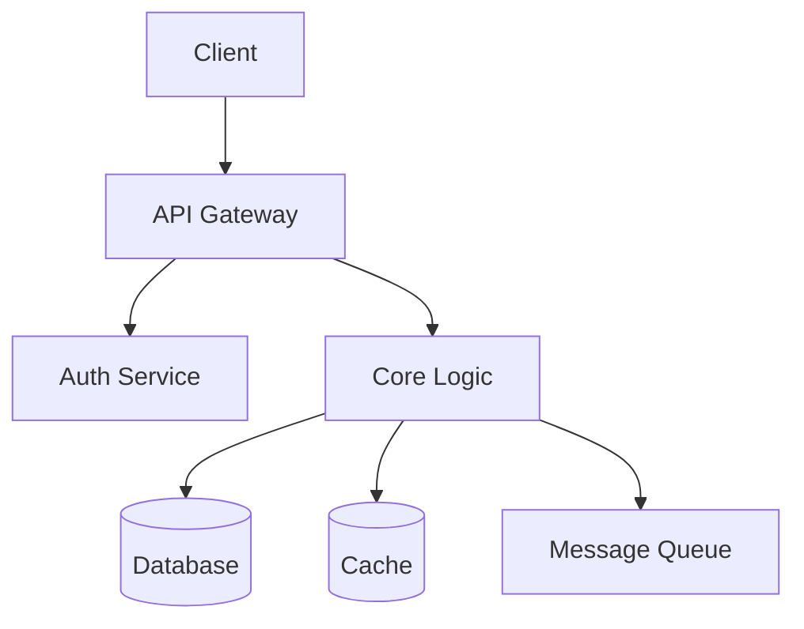
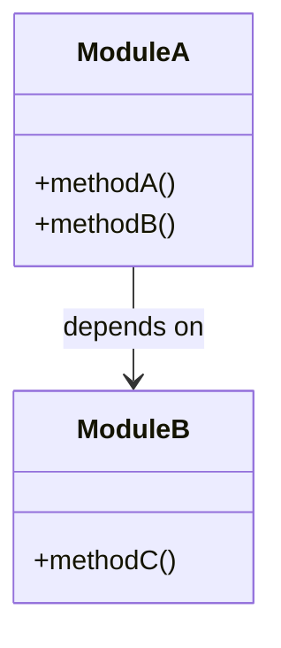
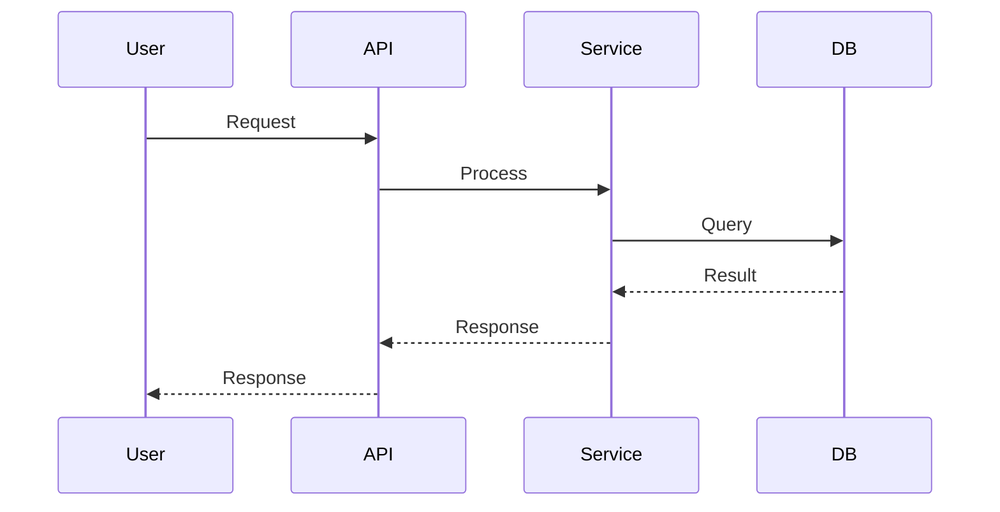
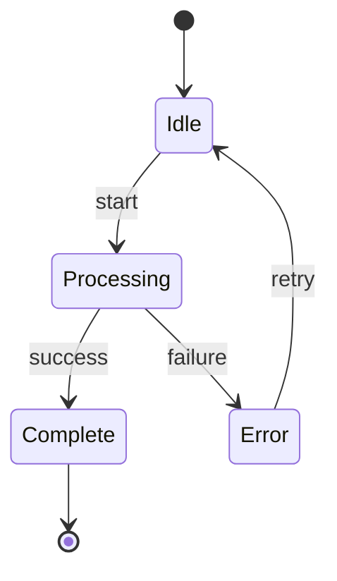
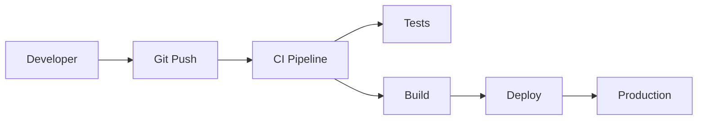

# Wiki Generation Knowledge Base

Rules and patterns for generating comprehensive project documentation wikis with mermaid diagrams.

## Quick Decision Tree: What Kind of Page

```
Content type?
├─ Project overview → Overview page (features, install, quick start)
├─ System design → Architecture page (components, data flow, patterns)
├─ Core module → Dedicated module page (API, internals, examples)
├─ Related modules → Grouped module page (2-3 modules per page)
├─ Config/Deploy → Configuration page (env vars, deploy steps)
├─ Developer onboarding → Development guide (setup, contributing, testing)
├─ API surface → API reference page (endpoints, params, responses)
├─ Data layer → Database & models page (schema, migrations, queries)
└─ Peripheral modules → Brief mention in overview or appendix
```

## Page Planning Rules

### Tier-Based Allocation

When workspace cache has tier info:

| Tier | Page Strategy | Detail Level |
|------|-------------|-------------|
| Tier 1 (core) | One dedicated page each | Full: API, internals, diagrams, examples |
| Tier 2 (important) | Group 2-3 related modules | Moderate: purpose, key APIs, one diagram |
| Tier 3 (peripheral) | Brief mention in overview/appendix | Minimal: one-line description |

### Page Count Guidelines

| Project Size | Recommended Pages |
|-------------|------------------|
| Small (1-5 modules) | 4-6 pages |
| Medium (6-15 modules) | 8-10 pages |
| Large (16+ modules) | 10-12 pages (group aggressively) |

### Required Pages (always include)

1. **Overview** — project intro, features, installation, quick start
2. **Architecture** — system design, component diagram, design patterns
3. **At least 2 module pages** — core functionality documentation
4. **Configuration/Deployment** — setup, env vars, deploy instructions

### Optional Pages (include if relevant)

- Data Flow / Pipeline (data processing projects)
- API Reference (REST/GraphQL APIs)
- Database & Models (projects with DB layer)
- Frontend Components (UI projects)
- Testing & CI/CD (projects with test infra)
- Plugin / Extension System (extensible architectures)

## Mermaid Diagram Patterns

### Architecture Diagram (flowchart)


### Module Relationship (classDiagram)


### Data Flow (sequenceDiagram)


### State Machine (stateDiagram)


### Deployment (flowchart)


### When to Use Which Diagram

| Page Type | Recommended Diagrams |
|-----------|---------------------|
| Overview | flowchart (high-level system) |
| Architecture | flowchart + classDiagram |
| Module (single) | classDiagram + sequenceDiagram |
| Module (grouped) | flowchart (relationship between modules) |
| Data Flow | sequenceDiagram |
| Config/Deploy | flowchart (pipeline) |
| State Management | stateDiagram-v2 |

## Page Template

```markdown
# {Page Title}

{1-2 sentence description of what this page covers}

## Overview

{Brief introduction to the topic/module}

## Architecture / Design

{How it works, design decisions}

```mermaid
{appropriate diagram}
```

## Key Components

### {Component A}
{Description, API, usage}

### {Component B}
{Description, API, usage}

## Code Examples

```{language}
{Practical usage example}
```

## Configuration

{Relevant config options, env vars}

## Related Pages

- [{Related Page 1}](./{page-id}.md) — {why it's related}
- [{Related Page 2}](./{page-id}.md) — {why it's related}
```

## Wiki Structure Template

```
docs/wiki/
├── index.md                    # Main page with navigation table
├── _sidebar.md                 # Navigation sidebar
├── .wiki-structure.yaml        # Structure metadata (machine-readable)
├── 01-overview.md              # Project overview & getting started
├── 02-architecture.md          # System architecture
├── 03-{module-a}.md            # Core module pages
├── 04-{module-b}.md
├── ...
├── {N-1}-configuration.md      # Configuration & deployment
└── {N}-development-guide.md    # Development guide & contributing
```

## Cross-Linking Rules

- Every page should link to at least 1 related page
- Use relative paths: `[Page Title](./page-id.md)`
- Architecture page should link to all module pages
- Module pages should link back to architecture
- Overview should have a navigation table linking all pages

## MkDocs Deployment

If deploying to GitLab Pages:

### mkdocs.yml (save to repo root)
```yaml
site_name: "{Project Name} Wiki"
docs_dir: docs/wiki
theme:
  name: material
  features:
    - navigation.sidebar
    - navigation.expand
    - content.code.copy
markdown_extensions:
  - pymdownx.superfences:
      custom_fences:
        - name: mermaid
          class: mermaid
          format: !!python/name:pymdownx.superfences.fence_code_format
  - pymdownx.highlight:
      anchor_linenums: true
  - admonition
  - tables
```

### .gitlab-ci.yml (save to repo root)
```yaml
pages:
  stage: deploy
  image: python:3.11-slim
  before_script:
    - pip install mkdocs mkdocs-material pymdown-extensions
  script:
    - mkdocs build --site-dir public
  artifacts:
    paths:
      - public
  rules:
    - if: $CI_COMMIT_BRANCH == $CI_DEFAULT_BRANCH
      changes:
        - docs/wiki/**/*
        - mkdocs.yml
```
