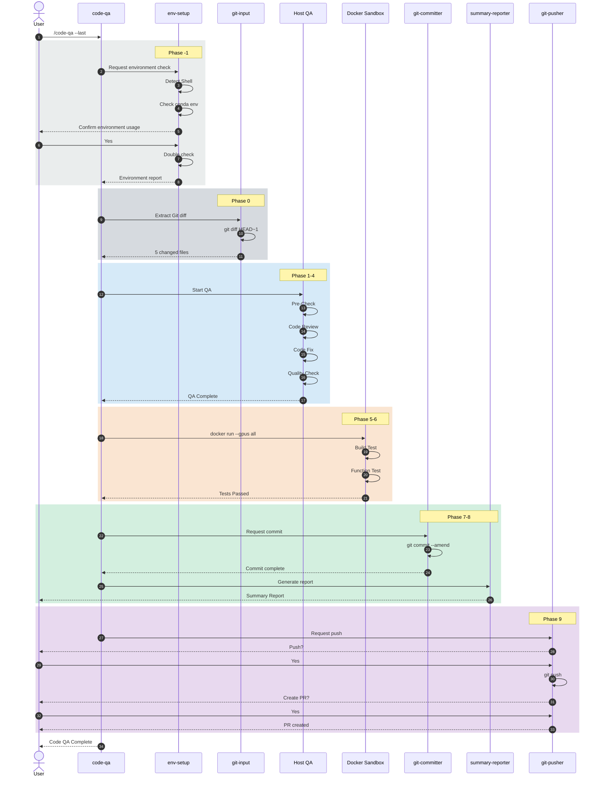

# Code QA v4 Complete Workflow Diagram

## Overview

This document provides an integrated diagram of the complete **Code QA v4 Workflow**.

---

## 1. Pipeline Overview

```
┌─────────────────────────────────────────────────────────────────────────────────────────────────────┐
│                                    Code QA Workflow v4                                               │
│                            (Environment + Git + Docker Sandbox Integration)                          │
├─────────────────────────────────────────────────────────────────────────────────────────────────────┤
│                                                                                                      │
│   ┌──────────────────────────────────────────────────────────────────────────────────────────────┐  │
│   │                                    Host Execution Zone                                        │  │
│   ├──────────────────────────────────────────────────────────────────────────────────────────────┤  │
│   │                                                                                               │  │
│   │  Phase -1        Phase 0         Phase 1         Phase 2         Phase 3         Phase 4     │  │
│   │  ┌─────────┐    ┌─────────┐    ┌─────────┐    ┌─────────┐    ┌─────────┐    ┌─────────┐    │  │
│   │  │   🔧    │───▶│   📂    │───▶│   ⚡    │───▶│   🔍    │───▶│   🔧    │───▶│   📋    │    │  │
│   │  │   Env   │    │   Git   │    │   Pre   │    │  Review │    │   Fix   │    │ Quality │    │  │
│   │  │  Setup  │    │  Input  │    │  Check  │    │         │    │         │    │  Check  │    │  │
│   │  └─────────┘    └─────────┘    └─────────┘    └─────────┘    └────┬────┘    └────┬────┘    │  │
│   │                                                                   │              │          │  │
│   │                                                                   │◀── Regress ◀─┤ <70%     │  │
│   │                                                                   │   (max 3x)   │          │  │
│   └───────────────────────────────────────────────────────────────────┼──────────────┼──────────┘  │
│                                                                       │              │              │
│   ┌───────────────────────────────────────────────────────────────────┼──────────────┼──────────┐  │
│   │                              Docker Sandbox Zone (default)         │              │          │  │
│   ├───────────────────────────────────────────────────────────────────┼──────────────┼──────────┤  │
│   │                                                                   │              ▼          │  │
│   │  Phase 5                                    Phase 6               │        ┌─────────┐     │  │
│   │  ┌─────────────────────┐                   ┌─────────────────────┐│        │  Build  │     │  │
│   │  │        🏗️           │                   │        🧪           ││◀───────│   🏗️    │     │  │
│   │  │   Build Tester     │──────────────────▶│  Function Tester    ││ Regress└─────────┘     │  │
│   │  │   (GPU Support)     │                   │   (GPU Support)      ││                        │  │
│   │  └─────────────────────┘                   └──────────┬──────────┘│                        │  │
│   │                                                       │           │                        │  │
│   │  ┌─────────────────────────────────────────────────────────────────────────────────────┐  │  │
│   │  │  docker run --gpus all -v $(pwd):/workspace qa-sandbox python -m pytest tests/     │  │  │
│   │  └─────────────────────────────────────────────────────────────────────────────────────┘  │  │
│   │                                                       │           │                        │  │
│   └───────────────────────────────────────────────────────┼───────────┼────────────────────────┘  │
│                                                           │           │                          │
│   ┌───────────────────────────────────────────────────────┼───────────┼────────────────────────┐  │
│   │                                    Host Execution Zone │           │                        │  │
│   ├───────────────────────────────────────────────────────┼───────────┼────────────────────────┤  │
│   │                                                       │  Regress ◀┤ Failed                 │  │
│   │                                                       │           │                        │  │
│   │                                                       ▼           │                        │  │
│   │  Phase 7              Phase 8              Phase 9                │                        │  │
│   │  ┌─────────┐         ┌─────────┐         ┌─────────────────────┐ │                        │  │
│   │  │   📝    │────────▶│   📊    │────────▶│   📤 Push   🔀 PR   │ │                        │  │
│   │  │ Commit  │         │ Summary │         │   (User Confirm Req) │ │                        │  │
│   │  │ /Amend  │         │ Report  │         └─────────────────────┘ │                        │  │
│   │  └─────────┘         └─────────┘                  │               │                        │  │
│   │                                                   ▼               │                        │  │
│   │                                              ┌─────────┐         │                        │  │
│   │                                              │   🎉    │         │                        │  │
│   │                                              │ Complete │         │                        │  │
│   │                                              └─────────┘         │                        │  │
│   └──────────────────────────────────────────────────────────────────────────────────────────┘  │
│                                                                                                      │
└─────────────────────────────────────────────────────────────────────────────────────────────────────┘
```

---

## 2. Phase Summary Table

| Phase | Agent | Model | Role | Execution Environment |
|-------|-------|-------|------|----------------------|
| **-1** | `@env-setup` | Qwen3.5 Instruct | Shell/conda/venv environment detection | Host |
| **0** | `@git-input` | Qwen3.5 Instruct | Git diff extraction, changed file list | Host |
| **1** | `@pre-checker` | Qwen3.5 Instruct | Auto-fix (lint --fix, format) | Host |
| **2** | `@code-reviewer` | Qwen3.5 Thinking | Issue discovery via manual code reading (CoT) | Host |
| **3** | `@code-fixer` | Qwen3.5 Instruct | Fix discovered issues (SWE-Bench) | Host |
| **4** | `@quality-checker` | Qwen3.5 Thinking | Tool-based quality scoring (≥70%) | Host |
| **5** | `@build-tester` | Qwen3.5 Instruct | Build test (GPU) | **Sandbox** |
| **6** | `@function-tester` | Qwen3.5 Instruct | Function test (GPU) | **Sandbox** |
| **7** | `@git-committer` | Qwen3.5 Instruct | Commit or Amend | Host |
| **8** | `@summary-reporter` | Qwen3.5 Thinking | Markdown result report (CoT) | Host |
| **9** | `@git-pusher` | Qwen3.5 Instruct | Push & PR creation | Host |

> ⚠️ **Note**: code-reviewer has Read permission only (Glob/Grep/Bash disabled). It discovers issues by manually reading code — does NOT run external tools. See quality-checker for tool-based scoring.
>
> ⚠️ **Note**: pre-checker has `edit: deny` intentionally. File modifications happen through linter `--fix` commands via Bash only.

### 2.1 Dual Model Strategy

```
┌─────────────────────────────────────────────────────────────────────────────────────────┐
│                   Single Server + Per-Request Thinking Control                            │
├─────────────────────────────────────────────────────────────────────────────────────────┤
│                                                                                          │
│  SGLang (port 8000): Qwen3.5-122B-A10B-FP8                                              │
│  --reasoning-parser qwen3 --tool-call-parser qwen3_coder                                │
│                                                                                          │
│  ┌─────────────────────────────────────────────────────────────────────────────────┐   │
│  │  [Thinking] chat_template_kwargs: enable_thinking=true                         │   │
│  │  ──────────────────────────────────────────────────                             │   │
│  │  • Thinking Mode + CoT reasoning specialized (3 agents)                        │   │
│  │  • Applied: code-reviewer, quality-checker, summary-reporter                   │   │
│  └─────────────────────────────────────────────────────────────────────────────────┘   │
│                                                                                          │
│  ┌─────────────────────────────────────────────────────────────────────────────────┐   │
│  │  [Instruct] chat_template_kwargs: enable_thinking=false                        │   │
│  │  ──────────────────────────────────────────────────                             │   │
│  │  • Tool Calling + code generation/modification specialized (10 agents)         │   │
│  │  • Applied: Orchestrator, env-setup, git-input, file-input, pre-checker,       │   │
│  │    code-fixer, build-tester, function-tester, git-committer, git-pusher        │   │
│  └─────────────────────────────────────────────────────────────────────────────────┘   │
│                                                                                          │
│  ═══════════════════════════════════════════════════════════════════════════════════   │
│                                                                                          │
│   Phase -1  Phase 0   Phase 1   Phase 2   Phase 3   Phase 4   Phase 5-6   Phase 7-9   │
│   ┌─────┐  ┌─────┐   ┌─────┐   ┌─────┐   ┌─────┐   ┌─────┐   ┌───────┐   ┌───────┐   │
│   │Instr│  │Instr│   │Instr│   │Think│   │Instr│   │Think│   │ Instr │   │ Mixed │   │
│   │ uct │→ │ uct │ → │ uct │ → │ ing │ → │ uct │ → │ ing │ → │  uct  │ → │       │   │
│   └─────┘  └─────┘   └─────┘   └─────┘   └─────┘   └─────┘   └───────┘   └───────┘   │
│    env      git       pre      review     fix      quality   build/test  commit/     │
│   setup    input     check      (CoT)    (SWE)    check      (Instruct) summary     │
│                                                                                          │
└─────────────────────────────────────────────────────────────────────────────────────────┘
```

---

## 3. Detailed Flowchart

```mermaid
flowchart TB
    START(["code-qa --last"]) --> ENV_SETUP

    subgraph PHASE_NEG1["Phase -1: Environment Setup"]
        ENV_SETUP["env-setup"]
        SHELL["Check Shell"]
        ENV_CHECK["Check Environment"]
        ENV_SELECT{"Select Environment"}
        DOUBLE_CHECK["Double Check"]

        ENV_SETUP --> SHELL --> ENV_CHECK --> ENV_SELECT --> DOUBLE_CHECK
    end

    DOUBLE_CHECK --> GIT_INPUT

    subgraph PHASE_0["Phase 0: Git Input"]
        GIT_INPUT["git-input"]
        PARSE_MODE["Parse Mode"]
        EXTRACT_FILES["Extract Changed Files"]

        GIT_INPUT --> PARSE_MODE --> EXTRACT_FILES
    end

    EXTRACT_FILES --> PRE_CHECK

    subgraph HOST_QA["Phase 1-4: Host QA"]
        PRE_CHECK["pre-checker"]
        CODE_REVIEW["code-reviewer"]
        CODE_FIX["code-fixer"]
        QUALITY["quality-checker"]

        PRE_CHECK --> CODE_REVIEW --> CODE_FIX --> QUALITY
    end

    QUALITY --> Q_CHECK{"≥70%?"}
    Q_CHECK -->|No| RETRY_Q{"Per-source <3x?\nTotal <5x?"}
    RETRY_Q -->|Yes| CODE_FIX
    RETRY_Q -->|No| HUMAN["User Intervention"]
    HUMAN --> BUILD_TEST

    Q_CHECK -->|Yes| BUILD_TEST

    subgraph SANDBOX["Phase 5-6: Docker Sandbox"]
        BUILD_TEST["build-tester"]
        FUNC_TEST["function-tester"]

        BUILD_TEST --> B_CHECK{"Success?"}
        B_CHECK -->|Yes| FUNC_TEST
        FUNC_TEST --> T_CHECK{"Pass?"}
    end

    B_CHECK -->|No| CODE_FIX
    T_CHECK -->|No| CODE_FIX

    T_CHECK -->|Yes| COMMIT

    subgraph HOST_GIT["Phase 7-9: Git Operations"]
        COMMIT["git-committer"]
        SUMMARY["summary-reporter"]
        PUSH_PR["git-pusher"]

        COMMIT --> HAS_CHANGE{"Has Changes?"}
        HAS_CHANGE -->|No| SUMMARY
        HAS_CHANGE -->|Yes| COMMIT_MODE{"Input Mode?"}

        COMMIT_MODE -->|Pre-commit| NEW_COMMIT["New Commit"]
        COMMIT_MODE -->|Post-commit| AMEND["amend"]

        NEW_COMMIT --> SUMMARY
        AMEND --> SUMMARY
        SUMMARY --> PUSH_PR
    end

    PUSH_PR --> PUSH_ASK["Push?"]
    PUSH_ASK --> PUSH_CHOICE{"Choice"}
    PUSH_CHOICE -->|No| DONE_LOCAL(["Complete - Local Only"])
    PUSH_CHOICE -->|Yes| DO_PUSH["git push"]

    DO_PUSH --> PR_ASK["Create PR?"]
    PR_ASK --> PR_CHOICE{"Choice"}
    PR_CHOICE -->|No| DONE_PUSH(["Complete - Push Only"])
    PR_CHOICE -->|Yes| CREATE_PR["Create PR"]
    CREATE_PR --> DONE(["Complete!"])

    style PHASE_NEG1 fill:#95A5A622,stroke:#95A5A6
    style PHASE_0 fill:#34495E22,stroke:#34495E
    style HOST_QA fill:#3498DB22,stroke:#3498DB
    style SANDBOX fill:#E67E2222,stroke:#E67E22
    style HOST_GIT fill:#27AE6022,stroke:#27AE60
```



---

## 4. Execution Flow Sequence



---

## 5. Input Options Behavior

```
┌─────────────────────────────────────────────────────────────────────────────────────────┐
│                                Input Options Behavior                                     │
├─────────────────────────────────────────────────────────────────────────────────────────┤
│                                                                                          │
│  ┌────────────────────────────────────────┐  ┌────────────────────────────────────────┐ │
│  │         Git Options                    │  │         Sandbox Options                │ │
│  ├────────────────────────────────────────┤  ├────────────────────────────────────────┤ │
│  │                                        │  │                                        │ │
│  │  --working (default)                   │  │  (default)                             │ │
│  │  └─ git diff                           │  │  └─ Run Build/Test in                  │ │
│  │  └─ Pre-commit → New commit            │  │     Docker Sandbox                     │ │
│  │                                        │  │  └─ GPU support (nvidia-docker)        │ │
│  │  --staged                              │  │                                        │ │
│  │  └─ git diff --staged                  │  │  --no-sandbox                          │ │
│  │  └─ Pre-commit → New commit            │  │  └─ Run Build/Test                     │ │
│  │                                        │  │     directly on host                   │ │
│  │  --last                                │  │                                        │ │
│  │  └─ git diff HEAD~1                    │  │                                        │ │
│  │  └─ Post-commit → amend                │  │                                        │ │
│  │                                        │  │                                        │ │
│  │  --branch                              │  │                                        │ │
│  │  └─ git diff main...HEAD               │  │                                        │ │
│  │  └─ Post-commit → amend                │  │                                        │ │
│  │                                        │  │                                        │ │
│  │  --range a..b                          │  │                                        │ │
│  │  └─ git diff a..b                      │  │                                        │ │
│  │  └─ Post-commit → amend                │  │                                        │ │
│  │                                        │  │                                        │ │
│  └────────────────────────────────────────┘  └────────────────────────────────────────┘ │
│                                                                                          │
│  Usage Examples:                                                                         │
│  ┌──────────────────────────────────────────────────────────────────────────────────┐   │
│  │  /code-qa                         # working + Sandbox (default)                  │   │
│  │  /code-qa --staged                # staged + Sandbox                             │   │
│  │  /code-qa --last                  # last commit + Sandbox (amend)                │   │
│  │  /code-qa --last --no-sandbox     # last commit + Host (amend)                   │   │
│  │  /code-qa --branch                # entire branch + Sandbox                      │   │
│  └──────────────────────────────────────────────────────────────────────────────────┘   │
│                                                                                          │
└─────────────────────────────────────────────────────────────────────────────────────────┘
```

---

## 6. Regression Loop Details

```
┌─────────────────────────────────────────────────────────────────────────────────────────┐
│                                    Regression Loop System                                 │
├─────────────────────────────────────────────────────────────────────────────────────────┤
│                                                                                          │
│  ┌─────────────────────────────────────────────────────────────────────────────────┐   │
│  │  Regression Triggers                                                             │   │
│  │                                                                                  │   │
│  │  1. Quality Check < 70%  (source: quality, max 3 per-source)                     │   │
│  │     └─ Regress to @code-fixer                                                    │   │
│  │     └─ Increment retry_counters.quality                                          │   │
│  │                                                                                  │   │
│  │  2. Build Failed  (source: build, max 3 per-source)                              │   │
│  │     └─ Regress to @code-fixer                                                    │   │
│  │     └─ Pass build error log + increment retry_counters.build                     │   │
│  │                                                                                  │   │
│  │  3. Test Failed  (source: test, max 3 per-source)                                │   │
│  │     └─ Regress to @code-fixer                                                    │   │
│  │     └─ Pass failed test cases + increment retry_counters.test                    │   │
│  │                                                                                  │   │
│  └─────────────────────────────────────────────────────────────────────────────────┘   │
│                                                                                          │
│  ┌─────────────────────────────────────────────────────────────────────────────────┐   │
│  │  Regression Flow                                                                 │   │
│  │                                                                                  │   │
│  │   @quality-checker ──(< 70%)──▶ @code-fixer ──▶ @quality-checker ──▶ ...        │   │
│  │         │                            ▲                                           │   │
│  │         │                            │                                           │   │
│  │   @build-tester ──(failed)───────────┤                                           │   │
│  │         │                            │                                           │   │
│  │         │                            │                                           │   │
│  │   @function-tester ──(failed)────────┘                                           │   │
│  │                                                                                  │   │
│  └─────────────────────────────────────────────────────────────────────────────────┘   │
│                                                                                          │
│  Per-Source Retry Counters:                                                             │
│    PER_SOURCE_MAX = 3  (quality, build, test each max 3)                                │
│    TOTAL_REGRESSION_CAP = 5  (across all sources combined)                              │
│  QUALITY_THRESHOLD = 70                                                                 │
│                                                                                          │
└─────────────────────────────────────────────────────────────────────────────────────────┘
```

---

## 7. File Structure

```
project-root/
├── .opencode/
│   ├── agent/                     # 22 Agents
│   │   ├── ── Code QA Pipeline ──
│   │   ├── env-setup.md           # STEP 1: Environment setup
│   │   ├── git-input.md           # STEP 2: Git changed file extraction
│   │   ├── file-input.md          # STEP 2 alt: File input parser (non-Git)
│   │   ├── pre-checker.md         # STEP 3: Lint/Format auto-fix
│   │   ├── code-reviewer.md       # STEP 4: Code review (domain-aware)
│   │   ├── code-fixer.md          # STEP 5: Issue fixing
│   │   ├── quality-checker.md     # STEP 6: Quality check
│   │   ├── build-tester.md        # STEP 7: Build test
│   │   ├── function-tester.md     # STEP 8: Function test
│   │   ├── git-committer.md       # STEP 9: Git commit
│   │   ├── summary-reporter.md    # STEP 10: Summary report
│   │   ├── git-pusher.md          # STEP 11: Push & PR
│   │   ├── ── Workspace Analysis ──
│   │   ├── workspace-scanner.md   # Fast project scan
│   │   ├── module-analyzer.md     # Per-module deep analysis
│   │   ├── workspace-analyzer.md  # Legacy fallback (DEPRECATED)
│   │   ├── analyze.md             # /analyze orchestrator
│   │   ├── ── DeepWiki ──
│   │   ├── deepwiki.md            # /deepwiki orchestrator
│   │   ├── wiki-page-generator.md # Wiki page generation
│   │   ├── ── Utility Agents ──
│   │   ├── docs.md                # Documentation writing
│   │   ├── translator.md          # Translation
│   │   ├── duplicate-pr.md        # Duplicate PR detection
│   │   └── triage.md              # GitHub issue triage
│   │
│   ├── command/                   # 15 Commands
│   │   ├── code-qa.md             # /code-qa (full pipeline)
│   │   ├── analyze.md             # /analyze (workspace analysis + doc indexing)
│   │   ├── deepwiki.md            # /deepwiki (wiki generation)
│   │   ├── env.md, lint.md, review.md, fix.md   # Standalone agents
│   │   ├── quality.md, build.md, test.md         # Standalone agents
│   │   ├── commit.md, issues.md                  # Git/GitHub
│   │   └── ai-deps.md, rmslop.md, spellcheck.md # Utility commands
│   │
│   ├── skills/                    # 6 Skills (knowledge bases)
│   │   ├── code-review/           # Review checklists per language
│   │   ├── code-quality/          # Scoring rules & lint mappings
│   │   ├── build-test/            # Build patterns per project type
│   │   ├── wiki-generation/       # Wiki page templates & diagrams
│   │   ├── translation/           # Locale glossary & preserve rules
│   │   └── doc-indexer/           # Docs → project-knowledge generator
│   │
│   ├── config/
│   │   ├── workflow-settings.yaml # Timeout, retry, quality settings
│   │   ├── context-schema.md      # JSON schemas for context passing
│   │   ├── permission-templates.yaml # Agent permission templates
│   │   └── logging-format.md      # Unified log format
│   │
│   ├── docker/
│   │   └── Dockerfile.sandbox     # Docker Sandbox image
│   │
│   ├── mode/
│   │   └── code-qa.md             # QA orchestrator mode
│   │
│   ├── glossary/                  # 16 locale translation glossaries
│   │
│   └── workspace-cache/           # Auto-generated (gitignored)
│       ├── project-map.yaml       # L1: Project overview (~1K tokens)
│       └── modules/*.yaml         # L2: Per-module details
│
└── src/
    └── ...
```

---

## 8. Permission Matrix

```
┌──────────────────────────────────────────────────────────────────────────────────────────────┐
│                                      Agent Permission Matrix                                   │
├───────────────────┬───────┬───────┬────────────────┬────────────────┬───────────────────────┤
│ Agent             │ read  │ edit  │ bash (git)     │ bash (other)   │ User Confirm          │
├───────────────────┼───────┼───────┼────────────────┼────────────────┼───────────────────────┤
│ @env-setup        │  ✅   │  ❌   │ ❌             │ echo, conda,   │ On env selection      │
│                   │       │       │                │ python, nvidia │                       │
├───────────────────┼───────┼───────┼────────────────┼────────────────┼───────────────────────┤
│ @git-input        │  ✅   │  ❌   │ diff, status,  │ ❌             │ ❌                    │
│                   │       │       │ log, branch    │                │                       │
├───────────────────┼───────┼───────┼────────────────┼────────────────┼───────────────────────┤
│ @pre-checker      │  ✅   │  ❌   │ diff           │ lint --fix,    │ ❌                    │
│                   │       │       │                │ format         │                       │
├───────────────────┼───────┼───────┼────────────────┼────────────────┼───────────────────────┤
│ @code-reviewer    │  ✅   │  ❌   │ ❌ (Read only!)│ ❌             │ ❌                    │
│ ⚠️ Read only     │       │       │                │                │                       │
├───────────────────┼───────┼───────┼────────────────┼────────────────┼───────────────────────┤
│ @code-fixer       │  ✅   │  ✅   │ diff, status   │ ❌             │ ❌                    │
├───────────────────┼───────┼───────┼────────────────┼────────────────┼───────────────────────┤
│ @quality-checker  │  ✅   │  ❌   │ ❌             │ lint, tsc,     │ ❌                    │
│                   │       │       │                │ format         │                       │
├───────────────────┼───────┼───────┼────────────────┼────────────────┼───────────────────────┤
│ @build-tester     │  ✅   │  ❌   │ ❌             │ build,         │ ✅ Env confirm req    │
│                   │       │       │                │ docker run     │                       │
├───────────────────┼───────┼───────┼────────────────┼────────────────┼───────────────────────┤
│ @function-tester  │  ✅   │  ❌   │ diff           │ test,          │ ✅ Test run confirm   │
│                   │       │       │                │ docker run     │                       │
├───────────────────┼───────┼───────┼────────────────┼────────────────┼───────────────────────┤
│ @git-committer    │  ✅   │  ❌   │ add, commit,   │ ❌             │ ❌                    │
│                   │       │       │ status         │                │                       │
├───────────────────┼───────┼───────┼────────────────┼────────────────┼───────────────────────┤
│ @summary-reporter │  ✅   │  ❌   │ log, diff      │ ❌             │ ❌                    │
├───────────────────┼───────┼───────┼────────────────┼────────────────┼───────────────────────┤
│ @git-pusher       │  ✅   │  ❌   │ push (ask),    │ ❌             │ ✅ Push/PR required   │
│                   │       │       │ branch, remote │                │                       │
└───────────────────┴───────┴───────┴────────────────┴────────────────┴───────────────────────┘
```

---

## 9. Quick Reference

### 9.1 Commonly Used Commands

| Command | Description |
|---------|-------------|
| `/code-qa` | Check working changes (Sandbox default) |
| `/code-qa --staged` | Check staged changes only |
| `/code-qa --last` | Check last commit → amend |
| `/code-qa --branch` | Check entire branch |
| `/code-qa --last --no-sandbox` | Build/Test on host |

### 9.2 Environment Requirements

| Requirement | Description |
|-------------|-------------|
| Docker | Docker Engine installed |
| nvidia-docker | NVIDIA Container Toolkit for GPU |
| CUDA Driver | NVIDIA driver installed on host |

### 9.3 Configuration Files

| File | Location | Purpose |
|------|----------|---------|
| `env-config.yaml` | `.opencode/` | Shell, environment, requirements, Sandbox settings |
| `workflow-settings.yaml` | `.opencode/config/` | Timeout, retry, quality, model settings |
| `context-schema.md` | `.opencode/config/` | JSON schemas for structured context passing |
| `permission-templates.yaml` | `.opencode/config/` | Agent permission templates |
| `Dockerfile.sandbox` | `.opencode/docker/` | Sandbox image definition |
| `code-qa.md` | `.opencode/command/` | /code-qa command definition |
| `code-qa.md` | `.opencode/mode/` | QA orchestrator mode |

---

## Related Documents

- [Environment Setup Details](./12-environment-setup-workflow.md)
- [Code QA v4 Quick Start](./14-code-qa-v4-quick-start.md)
- [Custom Agent Guide](./02-custom-agent-guide.md)
