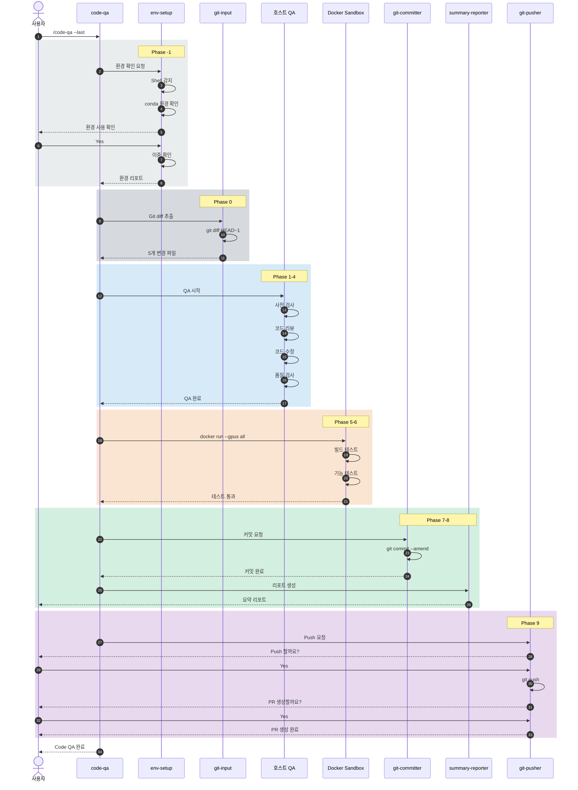

# Code QA v4 전체 워크플로우 다이어그램

## 개요

이 문서는 **Code QA v4 Workflow**의 통합 다이어그램을 제공합니다.

---

## 1. 파이프라인 개요

```
┌─────────────────────────────────────────────────────────────────────────────────────────────────────┐
│                                    Code QA Workflow v4                                               │
│                            (환경 + Git + Docker Sandbox 통합)                                        │
├─────────────────────────────────────────────────────────────────────────────────────────────────────┤
│                                                                                                      │
│   ┌──────────────────────────────────────────────────────────────────────────────────────────────┐  │
│   │                                    호스트 실행 영역                                           │  │
│   ├──────────────────────────────────────────────────────────────────────────────────────────────┤  │
│   │                                                                                               │  │
│   │  Phase -1        Phase 0         Phase 1         Phase 2         Phase 3         Phase 4     │  │
│   │  ┌─────────┐    ┌─────────┐    ┌─────────┐    ┌─────────┐    ┌─────────┐    ┌─────────┐    │  │
│   │  │   환경   │───>│   Git   │───>│  사전   │───>│  리뷰   │───>│  수정   │───>│  품질   │    │  │
│   │  │  설정   │    │  입력   │    │  검사   │    │         │    │         │    │  검사   │    │  │
│   │  └─────────┘    └─────────┘    └─────────┘    └─────────┘    └────┬────┘    └────┬────┘    │  │
│   │                                                                   │              │          │  │
│   │                                                                   │<── 회귀  <───┤ <70%     │  │
│   │                                                                   │   (최대 3회) │          │  │
│   └───────────────────────────────────────────────────────────────────┼──────────────┼──────────┘  │
│                                                                       │              │              │
│   ┌───────────────────────────────────────────────────────────────────┼──────────────┼──────────┐  │
│   │                         Docker Sandbox 영역 (기본값)               │              │          │  │
│   ├───────────────────────────────────────────────────────────────────┼──────────────┼──────────┤  │
│   │                                                                   │              v          │  │
│   │  Phase 5                                    Phase 6               │        ┌─────────┐     │  │
│   │  ┌─────────────────────┐                   ┌─────────────────────┐│        │  빌드   │     │  │
│   │  │   빌드 테스터       │                   │  기능 테스터        ││<───────│  테스트 │     │  │
│   │  │   (GPU 지원)        │──────────────────>│   (GPU 지원)        ││ 회귀   └─────────┘     │  │
│   │  └─────────────────────┘                   └──────────┬──────────┘│                        │  │
│   │                                                       │           │                        │  │
│   │  ┌─────────────────────────────────────────────────────────────────────────────────────┐  │  │
│   │  │  docker run --gpus all -v $(pwd):/workspace qa-sandbox python -m pytest tests/     │  │  │
│   │  └─────────────────────────────────────────────────────────────────────────────────────┘  │  │
│   │                                                       │           │                        │  │
│   └───────────────────────────────────────────────────────┼───────────┼────────────────────────┘  │
│                                                           │           │                          │
│   ┌───────────────────────────────────────────────────────┼───────────┼────────────────────────┐  │
│   │                                    호스트 실행 영역    │           │                        │  │
│   ├───────────────────────────────────────────────────────┼───────────┼────────────────────────┤  │
│   │                                                       │  회귀  <──┤ 실패                   │  │
│   │                                                       v           │                        │  │
│   │  Phase 7              Phase 8              Phase 9                │                        │  │
│   │  ┌─────────┐         ┌─────────┐         ┌─────────────────────┐ │                        │  │
│   │  │ 커밋    │────────>│  요약   │────────>│  Push      PR       │ │                        │  │
│   │  │ /수정   │         │ 리포트  │         │  (사용자 확인 필수)  │ │                        │  │
│   │  └─────────┘         └─────────┘         └─────────────────────┘ │                        │  │
│   │                                                   │               │                        │  │
│   │                                                   v               │                        │  │
│   │                                              ┌─────────┐         │                        │  │
│   │                                              │  완료   │         │                        │  │
│   │                                              └─────────┘         │                        │  │
│   └──────────────────────────────────────────────────────────────────────────────────────────┘  │
│                                                                                                      │
└─────────────────────────────────────────────────────────────────────────────────────────────────────┘
```

---

## 2. Phase 요약 테이블

| Phase | Agent | 모델 | 역할 | 실행 환경 |
|-------|-------|------|------|----------|
| **-1** | `@env-setup` | Qwen3.5 Instruct | Shell/conda/venv 환경 감지 | 호스트 |
| **0** | `@git-input` | Qwen3.5 Instruct | Git diff 추출, 변경 파일 목록 | 호스트 |
| **1** | `@pre-checker` | Qwen3.5 Instruct | 자동 수정 (lint --fix, format) | 호스트 |
| **2** | `@code-reviewer` | Qwen3.5 Thinking | 수동 코드 읽기로 이슈 발견 (CoT) | 호스트 |
| **3** | `@code-fixer` | Qwen3.5 Instruct | 발견된 이슈 수정 (SWE-Bench) | 호스트 |
| **4** | `@quality-checker` | Qwen3.5 Thinking | 도구 기반 품질 점수 산출 (>=70%) | 호스트 |
| **5** | `@build-tester` | Qwen3.5 Instruct | 빌드 테스트 (GPU) | **Sandbox** |
| **6** | `@function-tester` | Qwen3.5 Instruct | 기능 테스트 (GPU) | **Sandbox** |
| **7** | `@git-committer` | Qwen3.5 Instruct | 커밋 또는 Amend | 호스트 |
| **8** | `@summary-reporter` | Qwen3.5 Thinking | 마크다운 결과 리포트 (CoT) | 호스트 |
| **9** | `@git-pusher` | Qwen3.5 Instruct | Push 및 PR 생성 | 호스트 |

> **참고**: code-reviewer는 Read 권한만 보유합니다 (Glob/Grep/Bash 비활성화). 수동으로 코드를 읽어 이슈를 발견하며, 외부 도구를 실행하지 않습니다. 도구 기반 점수 산출은 quality-checker를 참조하세요.
>
> **참고**: pre-checker는 의도적으로 `edit: deny`입니다. 파일 수정은 Bash를 통한 린터 `--fix` 명령으로만 수행됩니다.

### 2.1 듀얼 모델 전략

```
┌─────────────────────────────────────────────────────────────────────────────────────────┐
│                  단일 서버 + 요청별 Thinking 제어                                         │
├─────────────────────────────────────────────────────────────────────────────────────────┤
│                                                                                          │
│  SGLang (port 8000): Qwen3.5-122B-A10B-FP8                                              │
│  --reasoning-parser qwen3 --tool-call-parser qwen3_coder                                │
│                                                                                          │
│  ┌─────────────────────────────────────────────────────────────────────────────────┐   │
│  │  [Thinking] chat_template_kwargs: enable_thinking=true                         │   │
│  │  ──────────────────────────────────────────────────                             │   │
│  │  * Thinking Mode + CoT 추론 전문 (3개 에이전트)                                 │   │
│  │  * 적용: code-reviewer, quality-checker, summary-reporter                      │   │
│  └─────────────────────────────────────────────────────────────────────────────────┘   │
│                                                                                          │
│  ┌─────────────────────────────────────────────────────────────────────────────────┐   │
│  │  [Instruct] chat_template_kwargs: enable_thinking=false                        │   │
│  │  ──────────────────────────────────────────────────                             │   │
│  │  * Tool Calling + 코드 생성/수정 전문 (10개 에이전트)                            │   │
│  │  * 적용: Orchestrator, env-setup, git-input, file-input, pre-checker,          │   │
│  │    code-fixer, build-tester, function-tester, git-committer, git-pusher        │   │
│  └─────────────────────────────────────────────────────────────────────────────────┘   │
│                                                                                          │
│  ═══════════════════════════════════════════════════════════════════════════════════   │
│                                                                                          │
│   Phase -1  Phase 0   Phase 1   Phase 2   Phase 3   Phase 4   Phase 5-6   Phase 7-9   │
│   ┌─────┐  ┌─────┐   ┌─────┐   ┌─────┐   ┌─────┐   ┌─────┐   ┌───────┐   ┌───────┐   │
│   │Instr│  │Instr│   │Instr│   │Think│   │Instr│   │Think│   │ Instr │   │ Mixed │   │
│   │ uct │-> │ uct │ -> │ uct │ -> │ ing │ -> │ uct │ -> │ ing │ -> │  uct  │ -> │       │   │
│   └─────┘  └─────┘   └─────┘   └─────┘   └─────┘   └─────┘   └───────┘   └───────┘   │
│    환경     git       사전     리뷰      수정     품질     빌드/테스트 커밋/          │
│   설정    입력     검사      (CoT)    (SWE)    검사      (Instruct) 요약            │
│                                                                                          │
└─────────────────────────────────────────────────────────────────────────────────────────┘
```

---

## 3. 상세 플로우차트

```mermaid
flowchart TB
    START(["code-qa --last"]) --> ENV_SETUP

    subgraph PHASE_NEG1["Phase -1: 환경 설정"]
        ENV_SETUP["env-setup"]
        SHELL["Shell 확인"]
        ENV_CHECK["환경 확인"]
        ENV_SELECT{"환경 선택"}
        DOUBLE_CHECK["이중 확인"]

        ENV_SETUP --> SHELL --> ENV_CHECK --> ENV_SELECT --> DOUBLE_CHECK
    end

    DOUBLE_CHECK --> GIT_INPUT

    subgraph PHASE_0["Phase 0: Git 입력"]
        GIT_INPUT["git-input"]
        PARSE_MODE["모드 파싱"]
        EXTRACT_FILES["변경 파일 추출"]

        GIT_INPUT --> PARSE_MODE --> EXTRACT_FILES
    end

    EXTRACT_FILES --> PRE_CHECK

    subgraph HOST_QA["Phase 1-4: 호스트 QA"]
        PRE_CHECK["pre-checker"]
        CODE_REVIEW["code-reviewer"]
        CODE_FIX["code-fixer"]
        QUALITY["quality-checker"]

        PRE_CHECK --> CODE_REVIEW --> CODE_FIX --> QUALITY
    end

    QUALITY --> Q_CHECK{">=70%?"}
    Q_CHECK -->|No| RETRY_Q{"소스별 <3회?\n총 <5회?"}
    RETRY_Q -->|Yes| CODE_FIX
    RETRY_Q -->|No| HUMAN["사용자 개입"]
    HUMAN --> BUILD_TEST

    Q_CHECK -->|Yes| BUILD_TEST

    subgraph SANDBOX["Phase 5-6: Docker Sandbox"]
        BUILD_TEST["build-tester"]
        FUNC_TEST["function-tester"]

        BUILD_TEST --> B_CHECK{"성공?"}
        B_CHECK -->|Yes| FUNC_TEST
        FUNC_TEST --> T_CHECK{"통과?"}
    end

    B_CHECK -->|No| CODE_FIX
    T_CHECK -->|No| CODE_FIX

    T_CHECK -->|Yes| COMMIT

    subgraph HOST_GIT["Phase 7-9: Git 작업"]
        COMMIT["git-committer"]
        SUMMARY["summary-reporter"]
        PUSH_PR["git-pusher"]

        COMMIT --> HAS_CHANGE{"변경사항 있음?"}
        HAS_CHANGE -->|No| SUMMARY
        HAS_CHANGE -->|Yes| COMMIT_MODE{"입력 모드?"}

        COMMIT_MODE -->|Pre-commit| NEW_COMMIT["새 커밋"]
        COMMIT_MODE -->|Post-commit| AMEND["amend"]

        NEW_COMMIT --> SUMMARY
        AMEND --> SUMMARY
        SUMMARY --> PUSH_PR
    end

    PUSH_PR --> PUSH_ASK["Push?"]
    PUSH_ASK --> PUSH_CHOICE{"선택"}
    PUSH_CHOICE -->|No| DONE_LOCAL(["완료 - 로컬만"])
    PUSH_CHOICE -->|Yes| DO_PUSH["git push"]

    DO_PUSH --> PR_ASK["PR 생성?"]
    PR_ASK --> PR_CHOICE{"선택"}
    PR_CHOICE -->|No| DONE_PUSH(["완료 - Push만"])
    PR_CHOICE -->|Yes| CREATE_PR["PR 생성"]
    CREATE_PR --> DONE(["완료!"])

    style PHASE_NEG1 fill:#95A5A622,stroke:#95A5A6
    style PHASE_0 fill:#34495E22,stroke:#34495E
    style HOST_QA fill:#3498DB22,stroke:#3498DB
    style SANDBOX fill:#E67E2222,stroke:#E67E22
    style HOST_GIT fill:#27AE6022,stroke:#27AE60
```



---

## 4. 실행 흐름 시퀀스



---

## 5. 입력 옵션 동작

```
┌─────────────────────────────────────────────────────────────────────────────────────────┐
│                                입력 옵션 동작                                             │
├─────────────────────────────────────────────────────────────────────────────────────────┤
│                                                                                          │
│  ┌────────────────────────────────────────┐  ┌────────────────────────────────────────┐ │
│  │         Git 옵션                       │  │         Sandbox 옵션                   │ │
│  ├────────────────────────────────────────┤  ├────────────────────────────────────────┤ │
│  │                                        │  │                                        │ │
│  │  --working (기본값)                    │  │  (기본값)                              │ │
│  │  +- git diff                           │  │  +- Docker Sandbox에서                 │ │
│  │  +- Pre-commit -> 새 커밋              │  │     빌드/테스트 실행                   │ │
│  │                                        │  │  +- GPU 지원 (nvidia-docker)           │ │
│  │  --staged                              │  │                                        │ │
│  │  +- git diff --staged                  │  │  --no-sandbox                          │ │
│  │  +- Pre-commit -> 새 커밋              │  │  +- 호스트에서 직접                    │ │
│  │                                        │  │     빌드/테스트 실행                   │ │
│  │  --last                                │  │                                        │ │
│  │  +- git diff HEAD~1                    │  │                                        │ │
│  │  +- Post-commit -> amend               │  │                                        │ │
│  │                                        │  │                                        │ │
│  │  --branch                              │  │                                        │ │
│  │  +- git diff main...HEAD               │  │                                        │ │
│  │  +- Post-commit -> amend               │  │                                        │ │
│  │                                        │  │                                        │ │
│  │  --range a..b                          │  │                                        │ │
│  │  +- git diff a..b                      │  │                                        │ │
│  │  +- Post-commit -> amend               │  │                                        │ │
│  │                                        │  │                                        │ │
│  └────────────────────────────────────────┘  └────────────────────────────────────────┘ │
│                                                                                          │
│  사용 예시:                                                                              │
│  ┌──────────────────────────────────────────────────────────────────────────────────┐   │
│  │  /code-qa                         # working + Sandbox (기본값)                   │   │
│  │  /code-qa --staged                # staged + Sandbox                             │   │
│  │  /code-qa --last                  # 마지막 커밋 + Sandbox (amend)                │   │
│  │  /code-qa --last --no-sandbox     # 마지막 커밋 + 호스트 (amend)                 │   │
│  │  /code-qa --branch                # 전체 브랜치 + Sandbox                        │   │
│  └──────────────────────────────────────────────────────────────────────────────────┘   │
│                                                                                          │
└─────────────────────────────────────────────────────────────────────────────────────────┘
```

---

## 6. 회귀 루프 상세

```
┌─────────────────────────────────────────────────────────────────────────────────────────┐
│                                    회귀 루프 시스템                                       │
├─────────────────────────────────────────────────────────────────────────────────────────┤
│                                                                                          │
│  ┌─────────────────────────────────────────────────────────────────────────────────┐   │
│  │  회귀 트리거                                                                     │   │
│  │                                                                                  │   │
│  │  1. 품질 검사 < 70%  (소스: quality, 소스별 최대 3회)                             │   │
│  │     +- @code-fixer로 회귀                                                        │   │
│  │     +- retry_counters.quality 증가                                               │   │
│  │                                                                                  │   │
│  │  2. 빌드 실패  (소스: build, 소스별 최대 3회)                                     │   │
│  │     +- @code-fixer로 회귀                                                        │   │
│  │     +- 빌드 에러 로그 전달 + retry_counters.build 증가                            │   │
│  │                                                                                  │   │
│  │  3. 테스트 실패  (소스: test, 소스별 최대 3회)                                     │   │
│  │     +- @code-fixer로 회귀                                                        │   │
│  │     +- 실패한 테스트 케이스 전달 + retry_counters.test 증가                       │   │
│  │                                                                                  │   │
│  └─────────────────────────────────────────────────────────────────────────────────┘   │
│                                                                                          │
│  ┌─────────────────────────────────────────────────────────────────────────────────┐   │
│  │  회귀 흐름                                                                       │   │
│  │                                                                                  │   │
│  │   @quality-checker --(< 70%)--> @code-fixer --> @quality-checker --> ...          │   │
│  │         │                            ^                                           │   │
│  │         │                            │                                           │   │
│  │   @build-tester --(실패)─────────────┤                                           │   │
│  │         │                            │                                           │   │
│  │         │                            │                                           │   │
│  │   @function-tester --(실패)──────────┘                                           │   │
│  │                                                                                  │   │
│  └─────────────────────────────────────────────────────────────────────────────────┘   │
│                                                                                          │
│  소스별 재시도 카운터:                                                                   │
│    PER_SOURCE_MAX = 3  (quality, build, test 각 최대 3회)                                │
│    TOTAL_REGRESSION_CAP = 5  (모든 소스 합산)                                            │
│  QUALITY_THRESHOLD = 70                                                                 │
│                                                                                          │
└─────────────────────────────────────────────────────────────────────────────────────────┘
```

---

## 7. 파일 구조

```
project-root/
├── .opencode/
│   ├── agent/                     # 13개 Agent
│   │   ├── env-setup.md           # Phase -1: 환경 설정
│   │   ├── workspace-analyzer.md  # Phase 0B: 워크스페이스 분석 (캐시)
│   │   ├── git-input.md           # Phase 0: Git 입력
│   │   ├── file-input.md          # Non-Git: 파일 입력 파서
│   │   ├── pre-checker.md         # Phase 1: 자동 수정
│   │   ├── code-reviewer.md       # Phase 2: 코드 리뷰
│   │   ├── code-fixer.md          # Phase 3: 이슈 수정
│   │   ├── quality-checker.md     # Phase 4: 품질 검사
│   │   ├── build-tester.md        # Phase 5: 빌드 테스트
│   │   ├── function-tester.md     # Phase 6: 기능 테스트
│   │   ├── git-committer.md       # Phase 7: 커밋
│   │   ├── summary-reporter.md    # Phase 8: 리포트
│   │   └── git-pusher.md          # Phase 9: Push & PR
│   │
│   ├── command/
│   │   └── code-qa.md             # /code-qa 커맨드
│   │
│   ├── config/                    # 설정 파일
│   │   ├── workflow-settings.yaml # 타임아웃, 재시도, 품질, 모델 설정
│   │   ├── context-schema.md      # 구조화된 컨텍스트 JSON 스키마
│   │   └── permission-templates.yaml # Agent 권한 템플릿
│   │
│   ├── docker/
│   │   └── Dockerfile.sandbox     # Docker Sandbox 이미지
│   │
│   ├── mode/
│   │   └── code-qa.md             # QA 오케스트레이터 모드
│   │
│   └── env-config.yaml            # 환경 설정 파일
│
└── src/
    └── ...
```

---

## 8. 권한 매트릭스

```
┌──────────────────────────────────────────────────────────────────────────────────────────────┐
│                                     Agent 권한 매트릭스                                       │
├───────────────────┬───────┬───────┬────────────────┬────────────────┬───────────────────────┤
│ Agent             │ read  │ edit  │ bash (git)     │ bash (기타)    │ 사용자 확인            │
├───────────────────┼───────┼───────┼────────────────┼────────────────┼───────────────────────┤
│ @env-setup        │  Yes  │  No   │ No             │ echo, conda,   │ 환경 선택 시           │
│                   │       │       │                │ python, nvidia │                       │
├───────────────────┼───────┼───────┼────────────────┼────────────────┼───────────────────────┤
│ @git-input        │  Yes  │  No   │ diff, status,  │ No             │ No                    │
│                   │       │       │ log, branch    │                │                       │
├───────────────────┼───────┼───────┼────────────────┼────────────────┼───────────────────────┤
│ @pre-checker      │  Yes  │  No   │ diff           │ lint --fix,    │ No                    │
│                   │       │       │                │ format         │                       │
├───────────────────┼───────┼───────┼────────────────┼────────────────┼───────────────────────┤
│ @code-reviewer    │  Yes  │  No   │ No (Read만!)   │ No             │ No                    │
│ (Read만)          │       │       │                │                │                       │
├───────────────────┼───────┼───────┼────────────────┼────────────────┼───────────────────────┤
│ @code-fixer       │  Yes  │  Yes  │ diff, status   │ No             │ No                    │
├───────────────────┼───────┼───────┼────────────────┼────────────────┼───────────────────────┤
│ @quality-checker  │  Yes  │  No   │ No             │ lint, tsc,     │ No                    │
│                   │       │       │                │ format         │                       │
├───────────────────┼───────┼───────┼────────────────┼────────────────┼───────────────────────┤
│ @build-tester     │  Yes  │  No   │ No             │ build,         │ Yes (환경 확인)        │
│                   │       │       │                │ docker run     │                       │
├───────────────────┼───────┼───────┼────────────────┼────────────────┼───────────────────────┤
│ @function-tester  │  Yes  │  No   │ diff           │ test,          │ Yes (테스트 실행)      │
│                   │       │       │                │ docker run     │                       │
├───────────────────┼───────┼───────┼────────────────┼────────────────┼───────────────────────┤
│ @git-committer    │  Yes  │  No   │ add, commit,   │ No             │ No                    │
│                   │       │       │ status         │                │                       │
├───────────────────┼───────┼───────┼────────────────┼────────────────┼───────────────────────┤
│ @summary-reporter │  Yes  │  No   │ log, diff      │ No             │ No                    │
├───────────────────┼───────┼───────┼────────────────┼────────────────┼───────────────────────┤
│ @git-pusher       │  Yes  │  No   │ push (확인),   │ No             │ Yes (Push/PR)         │
│                   │       │       │ branch, remote │                │                       │
└───────────────────┴───────┴───────┴────────────────┴────────────────┴───────────────────────┘
```

---

## 9. 빠른 참조

### 9.1 자주 사용하는 명령어

| 명령어 | 설명 |
|--------|------|
| `/code-qa` | 작업 중 변경사항 검사 (Sandbox 기본) |
| `/code-qa --staged` | Staged 변경만 검사 |
| `/code-qa --last` | 마지막 커밋 검사 -> amend |
| `/code-qa --branch` | 전체 브랜치 검사 |
| `/code-qa --last --no-sandbox` | 호스트에서 빌드/테스트 |

### 9.2 환경 요구사항

| 요구사항 | 설명 |
|----------|------|
| Docker | Docker Engine 설치 필요 |
| nvidia-docker | GPU용 NVIDIA Container Toolkit |
| CUDA Driver | 호스트에 NVIDIA 드라이버 설치 필요 |

### 9.3 설정 파일

| 파일 | 위치 | 용도 |
|------|------|------|
| `env-config.yaml` | `.opencode/` | Shell, 환경, 요구사항, Sandbox 설정 |
| `workflow-settings.yaml` | `.opencode/config/` | 타임아웃, 재시도, 품질, 모델 설정 |
| `context-schema.md` | `.opencode/config/` | 구조화된 컨텍스트 전달용 JSON 스키마 |
| `permission-templates.yaml` | `.opencode/config/` | Agent 권한 템플릿 |
| `Dockerfile.sandbox` | `.opencode/docker/` | Sandbox 이미지 정의 |
| `code-qa.md` | `.opencode/command/` | /code-qa 커맨드 정의 |
| `code-qa.md` | `.opencode/mode/` | QA 오케스트레이터 모드 |

---

## 관련 문서

- [빠른 시작](./01-quick-start.kr.md) - 설치 및 사용 가이드
- [환경 설정](./03-environment-setup.kr.md) - 환경 설정 상세
- [구현 요약](./05-implementation-summary.kr.md) - 구현 요약
