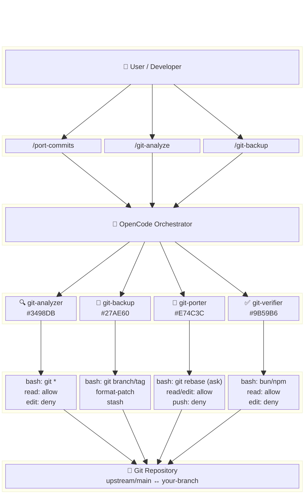
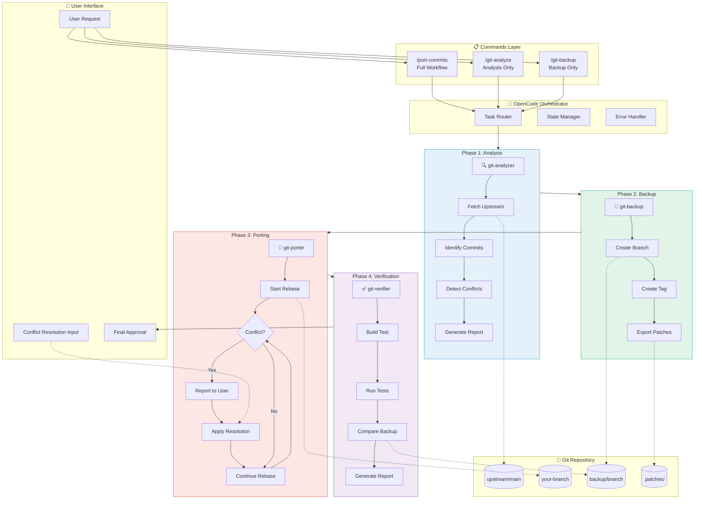
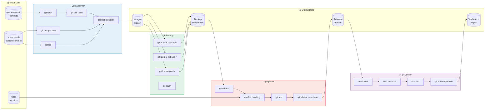
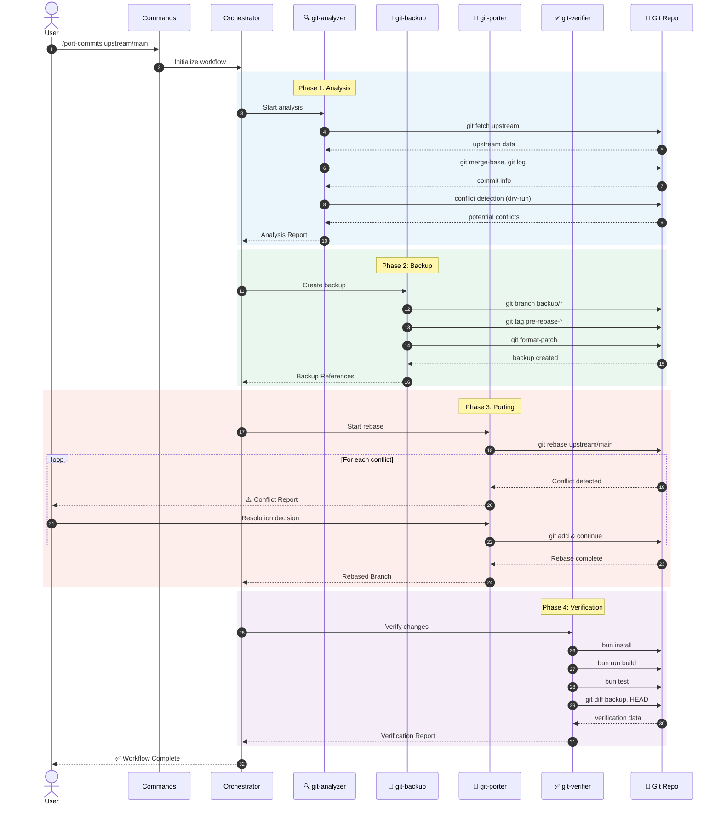
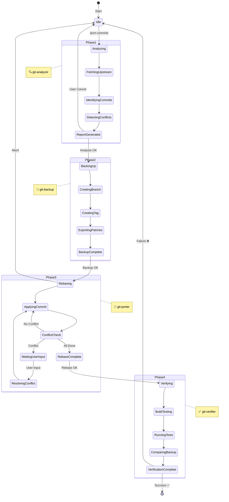
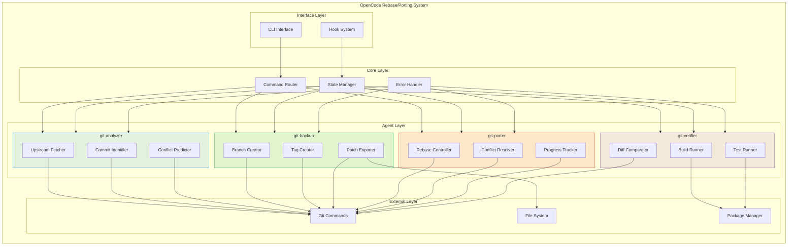

# Git Rebase/Porting Workflow Guide

## Overview

This guide explains how to manage custom commits in Git-based projects using OpenCode, and how to perform rebase and porting operations in response to upstream changes.

---

## Table of Contents

1. [Understanding the Scenario](#1-understanding-the-scenario)
2. [Workflow Design](#2-workflow-design)
3. [Agent Configuration](#3-agent-configuration)
4. [Command Definitions](#4-command-definitions)
5. [Execution Guide](#5-execution-guide)
6. [Troubleshooting](#6-troubleshooting)
7. [Automation Strategy](#7-automation-strategy)
8. [Agent Diagrams](#8-agent-diagrams)

---

## 1. Understanding the Scenario

### 1.1 Common Situation

```
upstream/main ─────●────●────●────●────●────●─────▶ (new commits added)
                   │
                   └────●────●────●─────▶ your-branch (custom commits)
                        ↑    ↑    ↑
                       C1   C2   C3 (commits that need porting)
```

### 1.2 Problems to Solve

1. **Upstream Synchronization**: Fetch latest changes from the original repository
2. **Conflict Resolution**: Handle conflicts occurring during rebase
3. **Commit Porting**: Apply custom commits to the new base
4. **Verification**: Confirm build/test pass after porting

### 1.3 Approach in a Single Model Environment

In a single model environment:
- All agents use the same model
- Sequential processing to manage server load
- Efficiency through clear role assignment

---

## 2. Workflow Design

### 2.1 Overall Process

```
┌─────────────────────────────────────────────────────────────────┐
│                    Git Rebase/Porting Workflow                   │
├─────────────────────────────────────────────────────────────────┤
│                                                                  │
│  Phase 1: Analysis                                               │
│  ┌─────────────────────────────────────────────────────────┐    │
│  │  1. Fetch upstream changes                               │    │
│  │  2. Identify custom commits                              │    │
│  │  3. Detect potential conflicts                           │    │
│  │  4. Generate analysis report                             │    │
│  └─────────────────────────────────────────────────────────┘    │
│                              │                                   │
│                              ▼                                   │
│  Phase 2: Backup                                                 │
│  ┌─────────────────────────────────────────────────────────┐    │
│  │  1. Create backup branch                                 │    │
│  │  2. Tag current state                                    │    │
│  │  3. Export patch files (optional)                        │    │
│  └─────────────────────────────────────────────────────────┘    │
│                              │                                   │
│                              ▼                                   │
│  Phase 3: Porting                                                │
│  ┌─────────────────────────────────────────────────────────┐    │
│  │  1. Start rebase onto upstream                           │    │
│  │  2. Resolve conflicts (with human help)                  │    │
│  │  3. Continue until complete                              │    │
│  └─────────────────────────────────────────────────────────┘    │
│                              │                                   │
│                              ▼                                   │
│  Phase 4: Verification                                           │
│  ┌─────────────────────────────────────────────────────────┐    │
│  │  1. Build test                                           │    │
│  │  2. Run test suite                                       │    │
│  │  3. Compare with backup                                  │    │
│  │  4. Generate verification report                         │    │
│  └─────────────────────────────────────────────────────────┘    │
│                                                                  │
└─────────────────────────────────────────────────────────────────┘
```

### 2.2 Agent Role Assignment

| Agent | Phase | Role |
|-------|-------|------|
| `git-analyzer` | 1 | Status analysis, conflict prediction |
| `git-backup` | 2 | Backup creation, patch extraction |
| `git-porter` | 3 | Rebase execution, conflict resolution support |
| `git-verifier` | 4 | Build/test, result verification |

---

## 3. Agent Configuration

### 3.1 Git Analyzer

`.opencode/agent/git-analyzer.md`:
```markdown
---
description: Git status analysis and rebase necessity assessment
mode: subagent
color: "#3498DB"
permission:
  bash:
    "git *": allow
    "*": deny
  read: allow
  edit: deny
  glob: allow
  grep: allow
---

# Git Analyzer

You are a Git repository analysis expert.

## Role

1. **Upstream Change Analysis**
   - Number of new commits
   - List of changed files
   - Summary of major changes

2. **Custom Commit Identification**
   - List of commits diverged from upstream
   - Changes in each commit
   - List of affected files

3. **Conflict Prediction**
   - Whether same files were modified
   - Identify files with high conflict potential
   - Severity assessment

## Analysis Commands

```bash
# Update upstream
git fetch upstream

# Find divergence point
git merge-base HEAD upstream/main

# Custom commit list
git log --oneline $(git merge-base HEAD upstream/main)..HEAD

# Compare changed files
git diff --stat upstream/main

# Conflict prediction (dry-run)
git merge --no-commit --no-ff upstream/main 2>&1 || true
git merge --abort 2>/dev/null || true
```

## Output Format

### Analysis Report

**Upstream Status:**
- Last sync: [date]
- New commits: [N]
- Major changes: [summary]

**Custom Commits:**
| # | Hash | Description | Changed Files |
|---|------|-------------|---------------|
| 1 | abc1234 | ... | 3 |

**Conflict Prediction:**
- High Risk: [file list]
- Caution: [file list]
- Safe: [file list]

**Recommended Action:**
[Recommended method among rebase/merge/cherry-pick]
```

### 3.2 Git Backup

`.opencode/agent/git-backup.md`:
```markdown
---
description: Git backup creation and patch extraction
mode: subagent
color: "#27AE60"
permission:
  bash:
    "git branch *": allow
    "git tag *": allow
    "git format-patch *": allow
    "git stash *": allow
    "mkdir *": allow
    "*": deny
  read: allow
  edit: deny
  external_directory:
    "*": ask
---

# Git Backup Manager

You are a Git backup expert.

## Role

1. **Create backup branch**
2. **Create state tag**
3. **Extract patch files**
4. **Save work in progress (stash)**

## Backup Procedure

### 1. Backup Branch

```bash
# Create backup branch with current date
git branch backup/$(date +%Y%m%d-%H%M%S)

# Or with descriptive name
git branch backup/before-rebase-$(date +%Y%m%d)
```

### 2. Create Tag

```bash
# Tag current state
git tag -a pre-rebase-$(date +%Y%m%d) -m "Before rebase to upstream"
```

### 3. Extract Patches

```bash
# Create patch directory
mkdir -p .patches/$(date +%Y%m%d)

# Extract custom commits as patches
git format-patch $(git merge-base HEAD upstream/main)..HEAD -o .patches/$(date +%Y%m%d)
```

### 4. Stash Work in Progress

```bash
# Save work in progress
git stash push -m "WIP before rebase $(date +%Y%m%d)"
```

## Output Format

### Backup Completion Report

**Created Backups:**
- Branch: `backup/YYYYMMDD-HHMMSS`
- Tag: `pre-rebase-YYYYMMDD`
- Patch files: `.patches/YYYYMMDD/` (N files)

**Recovery Methods:**
```bash
# Recover from branch
git checkout backup/YYYYMMDD-HHMMSS

# Recover from tag
git checkout pre-rebase-YYYYMMDD

# Recover from patches
git am .patches/YYYYMMDD/*.patch
```
```

### 3.3 Git Porter

`.opencode/agent/git-porter.md`:
```markdown
---
description: Git rebase and commit porting expert
mode: subagent
color: "#E74C3C"
permission:
  bash:
    "git rebase *": ask
    "git cherry-pick *": ask
    "git checkout *": allow
    "git status": allow
    "git diff *": allow
    "git log *": allow
    "git add *": allow
    "git rebase --continue": ask
    "git rebase --abort": allow
    "git push *": deny
    "git push --force *": deny
    "*": deny
  read: allow
  edit: allow
  glob: allow
  grep: allow
---

# Git Porter

You are a Git rebase and commit porting expert.

## Core Rules

### Strictly Prohibited
- `git push --force`
- `git reset --hard` (commits synced with remote)
- Automatic conflict resolution without user confirmation

### Always Verify
- Confirm backup before starting rebase
- Report to user when conflicts occur
- Check status after each step completion

## Rebase Workflow

### 1. Preparation

```bash
# Check status
git status

# Check work in progress
git stash list

# Check current position
git log --oneline -5
```

### 2. Start Rebase

```bash
# Interactive rebase (recommended)
git rebase -i upstream/main

# Or standard rebase
git rebase upstream/main
```

### 3. Conflict Handling

When conflicts occur:

```bash
# Check conflicting files
git status

# Review conflict contents
git diff

# === Report to User ===
# Clearly explain conflicting files and contents
# Suggest resolution approaches
# Proceed after user confirmation
```

After resolving conflicts:

```bash
# Add resolved files
git add <resolved-files>

# Continue rebase
git rebase --continue
```

### 4. When Abort is Needed

```bash
# Cancel rebase
git rebase --abort
```

## Conflict Resolution Guide

### Auto-resolvable Cases
- Import order changes
- Simple line additions/deletions
- Whitespace/formatting differences

### Manual Resolution Required
- Same logic with different implementation
- Mismatch due to API changes
- Modifications to deleted files

## Output Format

### Progress Report

**Rebase Status:**
- Total: N commits
- Completed: M
- Current: [commit hash] - [description]

**When Conflict Occurs:**
```
⚠️ Conflict Detected

File: src/example.ts

Conflict Content:
<<<<<<< HEAD
// upstream version
=======
// custom version
>>>>>>> [commit]

Recommended Resolution:
[Specific resolution approach]

Please confirm to continue.
```
```

### 3.4 Git Verifier

`.opencode/agent/git-verifier.md`:
```markdown
---
description: Porting result verification expert
mode: subagent
color: "#9B59B6"
permission:
  bash:
    "bun *": allow
    "npm *": allow
    "pnpm *": allow
    "yarn *": allow
    "git diff *": allow
    "git log *": allow
    "git status": allow
    "*": deny
  read: allow
  edit: deny
  glob: allow
  grep: allow
---

# Git Verifier

You are a code change verification expert.

## Role

1. **Build verification**
2. **Test execution**
3. **Change comparison**
4. **Regression testing**

## Verification Procedure

### 1. Build Test

```bash
# Install dependencies
bun install

# Type check
bun run typecheck

# Build
bun run build
```

### 2. Run Tests

```bash
# Full test suite
bun test

# Or specific tests
bun test --filter "affected-module"
```

### 3. Compare Changes

```bash
# Compare with backup branch
git diff backup/YYYYMMDD..HEAD --stat

# Check for unintended changes
git diff backup/YYYYMMDD..HEAD -- "*.ts" "*.json"
```

### 4. Check Commit History

```bash
# Verify ported commits
git log --oneline upstream/main..HEAD

# Review commit contents
git log -p upstream/main..HEAD
```

## Verification Items

| Item | Method | Pass Criteria |
|------|--------|---------------|
| Build | `bun run build` | 0 errors |
| Types | `bun run typecheck` | 0 errors |
| Tests | `bun test` | All pass |
| Lint | `bun run lint` | 0 errors |

## Output Format

### Verification Report

**Build Results:**
- [ ] Dependency install: ✅/❌
- [ ] Type check: ✅/❌
- [ ] Build: ✅/❌

**Test Results:**
- Total: N
- Passed: M
- Failed: K
- Skipped: L

**Change Summary:**
- Added files: N
- Modified files: M
- Deleted files: K

**Commit History:**
| # | Hash | Description | Status |
|---|------|-------------|--------|
| 1 | abc1234 | ... | ✅ Ported |

**Final Result:** ✅ Verification Passed / ❌ Verification Failed

**Recommended Actions on Failure:**
[Specific remediation steps]
```

---

## 4. Command Definitions

### 4.1 Full Workflow Command

`.opencode/command/port-commits.md`:
```markdown
---
description: "Full upstream rebase and commit porting process"
---

# Git Rebase/Porting Workflow

$ARGUMENTS

## Execution Steps

### Phase 1: Analysis
Call @git-analyzer to:
1. Execute `git fetch upstream`
2. Compare upstream with current branch
3. Extract custom commit list
4. Analyze conflict potential

### Phase 2: Backup
Call @git-backup to:
1. Create backup branch
2. Create tag
3. Extract patch files

### Phase 3: Porting
Call @git-porter to:
1. Start rebase
2. Report to user when conflicts occur
3. Continue after resolution

### Phase 4: Verification
Call @git-verifier to:
1. Build test
2. Run test suite
3. Report results

## Important Rules

- **No automatic resolution** when conflicts occur
- **Status report** after each step completion
- **Immediate stop** when problems arise
```

### 4.2 Individual Step Commands

`.opencode/command/git-analyze.md`:
```markdown
---
description: "Git status analysis"
---

Call @git-analyzer to analyze the current Git status.

$ARGUMENTS

Analysis targets:
- upstream changes
- custom commit list
- conflict potential
```

`.opencode/command/git-backup.md`:
```markdown
---
description: "Git backup creation"
---

Call @git-backup to back up the current state.

$ARGUMENTS

Backup items:
- Branch
- Tag
- Patch files
```

---

## 5. Execution Guide

### 5.1 Basic Usage

```bash
# Execute full workflow
/port-commits rebase onto upstream/main

# Run analysis only
/git-analyze check upstream changes

# Run backup only
/git-backup backup current state
```

### 5.2 Step-by-Step Manual Execution

```
# Step 1: Analysis
@git-analyzer Please analyze upstream/main and the current branch.

# Step 2: Backup after reviewing analysis results
@git-backup Please back up the current state.

# Step 3: Rebase after confirming backup
@git-porter Please start rebase onto upstream/main.

# Step 4: Conflict resolution (manual)
# ... User resolves conflicts directly ...

# Step 5: Verification
@git-verifier Please run build and tests.
```

### 5.3 Handling Conflicts

```
# In conflict state
@git-porter Please analyze the conflict contents and suggest resolution approaches.

# After resolution
@git-porter Please execute git rebase --continue.

# When abort is needed
@git-porter Please abort the rebase.
```

---

## 6. Troubleshooting

### 6.1 Common Issues

#### Complex Conflicts During Rebase

```
Solution:
1. Cancel with git rebase --abort
2. Apply one by one with git cherry-pick
3. Resolve conflicts for each commit
```

#### Recovering from a Bad Rebase

```bash
# Recover from backup branch
git checkout backup/YYYYMMDD-HHMMSS
git branch -D feature-branch
git checkout -b feature-branch

# Or use reflog
git reflog
git reset --hard HEAD@{N}
```

#### Patch Application Failure

```bash
# Verify patch
git apply --check .patches/YYYYMMDD/0001-*.patch

# Apply with 3-way merge
git am -3 .patches/YYYYMMDD/*.patch

# Manual application on failure
git apply --reject .patches/YYYYMMDD/0001-*.patch
# Check .rej files and manually fix
```

### 6.2 Preventive Measures

1. **Always backup first**
2. **Rebase in small units**
3. **Regular upstream synchronization**
4. **Sufficient information in commit messages**

---

## 7. Automation Strategy

### 7.1 Regular Sync Script

```bash
#!/bin/bash
# sync-upstream.sh

# 1. Fetch
git fetch upstream

# 2. Check for changes
BEHIND=$(git rev-list HEAD..upstream/main --count)
if [ "$BEHIND" -eq "0" ]; then
    echo "Already up to date"
    exit 0
fi

echo "Behind by $BEHIND commits"

# 3. Notify (handled by OpenCode)
echo "Run: /port-commits upstream/main"
```

### 7.2 CI/CD Integration

```yaml
# .github/workflows/sync-check.yml
name: Upstream Sync Check

on:
  schedule:
    - cron: '0 9 * * 1'  # Every Monday at 9 AM
  workflow_dispatch:

jobs:
  check:
    runs-on: ubuntu-latest
    steps:
      - uses: actions/checkout@v4
        with:
          fetch-depth: 0

      - name: Add upstream
        run: git remote add upstream https://github.com/original/repo.git

      - name: Fetch upstream
        run: git fetch upstream

      - name: Check divergence
        run: |
          BEHIND=$(git rev-list HEAD..upstream/main --count)
          echo "Behind upstream by $BEHIND commits"
          if [ "$BEHIND" -gt "0" ]; then
            echo "::warning::Branch is $BEHIND commits behind upstream"
          fi
```

### 7.3 Notification Setup

Notifications using OpenCode hooks:

```json
{
  "experimental": {
    "hook": {
      "session_completed": [
        {
          "command": ["./scripts/notify-slack.sh"],
          "environment": {
            "SLACK_WEBHOOK": "{env:SLACK_WEBHOOK}"
          }
        }
      ]
    }
  }
}
```

---

## 8. Agent Diagrams

This section visualizes the Agent configuration and data flow of the Git Rebase/Porting workflow.

### 8.1 Agent Architecture Block Diagram (TB)



### 8.2 Flowchart Block Diagram (TB)



### 8.3 Data Flow Diagram



### 8.4 Sequence Diagram (Data Flow Timeline)



### 8.5 Agent Permission Matrix

| Agent | Phase | bash | read | edit | glob | grep | Special Restrictions |
|-------|-------|------|------|------|------|------|---------------------|
| **git-analyzer** | 1 | `git *` ✅ | ✅ | ❌ | ✅ | ✅ | Read-only |
| **git-backup** | 2 | `git branch/tag` ✅ | ✅ | ❌ | - | - | `external_directory: ask` |
| **git-porter** | 3 | `git rebase` 🔶ask | ✅ | ✅ | ✅ | ✅ | `push: deny`, `push --force: deny` |
| **git-verifier** | 4 | `bun/npm/yarn` ✅ | ✅ | ❌ | ✅ | ✅ | Build/test only |

### 8.6 State Machine Diagram



### 8.7 Component Interaction Block Diagram



### 8.8 Summary Table

| Component | Description | Color Code |
|-----------|-------------|------------|
| **git-analyzer** | Status analysis, conflict prediction, report generation | `#3498DB` (Blue) |
| **git-backup** | Backup branch/tag creation, patch extraction | `#27AE60` (Green) |
| **git-porter** | Rebase execution, conflict resolution support | `#E74C3C` (Red) |
| **git-verifier** | Build/test execution, result verification | `#9B59B6` (Purple) |

---

## Related Documents

- [Custom Agent Guide](./02-custom-agent-guide.en.md)
- [MCP Connection Guide](./01-mcp-connection-guide.en.md)
- [External Tools Usage Guide](./03-external-tools-guide.en.md)