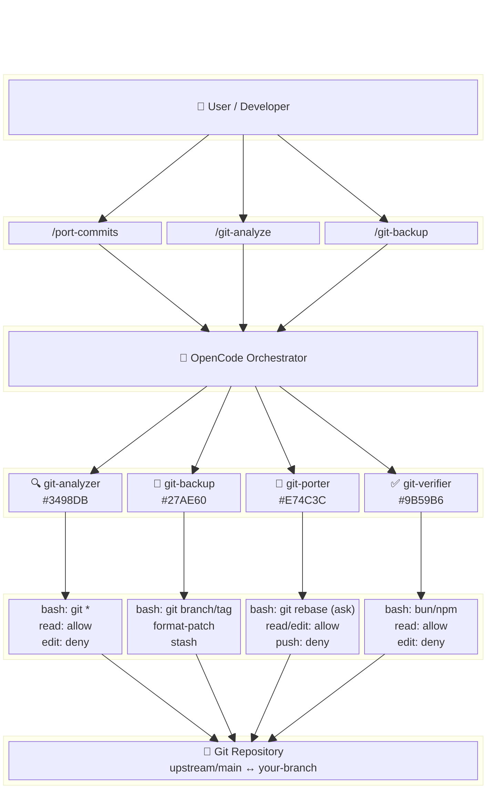
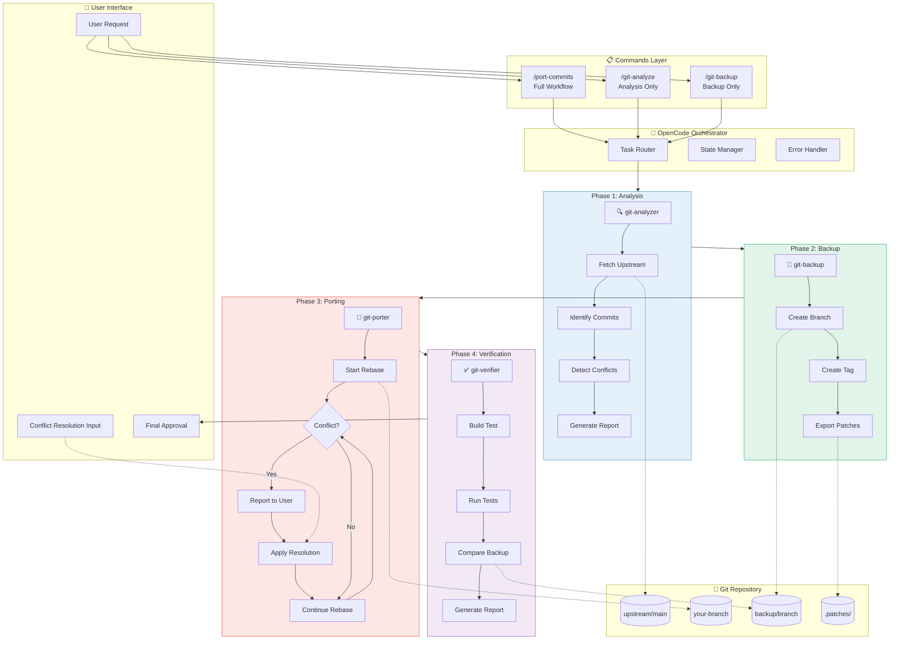
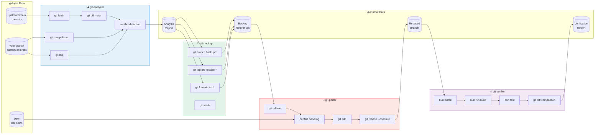
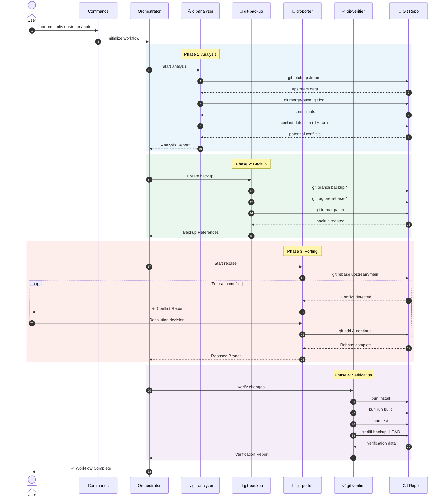
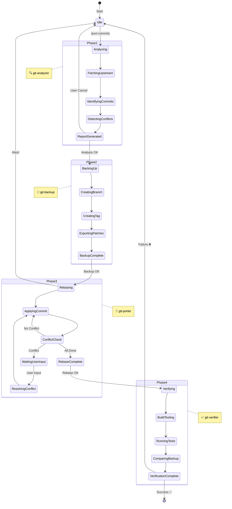
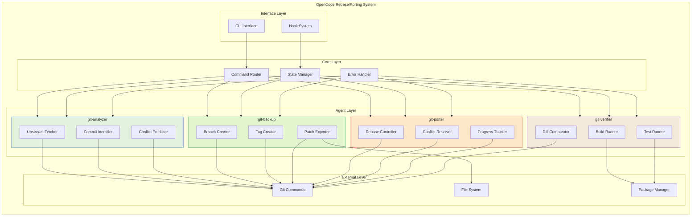

# Git Rebase/Porting 워크플로우 가이드

## 개요

이 가이드는 OpenCode를 활용하여 Git 기반 프로젝트에서 커스텀 커밋을 관리하고, upstream 변경사항에 대응하여 rebase 및 포팅 작업을 수행하는 방법을 설명합니다.

---

## 목차

1. [시나리오 이해](#1-시나리오-이해)
2. [워크플로우 설계](#2-워크플로우-설계)
3. [에이전트 구성](#3-에이전트-구성)
4. [Command 정의](#4-command-정의)
5. [실행 가이드](#5-실행-가이드)
6. [문제 해결](#6-문제-해결)
7. [자동화 전략](#7-자동화-전략)
8. [Agent 다이어그램](#8-agent-다이어그램)

---

## 1. 시나리오 이해

### 1.1 일반적인 상황

```
upstream/main ─────●────●────●────●────●────●─────▶ (새 커밋 추가됨)
                   │
                   └────●────●────●─────▶ your-branch (custom commits)
                        ↑    ↑    ↑
                       C1   C2   C3 (포팅 필요한 커밋)
```

### 1.2 해결해야 할 문제

1. **Upstream 동기화**: 원본 저장소의 최신 변경사항 가져오기
2. **충돌 해결**: Rebase 중 발생하는 충돌 처리
3. **커밋 포팅**: Custom 커밋을 새로운 베이스에 적용
4. **검증**: 포팅 후 빌드/테스트 통과 확인

### 1.3 단일 모델 환경에서의 접근

단일 모델 환경에서는:
- 모든 에이전트가 동일 모델 사용
- 순차적 처리로 서버 부하 관리
- 명확한 역할 분담으로 효율성 확보

---

## 2. 워크플로우 설계

### 2.1 전체 프로세스

```
┌─────────────────────────────────────────────────────────────────┐
│                    Git Rebase/Porting Workflow                   │
├─────────────────────────────────────────────────────────────────┤
│                                                                  │
│  Phase 1: Analysis (분석)                                        │
│  ┌─────────────────────────────────────────────────────────┐    │
│  │  1. Fetch upstream changes                               │    │
│  │  2. Identify custom commits                              │    │
│  │  3. Detect potential conflicts                           │    │
│  │  4. Generate analysis report                             │    │
│  └─────────────────────────────────────────────────────────┘    │
│                              │                                   │
│                              ▼                                   │
│  Phase 2: Backup (백업)                                          │
│  ┌─────────────────────────────────────────────────────────┐    │
│  │  1. Create backup branch                                 │    │
│  │  2. Tag current state                                    │    │
│  │  3. Export patch files (optional)                        │    │
│  └─────────────────────────────────────────────────────────┘    │
│                              │                                   │
│                              ▼                                   │
│  Phase 3: Porting (포팅)                                         │
│  ┌─────────────────────────────────────────────────────────┐    │
│  │  1. Start rebase onto upstream                           │    │
│  │  2. Resolve conflicts (with human help)                  │    │
│  │  3. Continue until complete                              │    │
│  └─────────────────────────────────────────────────────────┘    │
│                              │                                   │
│                              ▼                                   │
│  Phase 4: Verification (검증)                                    │
│  ┌─────────────────────────────────────────────────────────┐    │
│  │  1. Build test                                           │    │
│  │  2. Run test suite                                       │    │
│  │  3. Compare with backup                                  │    │
│  │  4. Generate verification report                         │    │
│  └─────────────────────────────────────────────────────────┘    │
│                                                                  │
└─────────────────────────────────────────────────────────────────┘
```

### 2.2 에이전트 역할 분담

| 에이전트 | Phase | 역할 |
|----------|-------|------|
| `git-analyzer` | 1 | 상태 분석, 충돌 예측 |
| `git-backup` | 2 | 백업 생성, 패치 추출 |
| `git-porter` | 3 | Rebase 수행, 충돌 해결 지원 |
| `git-verifier` | 4 | 빌드/테스트, 결과 검증 |

---

## 3. 에이전트 구성

### 3.1 Git Analyzer

`.opencode/agent/git-analyzer.md`:
```markdown
---
description: Git 상태 분석 및 rebase 필요성 판단
mode: subagent
color: "#3498DB"
permission:
  bash:
    "git *": allow
    "*": deny
  read: allow
  edit: deny
  glob: allow
  grep: allow
---

# Git Analyzer

당신은 Git 저장소 분석 전문가입니다.

## 역할

1. **Upstream 변경사항 분석**
   - 새로운 커밋 수
   - 변경된 파일 목록
   - 주요 변경 내용 요약

2. **Custom 커밋 식별**
   - upstream과 분기된 커밋 목록
   - 각 커밋의 변경 내용
   - 영향받는 파일 목록

3. **충돌 예측**
   - 동일 파일 수정 여부
   - 충돌 가능성 높은 파일 식별
   - 심각도 평가

## 분석 명령어

```bash
# Upstream 업데이트
git fetch upstream

# 분기점 확인
git merge-base HEAD upstream/main

# Custom 커밋 목록
git log --oneline $(git merge-base HEAD upstream/main)..HEAD

# 변경 파일 비교
git diff --stat upstream/main

# 충돌 예측 (dry-run)
git merge --no-commit --no-ff upstream/main 2>&1 || true
git merge --abort 2>/dev/null || true
```

## 출력 형식

### 분석 보고서

**Upstream 상태:**
- 마지막 동기화: [날짜]
- 새 커밋 수: [N]개
- 주요 변경: [요약]

**Custom 커밋:**
| # | Hash | 설명 | 변경 파일 |
|---|------|------|----------|
| 1 | abc1234 | ... | 3개 |

**충돌 예측:**
- 위험: [파일 목록]
- 주의: [파일 목록]
- 안전: [파일 목록]

**권장 조치:**
[rebase/merge/cherry-pick 중 권장 방법]
```

### 3.2 Git Backup

`.opencode/agent/git-backup.md`:
```markdown
---
description: Git 백업 생성 및 패치 추출
mode: subagent
color: "#27AE60"
permission:
  bash:
    "git branch *": allow
    "git tag *": allow
    "git format-patch *": allow
    "git stash *": allow
    "mkdir *": allow
    "*": deny
  read: allow
  edit: deny
  external_directory:
    "*": ask
---

# Git Backup Manager

당신은 Git 백업 전문가입니다.

## 역할

1. **백업 브랜치 생성**
2. **상태 태그 생성**
3. **패치 파일 추출**
4. **작업 내용 저장 (stash)**

## 백업 절차

### 1. 백업 브랜치

```bash
# 현재 날짜로 백업 브랜치 생성
git branch backup/$(date +%Y%m%d-%H%M%S)

# 또는 설명적 이름
git branch backup/before-rebase-$(date +%Y%m%d)
```

### 2. 태그 생성

```bash
# 현재 상태 태그
git tag -a pre-rebase-$(date +%Y%m%d) -m "Before rebase to upstream"
```

### 3. 패치 추출

```bash
# 패치 디렉토리 생성
mkdir -p .patches/$(date +%Y%m%d)

# Custom 커밋을 패치로 추출
git format-patch $(git merge-base HEAD upstream/main)..HEAD -o .patches/$(date +%Y%m%d)
```

### 4. Stash 작업 내용

```bash
# 작업 중인 내용 저장
git stash push -m "WIP before rebase $(date +%Y%m%d)"
```

## 출력 형식

### 백업 완료 보고서

**생성된 백업:**
- 브랜치: `backup/YYYYMMDD-HHMMSS`
- 태그: `pre-rebase-YYYYMMDD`
- 패치 파일: `.patches/YYYYMMDD/` (N개)

**복구 방법:**
```bash
# 브랜치로 복구
git checkout backup/YYYYMMDD-HHMMSS

# 태그로 복구
git checkout pre-rebase-YYYYMMDD

# 패치로 복구
git am .patches/YYYYMMDD/*.patch
```
```

### 3.3 Git Porter

`.opencode/agent/git-porter.md`:
```markdown
---
description: Git rebase 및 커밋 포팅 전문가
mode: subagent
color: "#E74C3C"
permission:
  bash:
    "git rebase *": ask
    "git cherry-pick *": ask
    "git checkout *": allow
    "git status": allow
    "git diff *": allow
    "git log *": allow
    "git add *": allow
    "git rebase --continue": ask
    "git rebase --abort": allow
    "git push *": deny
    "git push --force *": deny
    "*": deny
  read: allow
  edit: allow
  glob: allow
  grep: allow
---

# Git Porter

당신은 Git rebase 및 커밋 포팅 전문가입니다.

## 핵심 규칙

### 절대 금지
- `git push --force`
- `git reset --hard` (원격과 동기화된 커밋)
- 사용자 확인 없이 자동 충돌 해결

### 항상 확인
- Rebase 시작 전 백업 확인
- 충돌 발생 시 사용자에게 보고
- 각 단계 완료 후 상태 확인

## Rebase 워크플로우

### 1. 사전 준비

```bash
# 상태 확인
git status

# 작업 내용 확인
git stash list

# 현재 위치 확인
git log --oneline -5
```

### 2. Rebase 시작

```bash
# Interactive rebase (권장)
git rebase -i upstream/main

# 또는 일반 rebase
git rebase upstream/main
```

### 3. 충돌 처리

충돌 발생 시:

```bash
# 충돌 파일 확인
git status

# 충돌 내용 확인
git diff

# === 사용자에게 보고 ===
# 충돌 파일과 내용을 명확히 설명
# 해결 방안 제시
# 사용자 확인 후 진행
```

충돌 해결 후:

```bash
# 수정된 파일 추가
git add <resolved-files>

# Rebase 계속
git rebase --continue
```

### 4. 중단 필요 시

```bash
# Rebase 취소
git rebase --abort
```

## 충돌 해결 가이드

### 자동 해결 가능한 경우
- import 순서 변경
- 단순 줄 추가/삭제
- 공백/포맷팅 차이

### 수동 해결 필요한 경우
- 동일 로직 다른 구현
- API 변경으로 인한 불일치
- 삭제된 파일에 대한 수정

## 출력 형식

### 진행 상황 보고

**Rebase 상태:**
- 전체: N개 커밋
- 완료: M개
- 현재: [커밋 해시] - [설명]

**충돌 발생 시:**
```
⚠️ 충돌 발생

파일: src/example.ts

충돌 내용:
<<<<<<< HEAD
// upstream 버전
=======
// custom 버전
>>>>>>> [commit]

권장 해결 방법:
[구체적인 해결 방안]

계속하려면 확인해주세요.
```
```

### 3.4 Git Verifier

`.opencode/agent/git-verifier.md`:
```markdown
---
description: 포팅 결과 검증 전문가
mode: subagent
color: "#9B59B6"
permission:
  bash:
    "bun *": allow
    "npm *": allow
    "pnpm *": allow
    "yarn *": allow
    "git diff *": allow
    "git log *": allow
    "git status": allow
    "*": deny
  read: allow
  edit: deny
  glob: allow
  grep: allow
---

# Git Verifier

당신은 코드 변경 검증 전문가입니다.

## 역할

1. **빌드 검증**
2. **테스트 실행**
3. **변경사항 비교**
4. **회귀 검사**

## 검증 절차

### 1. 빌드 테스트

```bash
# 의존성 설치
bun install

# 타입 체크
bun run typecheck

# 빌드
bun run build
```

### 2. 테스트 실행

```bash
# 전체 테스트
bun test

# 또는 특정 테스트
bun test --filter "affected-module"
```

### 3. 변경사항 비교

```bash
# 백업 브랜치와 비교
git diff backup/YYYYMMDD..HEAD --stat

# 의도하지 않은 변경 확인
git diff backup/YYYYMMDD..HEAD -- "*.ts" "*.json"
```

### 4. 커밋 히스토리 확인

```bash
# 포팅된 커밋 확인
git log --oneline upstream/main..HEAD

# 커밋 내용 확인
git log -p upstream/main..HEAD
```

## 검증 항목

| 항목 | 확인 방법 | 통과 기준 |
|------|----------|----------|
| 빌드 | `bun run build` | 에러 0 |
| 타입 | `bun run typecheck` | 에러 0 |
| 테스트 | `bun test` | 모두 통과 |
| 린트 | `bun run lint` | 에러 0 |

## 출력 형식

### 검증 보고서

**빌드 결과:**
- [ ] 의존성 설치: ✅/❌
- [ ] 타입 체크: ✅/❌
- [ ] 빌드: ✅/❌

**테스트 결과:**
- 전체: N개
- 통과: M개
- 실패: K개
- 스킵: L개

**변경사항 요약:**
- 추가된 파일: N개
- 수정된 파일: M개
- 삭제된 파일: K개

**커밋 히스토리:**
| # | Hash | 설명 | 상태 |
|---|------|------|------|
| 1 | abc1234 | ... | ✅ 포팅됨 |

**최종 결과:** ✅ 검증 통과 / ❌ 검증 실패

**실패 시 권장 조치:**
[구체적인 수정 방안]
```

---

## 4. Command 정의

### 4.1 전체 워크플로우 Command

`.opencode/command/port-commits.md`:
```markdown
---
description: "Upstream rebase 및 커밋 포팅 전체 프로세스"
---

# Git Rebase/Porting 워크플로우

$ARGUMENTS

## 실행 단계

### Phase 1: 분석
@git-analyzer를 호출하여:
1. `git fetch upstream` 실행
2. upstream과 현재 브랜치 비교
3. custom 커밋 목록 추출
4. 충돌 가능성 분석

### Phase 2: 백업
@git-backup을 호출하여:
1. 백업 브랜치 생성
2. 태그 생성
3. 패치 파일 추출

### Phase 3: 포팅
@git-porter를 호출하여:
1. rebase 시작
2. 충돌 발생 시 사용자에게 보고
3. 해결 후 계속 진행

### Phase 4: 검증
@git-verifier를 호출하여:
1. 빌드 테스트
2. 테스트 스위트 실행
3. 결과 보고

## 중요 규칙

- 충돌 발생 시 **자동 해결 금지**
- 각 단계 완료 후 **상태 보고**
- 문제 발생 시 **즉시 중단**
```

### 4.2 개별 단계 Commands

`.opencode/command/git-analyze.md`:
```markdown
---
description: "Git 상태 분석"
---

@git-analyzer를 호출하여 현재 Git 상태를 분석합니다.

$ARGUMENTS

분석 대상:
- upstream 변경사항
- custom 커밋 목록
- 충돌 가능성
```

`.opencode/command/git-backup.md`:
```markdown
---
description: "Git 백업 생성"
---

@git-backup을 호출하여 현재 상태를 백업합니다.

$ARGUMENTS

백업 항목:
- 브랜치
- 태그
- 패치 파일
```

---

## 5. 실행 가이드

### 5.1 기본 사용법

```bash
# 전체 워크플로우 실행
/port-commits upstream/main으로 rebase

# 분석만 실행
/git-analyze upstream 변경사항 확인

# 백업만 실행
/git-backup 현재 상태 백업
```

### 5.2 단계별 수동 실행

```
# Step 1: 분석
@git-analyzer upstream/main과 현재 브랜치를 분석해주세요.

# Step 2: 분석 결과 확인 후 백업
@git-backup 현재 상태를 백업해주세요.

# Step 3: 백업 확인 후 rebase
@git-porter upstream/main으로 rebase를 시작해주세요.

# Step 4: 충돌 해결 (수동)
# ... 사용자가 직접 충돌 해결 ...

# Step 5: 검증
@git-verifier 빌드와 테스트를 실행해주세요.
```

### 5.3 충돌 발생 시 처리

```
# 충돌 상태에서
@git-porter 충돌 내용을 분석하고 해결 방안을 제시해주세요.

# 해결 후
@git-porter git rebase --continue를 실행해주세요.

# 중단이 필요한 경우
@git-porter rebase를 중단해주세요.
```

---

## 6. 문제 해결

### 6.1 일반적인 문제

#### Rebase 중 복잡한 충돌

```
해결 방법:
1. git rebase --abort으로 취소
2. git cherry-pick으로 하나씩 적용
3. 각 커밋별로 충돌 해결
```

#### 잘못된 rebase 복구

```bash
# 백업 브랜치로 복구
git checkout backup/YYYYMMDD-HHMMSS
git branch -D feature-branch
git checkout -b feature-branch

# 또는 reflog 사용
git reflog
git reset --hard HEAD@{N}
```

#### 패치 적용 실패

```bash
# 패치 확인
git apply --check .patches/YYYYMMDD/0001-*.patch

# 3-way merge로 적용
git am -3 .patches/YYYYMMDD/*.patch

# 실패 시 수동 적용
git apply --reject .patches/YYYYMMDD/0001-*.patch
# .rej 파일 확인 후 수동 수정
```

### 6.2 예방 조치

1. **항상 백업 먼저**
2. **작은 단위로 rebase**
3. **정기적인 upstream 동기화**
4. **커밋 메시지에 충분한 정보**

---

## 7. 자동화 전략

### 7.1 정기 동기화 스크립트

```bash
#!/bin/bash
# sync-upstream.sh

# 1. Fetch
git fetch upstream

# 2. Check for changes
BEHIND=$(git rev-list HEAD..upstream/main --count)
if [ "$BEHIND" -eq "0" ]; then
    echo "Already up to date"
    exit 0
fi

echo "Behind by $BEHIND commits"

# 3. Notify (OpenCode에서 처리)
echo "Run: /port-commits upstream/main"
```

### 7.2 CI/CD 통합

```yaml
# .github/workflows/sync-check.yml
name: Upstream Sync Check

on:
  schedule:
    - cron: '0 9 * * 1'  # 매주 월요일 9시
  workflow_dispatch:

jobs:
  check:
    runs-on: ubuntu-latest
    steps:
      - uses: actions/checkout@v4
        with:
          fetch-depth: 0

      - name: Add upstream
        run: git remote add upstream https://github.com/original/repo.git

      - name: Fetch upstream
        run: git fetch upstream

      - name: Check divergence
        run: |
          BEHIND=$(git rev-list HEAD..upstream/main --count)
          echo "Behind upstream by $BEHIND commits"
          if [ "$BEHIND" -gt "0" ]; then
            echo "::warning::Branch is $BEHIND commits behind upstream"
          fi
```

### 7.3 알림 설정

OpenCode 훅을 활용한 알림:

```json
{
  "experimental": {
    "hook": {
      "session_completed": [
        {
          "command": ["./scripts/notify-slack.sh"],
          "environment": {
            "SLACK_WEBHOOK": "{env:SLACK_WEBHOOK}"
          }
        }
      ]
    }
  }
}
```

---

## 8. Agent 다이어그램

이 섹션은 Git Rebase/Porting 워크플로우의 Agent 구성과 데이터 흐름을 시각화합니다.

### 8.1 Agent Architecture Block Diagram (TB)



### 8.2 Flowchart Block Diagram (TB)



### 8.3 Data Flow Diagram



### 8.4 Sequence Diagram (Data Flow Timeline)



### 8.5 Agent Permission Matrix

| Agent | Phase | bash | read | edit | glob | grep | 특별 제한 |
|-------|-------|------|------|------|------|------|-----------|
| **git-analyzer** | 1 | `git *` ✅ | ✅ | ❌ | ✅ | ✅ | 읽기 전용 |
| **git-backup** | 2 | `git branch/tag` ✅ | ✅ | ❌ | - | - | `external_directory: ask` |
| **git-porter** | 3 | `git rebase` 🔶ask | ✅ | ✅ | ✅ | ✅ | `push: deny`, `push --force: deny` |
| **git-verifier** | 4 | `bun/npm/yarn` ✅ | ✅ | ❌ | ✅ | ✅ | 빌드/테스트만 |

### 8.6 State Machine Diagram



### 8.7 Component Interaction Block Diagram



### 8.8 Summary Table

| 구성 요소 | 설명 | 색상 코드 |
|-----------|------|-----------|
| **git-analyzer** | 상태 분석, 충돌 예측, 보고서 생성 | `#3498DB` (Blue) |
| **git-backup** | 백업 브랜치/태그 생성, 패치 추출 | `#27AE60` (Green) |
| **git-porter** | Rebase 수행, 충돌 해결 지원 | `#E74C3C` (Red) |
| **git-verifier** | 빌드/테스트 실행, 결과 검증 | `#9B59B6` (Purple) |

---

## 관련 문서

- [Custom Agent 가이드](./02-custom-agent-guide.kr.md)
- [MCP 연결 가이드](./01-mcp-connection-guide.kr.md)
- [외부 도구 사용 가이드](./03-external-tools-guide.kr.md)