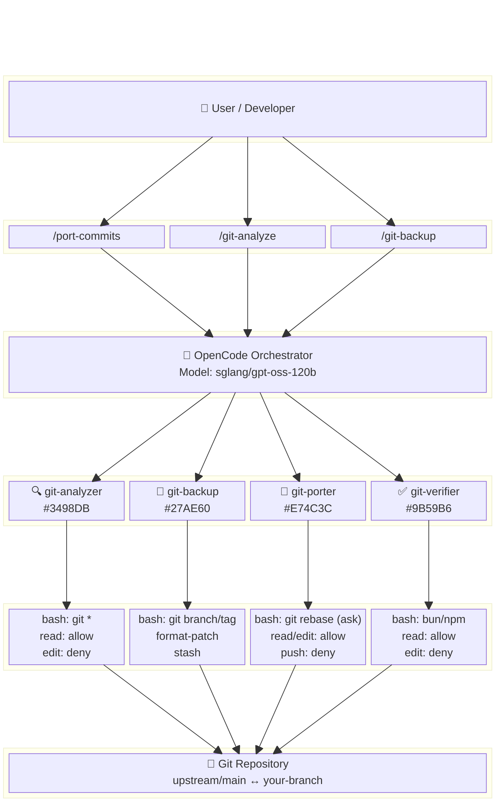
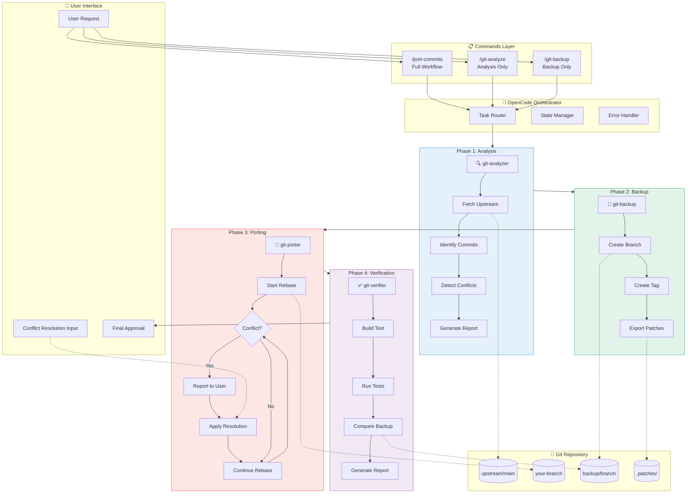
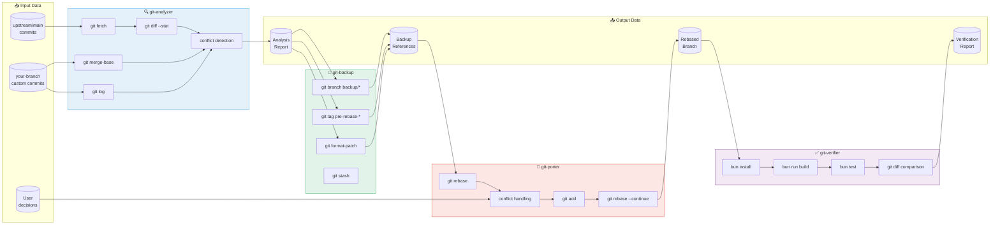
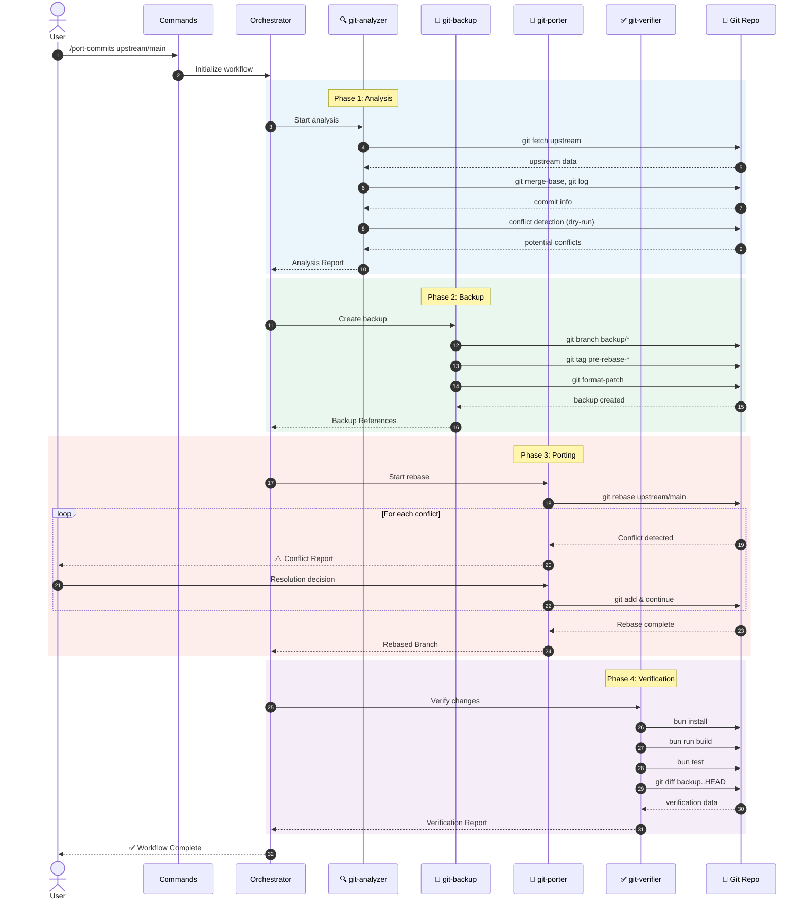
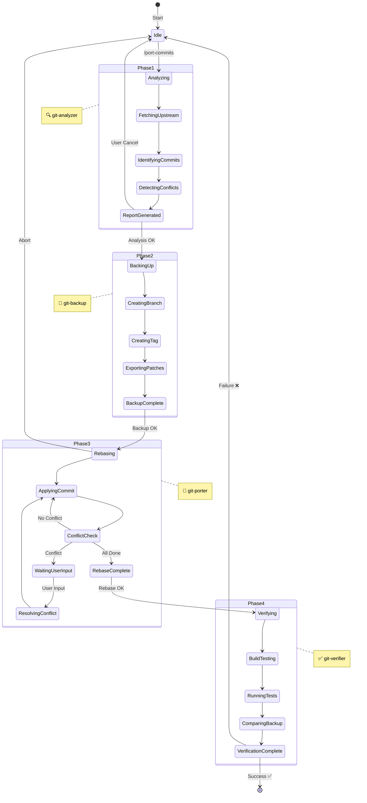
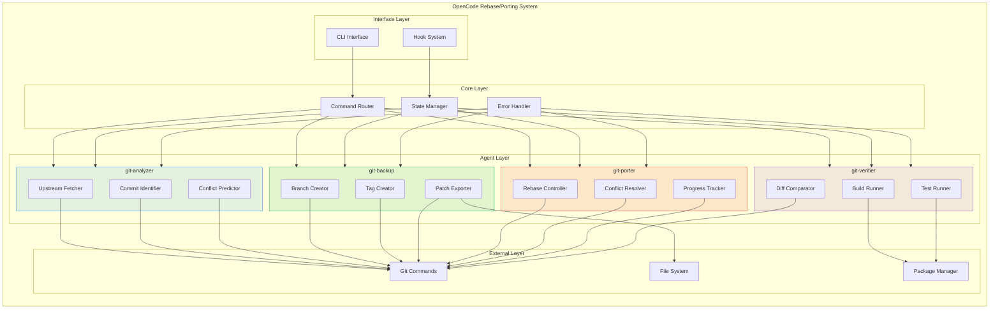

> **Note**: This document references `sglang/gpt-oss-120b` model IDs which are outdated. See [14-code-qa-v4-quick-start.md](./14-code-qa-v4-quick-start.md) for current model configuration.

# Git Rebase/Porting Workflow - Agent 다이어그램

이 문서는 Git Rebase/Porting 워크플로우의 Agent 구성과 데이터 흐름을 시각화합니다.

---

## 1. Agent Architecture Block Diagram (TB)

---

## 2. Flowchart Block Diagram (TB)

---

## 3. Data Flow Diagram

---

## 4. Sequence Diagram (Data Flow Timeline)

---

## 5. Agent Permission Matrix

| Agent | Phase | bash | read | edit | glob | grep | 특별 제한 |
|-------|-------|------|------|------|------|------|-----------|
| **git-analyzer** | 1 | `git *` ✅ | ✅ | ❌ | ✅ | ✅ | 읽기 전용 |
| **git-backup** | 2 | `git branch/tag` ✅ | ✅ | ❌ | - | - | `external_directory: ask` |
| **git-porter** | 3 | `git rebase` 🔶ask | ✅ | ✅ | ✅ | ✅ | `push: deny`, `push --force: deny` |
| **git-verifier** | 4 | `bun/npm/yarn` ✅ | ✅ | ❌ | ✅ | ✅ | 빌드/테스트만 |

---

## 6. State Machine Diagram

---

## 7. Component Interaction Block Diagram

---

## 8. Summary Table

| 구성 요소 | 설명 | 색상 코드 |
|-----------|------|-----------|
| **git-analyzer** | 상태 분석, 충돌 예측, 보고서 생성 | `#3498DB` (Blue) |
| **git-backup** | 백업 브랜치/태그 생성, 패치 추출 | `#27AE60` (Green) |
| **git-porter** | Rebase 수행, 충돌 해결 지원 | `#E74C3C` (Red) |
| **git-verifier** | 빌드/테스트 실행, 결과 검증 | `#9B59B6` (Purple) |

---

## 관련 문서

- [Git Rebase/Porting 워크플로우 가이드](./04-git-rebase-porting-workflow.md)
- [Custom Agent 가이드](./02-custom-agent-guide.md)
- [Code QA v4 Quick Start](./14-code-qa-v4-quick-start.md)
