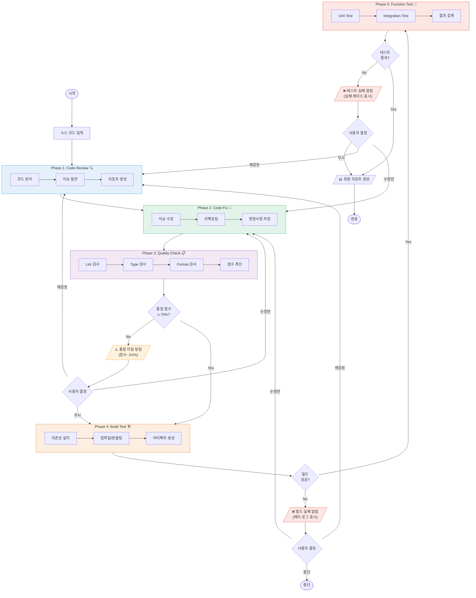
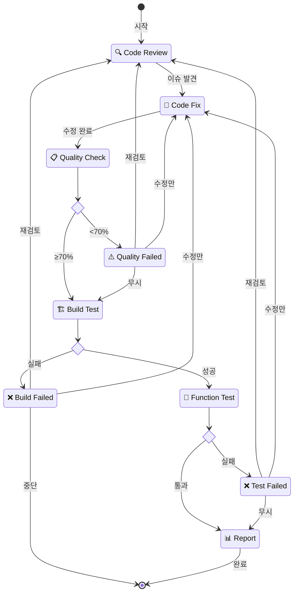
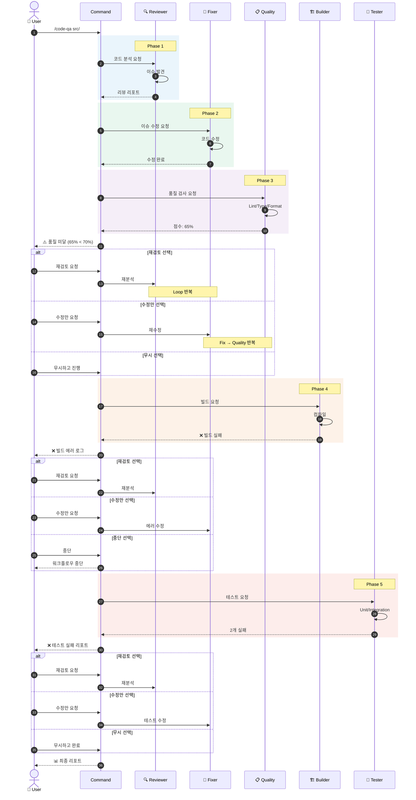
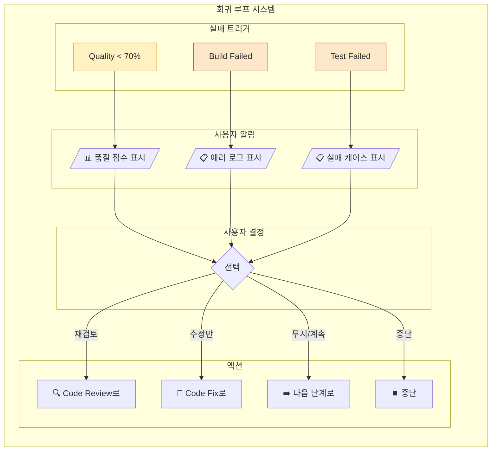
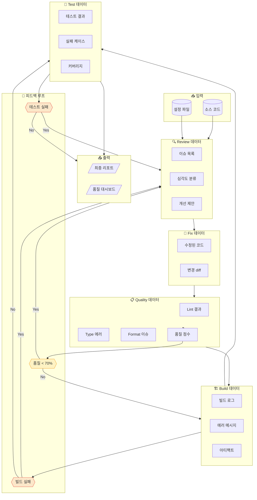
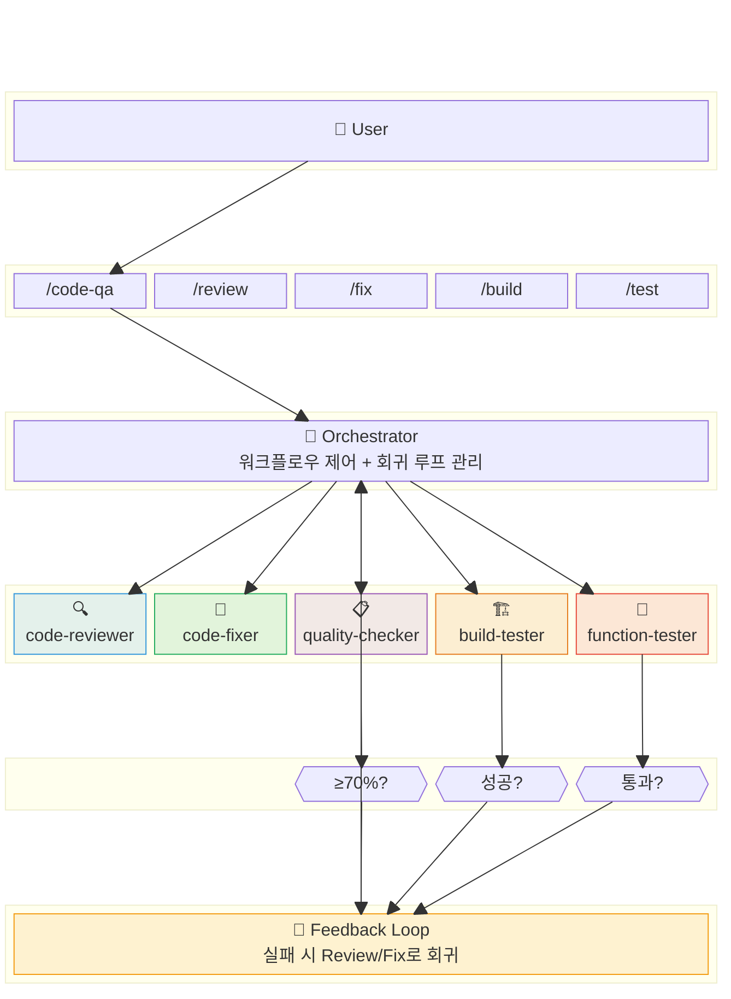
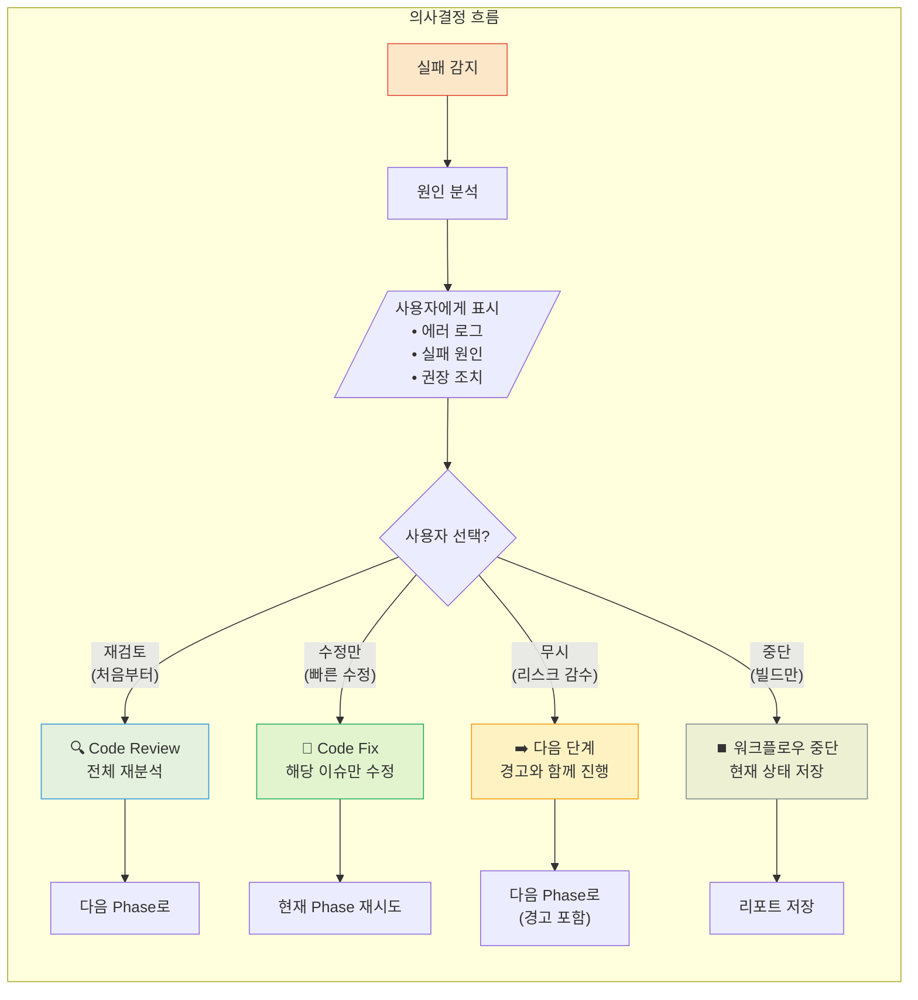

# Code Review 워크플로우 다이어그램

> ⚠️ **참고:** 이 문서는 Code QA v2 기준입니다.
> 최신 버전은 [Code QA v4 (Environment + Sandbox)](./12-environment-setup-workflow.md)를 참조하세요.
>
> **v4 주요 변경사항:**
> - **Phase -1: Environment Setup** - Shell/conda/venv 환경 자동 감지
> - **Docker Sandbox** - Build/Test를 격리된 컨테이너에서 실행 (기본값)
> - **10단계 파이프라인** - Phase -1 ~ Phase 9

---

## 1. 전체 워크플로우 (회귀 루프 포함)

---

## 2. 상태 다이어그램

---

## 3. 시퀀스 다이어그램 (사용자 상호작용 포함)

---

## 4. 회귀 루프 상세 다이어그램

---

## 5. 데이터 플로우 다이어그램

---

## 6. 컴포넌트 블록 다이어그램

---

## 7. 회귀 조건 요약

| Phase | 조건 | 회귀 대상 | 사용자 옵션 |
|-------|------|-----------|-------------|
| **Quality Check** | 점수 < 70% | Review 또는 Fix | 재검토 / 수정만 / 무시 |
| **Build Test** | 빌드 실패 | Review 또는 Fix | 재검토 / 수정만 / 중단 |
| **Function Test** | 테스트 실패 | Review 또는 Fix | 재검토 / 수정만 / 무시 |

---

## 8. 의사결정 플로우

---

## 관련 문서

- [Code Review 워크플로우 가이드](./09-code-review-workflow-guide.md)
- [Code QA v3 (Git 통합)](./11-code-qa-workflow-v3-git-integrated.md)
- [**Code QA v4 (Environment + Sandbox)** ⭐](./12-environment-setup-workflow.md)
- [Git Rebase 워크플로우 다이어그램](./04-git-rebase-workflow-diagrams.md)
