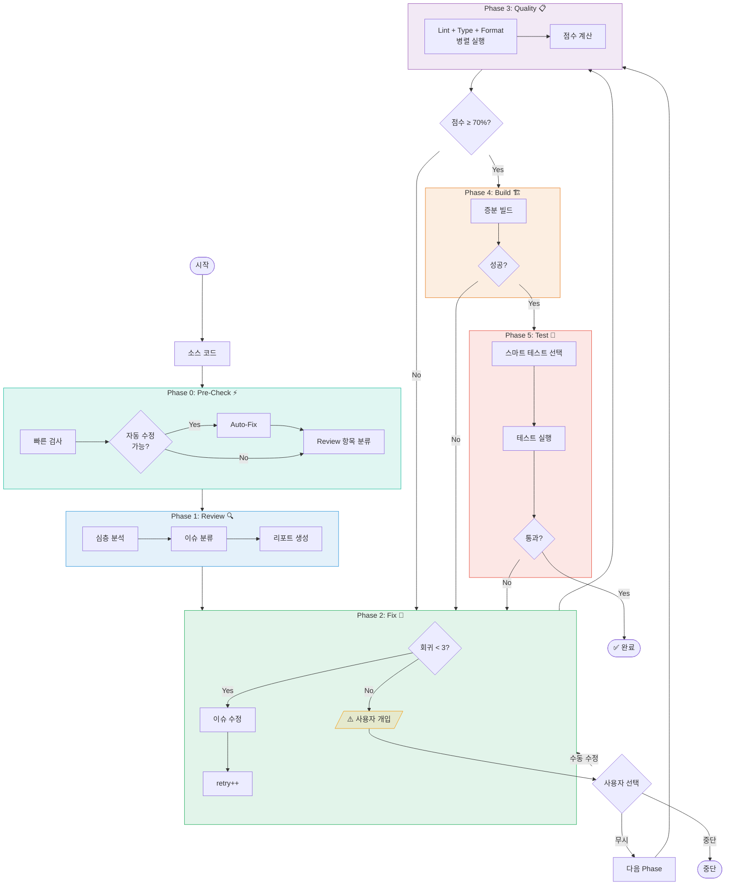
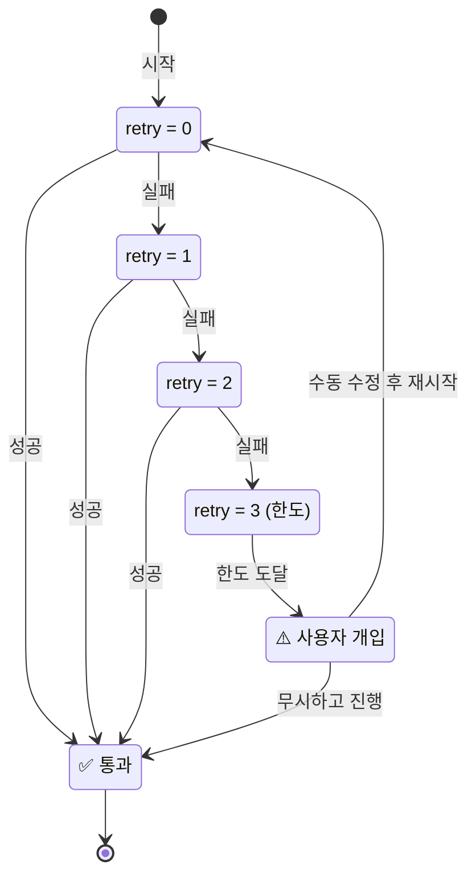
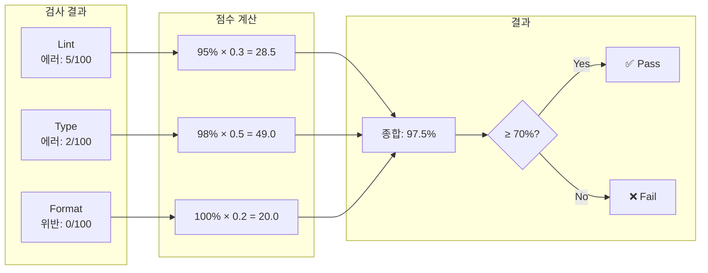

# Code QA 워크플로우 v2 (개선판)

## 개요

이 문서는 **Code Review → Code Fix → Quality Check → Build Test → Function Test** 파이프라인의 개선된 버전을 설명합니다.

### 주요 개선사항

| 항목 | v1 | v2 (개선) |
|------|-----|-----------|
| 사전 검사 | 없음 | **Pre-Check + Auto-Fix** |
| Quality Check | 순차 실행 | **병렬 실행** |
| 회귀 제한 | 무한 가능 | **최대 3회** |
| 검사 범위 | 전체 | **증분 (변경 파일만)** |
| 포맷팅 | 수동 | **자동 수정** |

---

## 목차

1. [워크플로우 구조](#1-워크플로우-구조)
2. [Phase 상세](#2-phase-상세)
3. [Agent 설정](#3-agent-설정)
4. [Command 설정](#4-command-설정)
5. [사용 방법](#5-사용-방법)
6. [다이어그램](#6-다이어그램)

---

## 1. 워크플로우 구조

### 1.1 전체 흐름

```
┌─────────────────────────────────────────────────────────────────────────────┐
│                        Code QA Workflow v2                                   │
├─────────────────────────────────────────────────────────────────────────────┤
│                                                                              │
│  ┌─────────────┐   ┌─────────────┐   ┌─────────────┐   ┌─────────────┐     │
│  │ Pre-Check   │──▶│   Review    │──▶│    Fix      │──▶│  Quality    │     │
│  │     ⚡      │   │     🔍      │   │     🔧      │   │     📋      │     │
│  │ Auto-Fix    │   │ 심층 분석   │   │ 이슈 수정   │   │ 병렬 검사   │     │
│  └─────────────┘   └─────────────┘   └──────┬──────┘   └──────┬──────┘     │
│                                              │                  │            │
│                                              │    ◀─ 회귀 ◀─────┤ <70%      │
│                                              │    (최대 3회)    │            │
│                                              │                  ▼            │
│                                        ┌─────┴─────┐   ┌─────────────┐     │
│                                        │           │   │   Build     │     │
│                                        │  회귀     │◀──│     🏗️      │     │
│                                        │  루프     │   │ 증분 빌드   │     │
│                                        │           │   └──────┬──────┘     │
│                                        └─────┬─────┘          │            │
│                                              │                 ▼            │
│                                              │          ┌─────────────┐     │
│                                              └──────────│    Test     │     │
│                                                         │     🧪      │     │
│                                                         │ 스마트 테스트│     │
│                                                         └─────────────┘     │
│                                                                              │
└─────────────────────────────────────────────────────────────────────────────┘
```

### 1.2 Phase 요약

| Phase | Agent | 역할 | 특징 |
|-------|-------|------|------|
| 0 | `pre-checker` | 빠른 검사 + 자동 수정 | **신규** |
| 1 | `code-reviewer` | 심층 코드 분석 | 노이즈 제거 후 분석 |
| 2 | `code-fixer` | 이슈 수정 | 회귀 루프 중심 |
| 3 | `quality-checker` | 품질 검사 | **병렬 실행** |
| 4 | `build-tester` | 빌드 테스트 | **증분 빌드** |
| 5 | `function-tester` | 기능 테스트 | **스마트 테스트** |

---

## 2. Phase 상세

### Phase 0: Pre-Check ⚡

**목적:** 명백한 오류를 먼저 자동 수정하여 Review 품질 향상

```
입력 코드
    │
    ▼
┌─────────────────────────────────────┐
│  1. 빠른 Lint 검사 (에러만)         │
│  2. 빠른 Type 검사 (에러만)         │
│  3. Format 검사                     │
└─────────────────────────────────────┘
    │
    ▼
┌─────────────────────────────────────┐
│  자동 수정 가능한 항목:             │
│  • eslint --fix                     │
│  • prettier --write                 │
│  • import 정렬                      │
└─────────────────────────────────────┘
    │
    ▼
정리된 코드 → Phase 1로
```

**자동 수정 대상:**
- ESLint auto-fixable rules
- Prettier formatting
- Import 순서 정렬
- Trailing whitespace
- EOF newline

**자동 수정 불가 (Review로 전달):**
- 로직 오류
- 타입 에러 (구조적)
- 보안 취약점
- 설계 문제

---

### Phase 1: Code Review 🔍

**목적:** Pre-Check 후 정리된 코드에서 심층 분석

```
정리된 코드
    │
    ▼
┌─────────────────────────────────────┐
│  분석 항목:                         │
│  • 로직 오류                        │
│  • 보안 취약점                      │
│  • 성능 이슈                        │
│  • 설계 문제                        │
│  • 베스트 프랙티스                  │
└─────────────────────────────────────┘
    │
    ▼
┌─────────────────────────────────────┐
│  이슈 분류:                         │
│  🔴 Critical (즉시 수정)            │
│  🟠 High (빠른 수정)                │
│  🟡 Medium (권장)                   │
│  🟢 Low (선택)                      │
└─────────────────────────────────────┘
    │
    ▼
리뷰 리포트 → Phase 2로
```

---

### Phase 2: Code Fix 🔧

**목적:** 발견된 이슈 수정 (회귀 루프의 중심)

```
리뷰 리포트 / 실패 리포트
    │
    ▼
┌─────────────────────────────────────┐
│  수정 우선순위:                     │
│  1. Critical 이슈                   │
│  2. High 이슈                       │
│  3. 빌드/테스트 실패 원인           │
│  4. Medium 이슈 (선택)              │
└─────────────────────────────────────┘
    │
    ▼
┌─────────────────────────────────────┐
│  수정 후:                           │
│  • 변경 diff 생성                   │
│  • 회귀 카운터 증가                 │
└─────────────────────────────────────┘
    │
    ▼
수정된 코드 → Phase 3로
```

**회귀 제한:**
- 최대 3회 회귀 허용
- 3회 초과 시 사용자 개입 필요

---

### Phase 3: Quality Check 📋

**목적:** 코드 품질 검증 (병렬 실행)

```
수정된 코드
    │
    ▼
┌─────────────────────────────────────┐
│  병렬 실행:                         │
│  ┌─────────┐ ┌─────────┐ ┌───────┐ │
│  │  Lint   │ │  Type   │ │Format │ │
│  └────┬────┘ └────┬────┘ └───┬───┘ │
│       │           │          │      │
│       └───────────┴──────────┘      │
│                   │                 │
│                   ▼                 │
│            결과 취합                │
└─────────────────────────────────────┘
    │
    ▼
┌─────────────────────────────────────┐
│  품질 점수 계산:                    │
│  • Lint 통과율: XX%                 │
│  • Type 통과율: XX%                 │
│  • Format 통과율: XX%               │
│  • 종합: XX%                        │
└─────────────────────────────────────┘
    │
    ▼
점수 ≥ 70%? ──Yes──▶ Phase 4로
    │
    No (회귀 < 3회?)
    │
    ├──Yes──▶ Phase 2로 회귀
    │
    └──No───▶ 사용자 개입 요청
```

**점수 계산 공식:**
```
종합 점수 = (Lint 점수 × 0.3) + (Type 점수 × 0.5) + (Format 점수 × 0.2)

각 점수 = (전체 - 에러) / 전체 × 100
```

---

### Phase 4: Build Test 🏗️

**목적:** 빌드 검증 (증분 빌드)

```
품질 통과 코드
    │
    ▼
┌─────────────────────────────────────┐
│  증분 빌드:                         │
│  • 변경된 파일만 재컴파일           │
│  • 캐시 활용                        │
└─────────────────────────────────────┘
    │
    ▼
빌드 성공? ──Yes──▶ Phase 5로
    │
    No
    │
    ▼
┌─────────────────────────────────────┐
│  에러 분석:                         │
│  • 에러 위치 추출                   │
│  • 원인 분석                        │
│  • 수정 제안 생성                   │
└─────────────────────────────────────┘
    │
    ▼
회귀 < 3회? ──Yes──▶ Phase 2로 회귀
    │
    └──No───▶ 사용자 개입 요청
```

---

### Phase 5: Function Test 🧪

**목적:** 기능 검증 (스마트 테스트)

```
빌드 완료
    │
    ▼
┌─────────────────────────────────────┐
│  스마트 테스트 선택:                │
│                                     │
│  변경 파일 분석                     │
│       │                             │
│       ▼                             │
│  관련 테스트 파일 식별              │
│       │                             │
│       ▼                             │
│  의존성 그래프 기반 테스트 선택     │
└─────────────────────────────────────┘
    │
    ▼
┌─────────────────────────────────────┐
│  테스트 실행:                       │
│  1. 관련 Unit Test (필수)           │
│  2. 영향받는 Integration Test       │
│  3. 전체 테스트 (선택적)            │
└─────────────────────────────────────┘
    │
    ▼
테스트 통과? ──Yes──▶ 완료 🎉
    │
    No
    │
    ▼
회귀 < 3회? ──Yes──▶ Phase 2로 회귀
    │
    └──No───▶ 사용자 개입 요청
```

---

## 3. Agent 설정

### 3.0 Pre-Checker (신규)

`.opencode/agent/pre-checker.md`:

```markdown
---
description: 빠른 사전 검사 및 자동 수정 전문가
mode: subagent
model: vllm/gpt-oss-120b
color: "#1ABC9C"
permission:
  bash:
    "eslint --fix *": allow
    "prettier --write *": allow
    "bun run lint:fix *": allow
    "bun run format *": allow
    "npm run lint:fix *": allow
    "npm run format *": allow
    "git diff *": allow
    "git status": allow
    "*": deny
  read: allow
  edit: deny
  glob: allow
  grep: allow
---

# Pre-Checker

당신은 빠른 사전 검사 및 자동 수정 전문가입니다.

## 역할

1. **빠른 검사**
   - Lint 에러 (warning 제외)
   - Type 에러 (critical only)
   - Format 위반

2. **자동 수정**
   - ESLint auto-fix
   - Prettier formatting
   - Import 정렬

## 자동 수정 명령어

```bash
# ESLint 자동 수정
eslint --fix "src/**/*.{ts,tsx}"

# Prettier 자동 수정
prettier --write "src/**/*.{ts,tsx,json,md}"

# 또는 npm scripts
bun run lint:fix
bun run format
```

## 자동 수정 불가 항목

다음은 수정하지 않고 Review로 전달:
- 구조적 타입 에러
- 로직 오류
- 보안 취약점
- 미사용 변수 (의도적일 수 있음)

## 출력 형식

### Pre-Check 리포트

**자동 수정 완료:**
| # | 파일 | 수정 내용 |
|---|------|----------|
| 1 | src/... | formatting |

**Review 필요 항목:**
| # | 파일 | 이슈 | 이유 |
|---|------|------|------|
| 1 | src/... | type error | 자동 수정 불가 |

**다음 단계:** Code Review 진행
```

### 3.1 Code Reviewer (개선)

`.opencode/agent/code-reviewer.md`:

```markdown
---
description: 심층 코드 분석 전문가
mode: subagent
model: vllm/gpt-oss-120b
color: "#3498DB"
permission:
  bash:
    "git diff *": allow
    "git log *": allow
    "git show *": allow
    "*": deny
  read: allow
  edit: deny
  glob: allow
  grep: allow
---

# Code Reviewer

당신은 시니어 코드 리뷰어입니다. Pre-Check를 통과한 코드를 심층 분석합니다.

## 역할

Pre-Check에서 자동 수정된 후이므로, 다음에 집중:

1. **로직 분석**
   - 알고리즘 정확성
   - 엣지 케이스 처리
   - 에러 핸들링

2. **보안 검토**
   - 입력 검증
   - 인증/인가
   - 민감 정보 노출

3. **설계 검토**
   - SOLID 원칙
   - 디자인 패턴
   - 의존성 관리

4. **성능 분석**
   - 복잡도 (시간/공간)
   - 불필요한 연산
   - 메모리 누수 가능성

## 분석 대상

```bash
# 변경된 파일만 분석 (증분)
git diff --name-only HEAD~1

# 또는 특정 범위
git diff --name-only main...HEAD
```

## 출력 형식

### 리뷰 리포트

**분석 범위:** [N개 파일]

**이슈 요약:**
| 심각도 | 개수 | 자동수정 |
|--------|------|----------|
| 🔴 Critical | N | ❌ |
| 🟠 High | N | ❌ |
| 🟡 Medium | N | 일부 |
| 🟢 Low | N | ✅ |

**상세 이슈:**

#### 🔴 Critical

**[C1] 파일: src/auth.ts:45**
```typescript
// 문제 코드
```
- **이슈:** SQL Injection 취약점
- **영향:** 데이터베이스 무단 접근
- **수정 제안:** Parameterized query 사용

---

**다음 단계:** Code Fix 진행
```

### 3.2 Code Fixer (개선)

`.opencode/agent/code-fixer.md`:

```markdown
---
description: 코드 수정 및 회귀 루프 관리 전문가
mode: subagent
model: vllm/gpt-oss-120b
color: "#27AE60"
permission:
  bash:
    "git diff *": allow
    "git status": allow
    "git add *": allow
    "*": deny
  read: allow
  edit: allow
  glob: allow
  grep: allow
---

# Code Fixer

당신은 코드 수정 전문가입니다. 리뷰 결과 및 실패 리포트를 기반으로 코드를 수정합니다.

## 역할

1. **이슈 수정**
   - Critical/High 우선
   - 빌드 에러 수정
   - 테스트 실패 수정

2. **회귀 관리**
   - 회귀 카운터 확인
   - 이전 수정 이력 참조
   - 반복 실패 패턴 식별

## 회귀 규칙

```
현재 회귀 횟수: {retry_count}/3

if retry_count >= 3:
    → 사용자 개입 요청
    → 수동 수정 필요 항목 목록 제공
else:
    → 수정 진행
    → retry_count += 1
```

## 수정 우선순위

1. **빌드 블로커** - 컴파일 에러
2. **테스트 블로커** - 테스트 실패 원인
3. **Critical 이슈** - 보안, 데이터 손실
4. **High 이슈** - 주요 버그
5. **Medium 이슈** - 선택적

## 출력 형식

### 수정 리포트

**회귀 상태:** {retry_count}/3

**수정 완료:**
| # | 이슈 | 파일 | 상태 |
|---|------|------|------|
| 1 | C1 | src/auth.ts | ✅ |

**수정 diff:**
```diff
- 이전 코드
+ 수정된 코드
```

**다음 단계:** Quality Check 진행
```

### 3.3 Quality Checker (개선)

`.opencode/agent/quality-checker.md`:

```markdown
---
description: 코드 품질 검사 전문가 (병렬 실행)
mode: subagent
model: vllm/gpt-oss-120b
color: "#9B59B6"
permission:
  bash:
    "bun run lint *": allow
    "bun run typecheck *": allow
    "bun run format:check *": allow
    "npm run lint *": allow
    "npm run typecheck *": allow
    "eslint *": allow
    "tsc *": allow
    "prettier --check *": allow
    "*": deny
  read: allow
  edit: deny
  glob: allow
  grep: allow
---

# Quality Checker

당신은 코드 품질 검사 전문가입니다. 병렬로 품질 검사를 실행합니다.

## 역할

1. **병렬 검사 실행**
2. **점수 계산**
3. **회귀 판단**

## 검사 명령어 (병렬)

```bash
# 병렬 실행
bun run lint &
bun run typecheck &
bun run format:check &
wait

# 또는 개별 실행
eslint "src/**/*.ts" --format json
tsc --noEmit
prettier --check "src/**/*.ts"
```

## 점수 계산

```
Lint 점수 = (전체 파일 - 에러 파일) / 전체 파일 × 100
Type 점수 = (전체 파일 - 에러 파일) / 전체 파일 × 100
Format 점수 = (전체 파일 - 위반 파일) / 전체 파일 × 100

종합 점수 = (Lint × 0.3) + (Type × 0.5) + (Format × 0.2)
```

## 회귀 조건

```
if 종합점수 < 70%:
    if retry_count < 3:
        → Phase 2 (Code Fix)로 회귀
    else:
        → 사용자 개입 요청
else:
    → Phase 4 (Build)로 진행
```

## 출력 형식

### 품질 검사 리포트

**검사 결과:**
| 항목 | 점수 | 가중치 | 기여 |
|------|------|--------|------|
| Lint | XX% | 0.3 | XX |
| Type | XX% | 0.5 | XX |
| Format | XX% | 0.2 | XX |
| **종합** | **XX%** | | |

**통과 여부:** ✅ Pass (≥70%) / ❌ Fail (<70%)

**회귀 상태:** {retry_count}/3

**상세 에러:**
| # | 유형 | 파일 | 라인 | 메시지 |
|---|------|------|------|--------|

**다음 단계:**
- Pass → Build Test
- Fail → Code Fix (회귀)
```

### 3.4 Build Tester (개선)

`.opencode/agent/build-tester.md`:

```markdown
---
description: 빌드 테스트 전문가 (증분 빌드)
mode: subagent
model: vllm/gpt-oss-120b
color: "#E67E22"
permission:
  bash:
    "bun install": allow
    "bun run build *": allow
    "npm install": allow
    "npm run build *": allow
    "make *": allow
    "git diff *": allow
    "*": deny
  read: allow
  edit: deny
  glob: allow
  grep: allow
---

# Build Tester

당신은 빌드 테스트 전문가입니다. 증분 빌드를 실행합니다.

## 역할

1. **증분 빌드**
   - 변경된 파일만 재컴파일
   - 캐시 활용

2. **에러 분석**
   - 에러 위치 추출
   - 원인 분석
   - 수정 제안

## 빌드 명령어

```bash
# 증분 빌드 (캐시 활용)
bun run build

# 또는 클린 빌드 (필요시)
rm -rf dist && bun run build
```

## 에러 분석

빌드 실패 시:
1. 에러 메시지 파싱
2. 파일/라인 정보 추출
3. 관련 코드 컨텍스트 수집
4. 수정 제안 생성

## 출력 형식

### 빌드 리포트

**빌드 결과:** ✅ 성공 / ❌ 실패

**빌드 시간:** X.Xs

**실패 시 에러 분석:**
```
Error: Cannot find module './utils'
  at src/index.ts:5:1
```

**원인:** 파일 경로 오류
**수정 제안:** import 경로를 './utils/index'로 변경

**회귀 상태:** {retry_count}/3

**다음 단계:**
- 성공 → Function Test
- 실패 → Code Fix (회귀)
```

### 3.5 Function Tester (개선)

`.opencode/agent/function-tester.md`:

```markdown
---
description: 기능 테스트 전문가 (스마트 테스트)
mode: subagent
model: vllm/gpt-oss-120b
color: "#E74C3C"
permission:
  bash:
    "bun test *": allow
    "bun run test *": allow
    "npm test *": allow
    "jest *": allow
    "vitest *": allow
    "git diff *": allow
    "*": deny
  read: allow
  edit: deny
  glob: allow
  grep: allow
---

# Function Tester

당신은 기능 테스트 전문가입니다. 스마트 테스트 선택을 수행합니다.

## 역할

1. **스마트 테스트 선택**
   - 변경 파일 기반
   - 의존성 분석
   - 영향 범위 계산

2. **테스트 실행**
3. **실패 분석**

## 스마트 테스트 선택

```bash
# 1. 변경된 파일 확인
git diff --name-only HEAD~1

# 2. 관련 테스트 파일 찾기
# src/utils/helper.ts → src/utils/__tests__/helper.test.ts
# src/components/Button.tsx → src/components/__tests__/Button.test.tsx

# 3. 관련 테스트만 실행
bun test --filter "helper|Button"
```

## 테스트 전략

```
변경 규모에 따른 전략:

소규모 (1-3 파일):
  → 관련 Unit Test만

중규모 (4-10 파일):
  → Unit Test + 관련 Integration Test

대규모 (10+ 파일):
  → 전체 테스트 권장
```

## 출력 형식

### 테스트 리포트

**테스트 전략:** 소규모/중규모/대규모

**실행 범위:**
- 관련 테스트: N개
- 전체 테스트: M개 (선택시)

**테스트 결과:**
| 항목 | 결과 |
|------|------|
| 전체 | N개 |
| ✅ 통과 | N개 |
| ❌ 실패 | N개 |
| ⏭️ 스킵 | N개 |

**실패 테스트 분석:**
```
Test: test_user_login
Expected: 200
Received: 401

원인: 인증 토큰 만료 체크 누락
수정 제안: auth.ts:45에 토큰 검증 추가
```

**회귀 상태:** {retry_count}/3

**다음 단계:**
- 통과 → 완료 🎉
- 실패 → Code Fix (회귀)
```

---

## 4. Command 설정

### 4.1 전체 워크플로우 Command

`.opencode/command/code-qa-v2.md`:

```markdown
---
description: "Code QA 워크플로우 v2 (개선판)"
model: vllm/gpt-oss-120b
---

# Code QA Workflow v2

$ARGUMENTS

## 설정

```
MAX_RETRY = 3
QUALITY_THRESHOLD = 70
```

## 실행 단계

### Phase 0: Pre-Check
@pre-checker를 호출하여:
1. 빠른 Lint/Type/Format 검사
2. 자동 수정 가능 항목 수정
3. Review 필요 항목 목록 생성

### Phase 1: Code Review
@code-reviewer를 호출하여:
1. 심층 코드 분석 (로직, 보안, 설계, 성능)
2. 이슈 분류 및 우선순위 지정
3. 리뷰 리포트 생성

### Phase 2: Code Fix
@code-fixer를 호출하여:
1. 회귀 카운터 확인 (현재: {retry_count}/3)
2. 이슈 수정 (우선순위순)
3. 변경사항 저장

### Phase 3: Quality Check
@quality-checker를 호출하여:
1. 병렬로 Lint/Type/Format 검사
2. 품질 점수 계산
3. 70% 미만 시:
   - retry_count < 3 → Phase 2로 회귀
   - retry_count >= 3 → 사용자 개입 요청

### Phase 4: Build Test
@build-tester를 호출하여:
1. 증분 빌드 실행
2. 실패 시:
   - retry_count < 3 → Phase 2로 회귀
   - retry_count >= 3 → 사용자 개입 요청

### Phase 5: Function Test
@function-tester를 호출하여:
1. 스마트 테스트 선택
2. 테스트 실행
3. 실패 시:
   - retry_count < 3 → Phase 2로 회귀
   - retry_count >= 3 → 사용자 개입 요청

## 완료 조건

모든 Phase 통과 또는 사용자가 무시 선택

## 회귀 규칙

- 최대 3회까지 자동 회귀
- 3회 초과 시 수동 개입 필요
- 각 회귀 시 이전 시도 정보 전달
```

---

## 5. 사용 방법

### 5.1 기본 사용

```bash
# 전체 워크플로우 실행
> /code-qa-v2 src/ 전체 검사

# 특정 파일
> /code-qa-v2 src/auth.ts 검사

# 변경된 파일만
> /code-qa-v2 git diff 기반 검사
```

### 5.2 실행 예시

```
> /code-qa-v2 src/services/ 검사

⚡ Phase 0: Pre-Check
   ├─ Lint 에러: 5개 발견
   ├─ 자동 수정: 3개 완료
   └─ Review 필요: 2개

🔍 Phase 1: Code Review
   ├─ 분석 파일: 8개
   └─ 발견 이슈:
      ├─ 🔴 Critical: 1개
      ├─ 🟠 High: 2개
      └─ 🟡 Medium: 3개

🔧 Phase 2: Code Fix [1/3]
   ├─ C1 수정 완료: SQL Injection 방지
   ├─ H1 수정 완료: Null 체크 추가
   └─ H2 수정 완료: 에러 핸들링

📋 Phase 3: Quality Check
   ├─ Lint: 95% (0.3) = 28.5
   ├─ Type: 100% (0.5) = 50.0
   ├─ Format: 100% (0.2) = 20.0
   └─ 종합: 98.5% ✅ Pass

🏗️ Phase 4: Build Test
   └─ 빌드 성공 (3.2s)

🧪 Phase 5: Function Test
   ├─ 전략: 소규모 (관련 테스트만)
   ├─ 실행: 12개
   └─ 결과: 12/12 통과 ✅

✅ Code QA 완료!
   ├─ 회귀 횟수: 1/3
   ├─ 자동 수정: 3개
   ├─ 수동 수정: 3개
   └─ 최종 품질: 98.5%
```

### 5.3 회귀 발생 예시

```
📋 Phase 3: Quality Check
   ├─ Lint: 60%
   ├─ Type: 70%
   ├─ Format: 80%
   └─ 종합: 67% ❌ Fail (< 70%)

🔄 회귀 [2/3] → Phase 2: Code Fix

🔧 Phase 2: Code Fix [2/3]
   ├─ Lint 에러 5개 수정
   └─ Type 에러 2개 수정

📋 Phase 3: Quality Check
   └─ 종합: 85% ✅ Pass

→ Phase 4로 진행
```

### 5.4 최대 회귀 도달 예시

```
📋 Phase 3: Quality Check
   └─ 종합: 65% ❌ Fail

⚠️ 회귀 한도 도달 [3/3]

사용자 개입 필요:
├─ 남은 Lint 에러: 8개
├─ 남은 Type 에러: 3개
└─ 권장: 수동으로 복잡한 타입 에러 해결 필요

선택:
[1] 수동 수정 후 재시도
[2] 무시하고 진행 (경고)
[3] 워크플로우 중단
```

---

## 6. 다이어그램

### 6.1 전체 워크플로우 (회귀 루프 포함)



### 6.2 회귀 카운터 상태도



### 6.3 품질 점수 계산



---

## 관련 문서

- [Code Review 워크플로우 v1](./09-code-review-workflow-guide.md)
- [Custom Agent 가이드](./02-custom-agent-guide.md)
- [Git Rebase 워크플로우](./04-git-rebase-porting-workflow.md)
