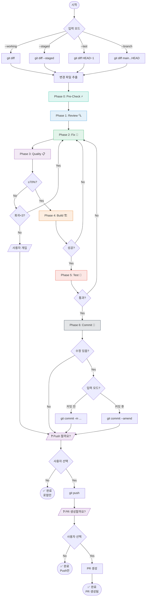
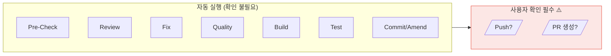
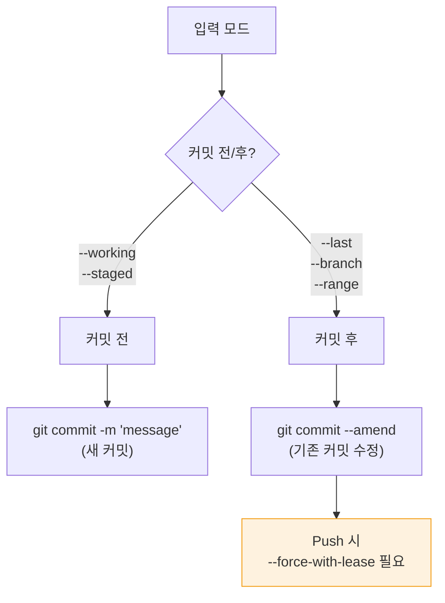
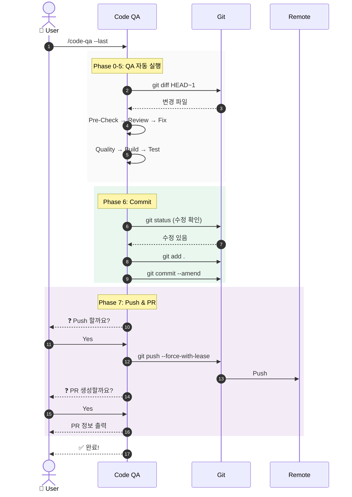

# Code QA 워크플로우 v3 (Git 통합)

## 개요

이 문서는 **Git 기반 Code QA 워크플로우**의 완전한 버전을 설명합니다. Git diff/commit을 입력으로 받아 QA를 수행하고, 수정 후 자동으로 커밋을 amend하며, 사용자 확인 후 Push/PR까지 지원합니다.

### v2 → v3 개선사항

| 항목 | v2 | v3 |
|------|-----|-----|
| 입력 | 디렉토리/파일 | **Git diff/commit 기반** |
| 커밋 | 수동 | **자동 amend** |
| Push | 미지원 | **사용자 확인 후 Push** |
| PR | 미지원 | **사용자 확인 후 PR 생성** |

---

## 목차

1. [전체 워크플로우](#1-전체-워크플로우)
2. [Git 입력 모드](#2-git-입력-모드)
3. [Phase 상세](#3-phase-상세)
4. [Agent 설정](#4-agent-설정)
5. [Command 설정](#5-command-설정)
6. [사용 방법](#6-사용-방법)
7. [다이어그램](#7-다이어그램)

---

## 1. 전체 워크플로우

### 1.1 8단계 파이프라인

```
┌─────────────────────────────────────────────────────────────────────────────────┐
│                        Code QA Workflow v3 (Git 통합)                            │
├─────────────────────────────────────────────────────────────────────────────────┤
│                                                                                  │
│  ┌─────────┐   ┌─────────┐   ┌─────────┐   ┌─────────┐   ┌─────────┐           │
│  │  Git    │──▶│Pre-Check│──▶│ Review  │──▶│   Fix   │──▶│ Quality │           │
│  │ Input   │   │   ⚡    │   │   🔍    │   │   🔧    │   │   📋    │           │
│  │ 📂      │   │Auto-Fix │   │ 심층    │   │ 수정    │   │ 병렬    │           │
│  └─────────┘   └─────────┘   └─────────┘   └────┬────┘   └────┬────┘           │
│                                                  │             │                 │
│                                                  │◀─ 회귀 ◀────┤ <70%           │
│                                                  │  (최대 3회) │                 │
│  ┌─────────┐   ┌─────────┐   ┌─────────┐       │             ▼                 │
│  │   PR    │◀──│  Push   │◀──│ Commit  │◀──────┴───┬─────────────┐             │
│  │   🔀    │   │   📤    │   │   📝    │           │   Build     │             │
│  │사용자확인│   │사용자확인│   │ amend   │     ◀─────│     🏗️      │             │
│  └─────────┘   └─────────┘   └─────────┘     회귀  └──────┬──────┘             │
│                                                           │                     │
│                                                           ▼                     │
│                                                    ┌─────────────┐             │
│                                              ◀─────│    Test     │             │
│                                              회귀  │     🧪      │             │
│                                                    └─────────────┘             │
│                                                                                  │
└─────────────────────────────────────────────────────────────────────────────────┘
```

### 1.2 Phase 요약

| Phase | Agent | 역할 | 사용자 확인 |
|-------|-------|------|-------------|
| - | `git-input` | Git diff 추출 | ❌ |
| 0 | `pre-checker` | 자동 수정 | ❌ |
| 1 | `code-reviewer` | 심층 분석 | ❌ |
| 2 | `code-fixer` | 이슈 수정 | ❌ |
| 3 | `quality-checker` | 품질 검사 | ❌ |
| 4 | `build-tester` | 빌드 테스트 | ❌ |
| 5 | `function-tester` | 기능 테스트 | ❌ |
| 6 | `git-committer` | Commit/Amend | ❌ (자동) |
| 7 | `git-pusher` | Push & PR | ✅ **필수** |

---

## 2. Git 입력 모드

### 2.1 입력 옵션

| 옵션 | 명령어 | Git 명령 | 사용 시점 |
|------|--------|----------|-----------|
| `--working` | `/code-qa` | `git diff` | 커밋 전 작업 중 |
| `--staged` | `/code-qa --staged` | `git diff --staged` | add 후 커밋 전 |
| `--last` | `/code-qa --last` | `git diff HEAD~1` | 커밋 직후 |
| `--branch` | `/code-qa --branch` | `git diff main...HEAD` | PR 전 전체 검사 |
| `--range` | `/code-qa --range a..b` | `git diff a..b` | 특정 범위 |

### 2.2 입력에 따른 커밋 전략

```
┌─────────────────────────────────────────────────────────────────┐
│                     입력 모드별 커밋 전략                        │
├─────────────────────────────────────────────────────────────────┤
│                                                                  │
│  --working / --staged (커밋 전)                                  │
│  ┌─────────────────────────────────────────────────────────┐   │
│  │  수정 발생 → git add . → git commit -m "message"        │   │
│  │  (새 커밋 생성)                                          │   │
│  └─────────────────────────────────────────────────────────┘   │
│                                                                  │
│  --last / --branch / --range (커밋 후)                          │
│  ┌─────────────────────────────────────────────────────────┐   │
│  │  수정 발생 → git add . → git commit --amend --no-edit   │   │
│  │  (기존 커밋 수정)                                        │   │
│  └─────────────────────────────────────────────────────────┘   │
│                                                                  │
└─────────────────────────────────────────────────────────────────┘
```

### 2.3 변경 파일 추출

```bash
# 변경된 파일 목록 (상태별)
git diff --name-status [범위]

# 출력 예시:
# A    src/new-file.ts        (추가)
# M    src/modified-file.ts   (수정)
# D    src/deleted-file.ts    (삭제)
# R    src/old.ts src/new.ts  (이름 변경)

# 삭제된 파일 제외하고 검사 대상 추출
git diff --name-only --diff-filter=d [범위]
```

---

## 3. Phase 상세

### Phase 0-5: QA 단계

(v2와 동일 - Pre-Check, Review, Fix, Quality, Build, Test)

### Phase 6: Commit 📝

**목적:** QA 완료 후 수정사항을 커밋에 반영

```
QA 완료
    │
    ▼
┌─────────────────────────────────────┐
│  수정 발생 여부 확인                │
│  git status --porcelain             │
└─────────────────────────────────────┘
    │
    ├─── 수정 없음 ───▶ Phase 7로 바로 이동
    │
    ▼ 수정 있음
┌─────────────────────────────────────┐
│  변경 파일 staging                  │
│  git add .                          │
└─────────────────────────────────────┘
    │
    ▼
┌─────────────────────────────────────┐
│  입력 모드 확인                     │
│                                     │
│  커밋 전 모드 (--working/--staged)  │
│  → git commit -m "QA 자동 수정"     │
│                                     │
│  커밋 후 모드 (--last/--branch)     │
│  → git commit --amend --no-edit     │
└─────────────────────────────────────┘
    │
    ▼
Phase 7로
```

### Phase 7: Push & PR 📤🔀

**목적:** Remote 작업 (반드시 사용자 확인 필요)

```
커밋 완료
    │
    ▼
┌─────────────────────────────────────┐
│  ❓ Push 할까요?                    │
│                                     │
│  [Y] Yes - Push 진행               │
│  [N] No - 로컬에만 유지             │
│  [S] Skip - PR 단계로 (이미 push됨) │
└─────────────────────────────────────┘
    │
    ├─── [N] ───▶ 완료 (로컬만)
    │
    ▼ [Y]
┌─────────────────────────────────────┐
│  git push origin <branch>           │
│                                     │
│  (amend된 경우)                     │
│  git push origin <branch> --force-with-lease │
└─────────────────────────────────────┘
    │
    ▼
┌─────────────────────────────────────┐
│  ❓ PR을 생성할까요?                │
│                                     │
│  [Y] Yes - PR 생성                  │
│  [N] No - Push만                    │
└─────────────────────────────────────┘
    │
    ├─── [N] ───▶ 완료 (Push만)
    │
    ▼ [Y]
┌─────────────────────────────────────┐
│  PR 정보 입력 요청                  │
│                                     │
│  • Title: (기본값: 커밋 메시지)     │
│  • Description: (자동 생성 제안)   │
│  • Base branch: main               │
│  • Reviewers: (선택)               │
└─────────────────────────────────────┘
    │
    ▼
┌─────────────────────────────────────┐
│  PR 생성                            │
│  (GitLab MR 또는 로컬 출력)         │
└─────────────────────────────────────┘
    │
    ▼
완료 🎉
```

---

## 4. Agent 설정

### 4.1 Git Input Agent

`.opencode/agent/git-input.md`:

```markdown
---
description: Git diff 기반 입력 처리 전문가
mode: subagent
model: vllm/gpt-oss-120b
color: "#34495E"
permission:
  bash:
    "git diff *": allow
    "git status *": allow
    "git log *": allow
    "git branch *": allow
    "git rev-parse *": allow
    "*": deny
  read: allow
  edit: deny
  glob: allow
  grep: allow
---

# Git Input Agent

당신은 Git diff 기반 입력 처리 전문가입니다.

## 역할

1. **입력 모드 파싱**
2. **변경 파일 추출**
3. **검사 대상 목록 생성**

## 입력 모드별 명령어

```bash
# --working (기본값)
git diff --name-only --diff-filter=d

# --staged
git diff --staged --name-only --diff-filter=d

# --last
git diff HEAD~1 --name-only --diff-filter=d

# --branch
git diff main...HEAD --name-only --diff-filter=d

# --range a..b
git diff a..b --name-only --diff-filter=d
```

## 출력 형식

### 입력 분석 리포트

**모드:** --last
**범위:** HEAD~1..HEAD

**변경 파일:**
| 상태 | 파일 |
|------|------|
| M | src/auth.ts |
| A | src/utils/helper.ts |
| M | src/api/handler.ts |

**검사 대상:** 3개 파일
**제외 (삭제됨):** 0개 파일

**다음 단계:** Pre-Check 진행
```

### 4.2 Git Committer Agent

`.opencode/agent/git-committer.md`:

```markdown
---
description: Git 커밋 및 amend 전문가
mode: subagent
model: vllm/gpt-oss-120b
color: "#2C3E50"
permission:
  bash:
    "git add *": allow
    "git commit *": allow
    "git status *": allow
    "git diff *": allow
    "git log *": allow
    "*": deny
  read: allow
  edit: deny
  glob: allow
  grep: allow
---

# Git Committer

당신은 Git 커밋 전문가입니다. QA 완료 후 수정사항을 커밋에 반영합니다.

## 역할

1. **수정 여부 확인**
2. **변경 파일 staging**
3. **커밋 모드 결정 및 실행**

## 커밋 전략

```bash
# 수정 여부 확인
git status --porcelain

# 수정 있으면 staging
git add .

# 커밋 전 모드 (--working/--staged)
git commit -m "fix: QA 자동 수정 적용

- Lint 에러 수정
- Type 에러 수정
- 코드 리뷰 이슈 해결"

# 커밋 후 모드 (--last/--branch/--range)
git commit --amend --no-edit
```

## 출력 형식

### 커밋 리포트

**수정 발생:** ✅ Yes / ❌ No

**커밋 모드:** 새 커밋 / Amend

**커밋 정보:**
- Hash: abc1234 → def5678 (amend)
- Message: "feat: 새 기능 추가"
- 변경 파일: 5개

**다음 단계:** Push 확인 대기
```

### 4.3 Git Pusher Agent

`.opencode/agent/git-pusher.md`:

```markdown
---
description: Git Push 및 PR 생성 전문가
mode: subagent
model: vllm/gpt-oss-120b
color: "#8E44AD"
permission:
  bash:
    "git push *": ask
    "git branch *": allow
    "git remote *": allow
    "git log *": allow
    "*": deny
  read: allow
  edit: deny
  glob: allow
  grep: allow
---

# Git Pusher

당신은 Git Push 및 PR 생성 전문가입니다.

## 중요 규칙

### 반드시 사용자 확인 필요
- Push 전 **반드시** 사용자에게 확인
- PR 생성 전 **반드시** 사용자에게 확인
- 강제 푸시(--force) 시 **경고 표시**

## Push 명령어

```bash
# 일반 Push
git push origin <branch>

# Amend 후 Push (force 필요)
git push origin <branch> --force-with-lease
```

## PR 생성 (로컬 환경)

로컬 환경에서는 MCP 없이 PR 정보를 출력합니다:

```
===== PR 생성 정보 =====
Base: main
Head: feature/my-feature
Title: feat: 새 기능 추가
Description:
  ## 변경사항
  - 인증 로직 개선
  - 에러 핸들링 추가

  ## QA 결과
  - Quality: 95%
  - Build: ✅
  - Test: 42/42 통과
========================

위 정보로 수동으로 PR을 생성하세요.
```

## 출력 형식

### Push 확인 요청

```
❓ Push 할까요?

현재 상태:
- Branch: feature/my-feature
- Commits: 3개 (amend됨)
- Remote: origin

⚠️ 주의: amend된 커밋이므로 --force-with-lease 사용

[Y] Push 진행
[N] 로컬에만 유지
[S] 건너뛰기 (이미 push됨)

선택:
```

### PR 확인 요청

```
❓ PR을 생성할까요?

PR 정보:
- Base: main
- Head: feature/my-feature
- Title: feat: 새 기능 추가

[Y] PR 생성
[N] Push만 완료

선택:
```
```

---

## 5. Command 설정

### 5.1 전체 워크플로우 Command

`.opencode/command/code-qa-v3.md`:

```markdown
---
description: "Code QA 워크플로우 v3 (Git 통합)"
model: vllm/gpt-oss-120b
---

# Code QA Workflow v3

$ARGUMENTS

## 설정

```
MAX_RETRY = 3
QUALITY_THRESHOLD = 70
```

## 입력 모드 파싱

옵션:
- (기본값): --working (git diff)
- --staged: staged 변경만
- --last: 마지막 커밋
- --branch: 브랜치 전체
- --range <a>..<b>: 특정 범위

## 실행 단계

### Git Input
@git-input을 호출하여:
1. 입력 모드 파싱
2. 변경 파일 추출
3. 검사 대상 목록 생성

### Phase 0-5: QA
@pre-checker, @code-reviewer, @code-fixer, @quality-checker, @build-tester, @function-tester를 순차 호출

### Phase 6: Commit
@git-committer를 호출하여:
1. 수정 여부 확인
2. 수정 있으면:
   - 커밋 전 모드 → 새 커밋
   - 커밋 후 모드 → amend

### Phase 7: Push & PR
@git-pusher를 호출하여:
1. **사용자에게 Push 여부 확인**
2. Push 승인 시:
   - amend면 --force-with-lease
   - 일반이면 그냥 push
3. **사용자에게 PR 생성 여부 확인**
4. PR 승인 시:
   - PR 정보 수집
   - PR 생성 (또는 정보 출력)

## 중요 규칙

- Phase 7의 모든 remote 작업은 **반드시 사용자 확인**
- 강제 푸시 시 **경고 표시**
- 회귀 최대 3회
```

---

## 6. 사용 방법

### 6.1 기본 사용 (커밋 전 검사)

```bash
# 작업 중인 변경사항 검사
> /code-qa

# staged 변경사항만 검사
> /code-qa --staged
```

### 6.2 커밋 후 검사 (amend 지원)

```bash
# 마지막 커밋 검사 → 수정 시 amend
> /code-qa --last

# 브랜치 전체 검사 → 수정 시 amend
> /code-qa --branch
```

### 6.3 전체 실행 예시

```
> /code-qa --last

📂 Git Input
   ├─ 모드: --last (HEAD~1)
   └─ 변경 파일: 5개

⚡ Phase 0: Pre-Check
   ├─ 자동 수정: 3개
   └─ Review 필요: 2개

🔍 Phase 1: Code Review
   └─ 이슈: Critical 1, High 2

🔧 Phase 2: Code Fix [1/3]
   └─ 3개 이슈 수정 완료

📋 Phase 3: Quality Check
   └─ 종합: 95% ✅

🏗️ Phase 4: Build Test
   └─ 빌드 성공 (3.2s)

🧪 Phase 5: Function Test
   └─ 15/15 통과 ✅

📝 Phase 6: Commit
   ├─ 수정 발생: ✅
   ├─ 모드: amend (--last)
   └─ 커밋 수정됨: abc1234 → def5678

📤 Phase 7: Push & PR

   ❓ Push 할까요?
   ⚠️ amend된 커밋 → --force-with-lease 사용

   [Y] Push  [N] 로컬만  [S] 건너뛰기

> Y

   ✅ Push 완료: origin/feature/my-feature

   ❓ PR을 생성할까요?

   [Y] 생성  [N] 완료

> Y

   PR 정보 입력:
   Title [feat: 새 기능]:
   Description: (자동 생성됨)

   ✅ PR 생성 완료!
   URL: https://gitlab.internal/project/-/merge_requests/42

🎉 Code QA 완료!
```

### 6.4 로컬만 유지 (Push 거부)

```
📤 Phase 7: Push & PR

   ❓ Push 할까요?
   [Y] Push  [N] 로컬만  [S] 건너뛰기

> N

✅ Code QA 완료! (로컬 커밋만)
   └─ Push는 나중에 수동으로: git push origin feature/my-feature
```

---

## 7. 다이어그램

### 7.1 전체 워크플로우



### 7.2 사용자 확인 포인트



### 7.3 커밋 전략 결정



### 7.4 시퀀스 다이어그램



---

## 8. 권한 매트릭스

| Agent | read | edit | bash (git) | bash (other) | 사용자 확인 |
|-------|------|------|------------|--------------|-------------|
| git-input | ✅ | ❌ | diff, status, log | ❌ | ❌ |
| pre-checker | ✅ | ❌ | diff | lint --fix | ❌ |
| code-reviewer | ✅ | ❌ | diff, log | ❌ | ❌ |
| code-fixer | ✅ | ✅ | diff, status | ❌ | ❌ |
| quality-checker | ✅ | ❌ | ❌ | lint, tsc | ❌ |
| build-tester | ✅ | ❌ | ❌ | build | ❌ |
| function-tester | ✅ | ❌ | diff | test | ❌ |
| git-committer | ✅ | ❌ | add, commit | ❌ | ❌ |
| git-pusher | ✅ | ❌ | push **(ask)** | ❌ | ✅ **필수** |

---

## 관련 문서

- [Code QA 워크플로우 v2](./10-code-qa-workflow-v2.md)
- [Git Rebase 워크플로우](./04-git-rebase-porting-workflow.md)
- [Custom Agent 가이드](./02-custom-agent-guide.md)
