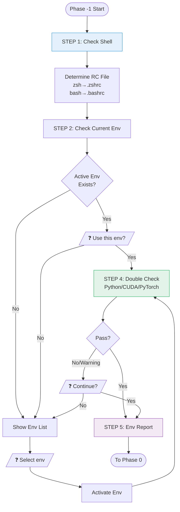

# Environment Setup Workflow

## Overview

This document describes the environment setup phase (Phase -1) of the **Code QA Workflow v4**.
It verifies and configures the correct execution environment for build/function tests in OpenCode TUI.

### Core Purpose

```
┌─────────────────────────────────────────────────────────────────────────────────┐
│                              Core Purpose                                        │
├─────────────────────────────────────────────────────────────────────────────────┤
│                                                                                  │
│   "Which env environment should OpenCode TUI use to                              │
│    perform build/function tests?"                                                │
│                                                                                  │
│   ┌─────────────────────────────────────────────────────────────────────────┐   │
│   │  Assumptions (already exist):                                           │   │
│   │  • Developer's conda/venv environment                                   │   │
│   │  • Environment variables set in ~/.zshrc, ~/.bashrc                     │   │
│   │  • Packages installed via pip (torch, numpy, etc.)                      │   │
│   └─────────────────────────────────────────────────────────────────────────┘   │
│                                                                                  │
│   ┌─────────────────────────────────────────────────────────────────────────┐   │
│   │  What needs to be done:                                                 │   │
│   │  1. Check which Shell is being used                                     │   │
│   │  2. Decide which env to use (user confirmation)                         │   │
│   │  3. Minimal double-check (Python, CUDA, PyTorch versions)               │   │
│   │  4. Run build/test in that environment                                  │   │
│   └─────────────────────────────────────────────────────────────────────────┘   │
│                                                                                  │
└─────────────────────────────────────────────────────────────────────────────────┘
```

### Target Environment

| Item | Value |
|------|-------|
| OS | Linux development server |
| Access | SSH |
| Shell | bash / zsh / sh |
| Environment Manager | conda / venv / uv |

---

## Table of Contents

1. [Shell and RC Files](#1-shell-and-rc-files)
2. [Environment Config](#2-environment-config)
3. [Workflow](#3-workflow)
4. [User Interaction](#4-user-interaction)
5. [Environment Report](#5-environment-report)
6. [Diagrams](#6-diagrams)
7. [Agent Definition](#7-agent-definition)
8. [Command Integration](#8-command-integration)
9. [Docker Sandbox](#9-docker-sandbox)

---

## 1. Shell and RC Files

### 1.1 Shell to RC File Mapping

| Shell | RC File | Notes |
|-------|---------|-------|
| `zsh` | `~/.zshrc` | Default (modern Linux, macOS) |
| `bash` | `~/.bashrc` | Interactive shell |
| `bash` | `~/.bash_profile` | Login shell |
| `sh` | `~/.profile` | POSIX compatible |

### 1.2 Shell Detection Method

```bash
# Check current Shell
echo $SHELL
# → /bin/zsh

# Or current process Shell
echo $0
# → -zsh
```

### 1.3 RC File Contents to Check

```
┌─────────────────────────────────────────────────────────────────────────────────┐
│                         RC File Analysis                                         │
├─────────────────────────────────────────────────────────────────────────────────┤
│                                                                                  │
│  ~/.zshrc or ~/.bashrc                                                          │
│                                                                                  │
│  1. conda init block                                                            │
│     ┌───────────────────────────────────────────────────────────────────────┐   │
│     │ # >>> conda initialize >>>                                            │   │
│     │ __conda_setup="$('/home/user/miniconda3/bin/conda' 'shell.zsh' ...)"  │   │
│     │ ...                                                                    │   │
│     │ # <<< conda initialize <<<                                            │   │
│     └───────────────────────────────────────────────────────────────────────┘   │
│                                                                                  │
│  2. Auto-activation                                                              │
│     ┌───────────────────────────────────────────────────────────────────────┐   │
│     │ conda activate my-project-env                                          │   │
│     │ # or                                                                    │   │
│     │ source ~/projects/my-project/venv/bin/activate                         │   │
│     └───────────────────────────────────────────────────────────────────────┘   │
│                                                                                  │
│  3. CUDA environment variables                                                   │
│     ┌───────────────────────────────────────────────────────────────────────┐   │
│     │ export CUDA_HOME=/usr/local/cuda-11.8                                  │   │
│     │ export PATH=$CUDA_HOME/bin:$PATH                                       │   │
│     │ export LD_LIBRARY_PATH=$CUDA_HOME/lib64:$LD_LIBRARY_PATH               │   │
│     └───────────────────────────────────────────────────────────────────────┘   │
│                                                                                  │
└─────────────────────────────────────────────────────────────────────────────────┘
```

---

## 2. Environment Config

### 2.1 File Location

```
project-root/
└── .opencode/
    └── env-config.yaml      # Environment config (optional)
```

### 2.2 Config Structure

```yaml
# =============================================================================
# Environment Config - Execution Environment Settings
# =============================================================================

# Shell settings
shell:
  type: "zsh"                # zsh | bash | sh
  rc_file: "~/.zshrc"        # Auto-inferred (can be omitted)

# Environment settings
environment:
  name: "my-project-env"     # conda env name or venv path
  type: "conda"              # conda | venv | uv

# Minimum requirements (for double-check, optional)
requirements:
  python: ">=3.10"
  cuda: ">=11.8"
  torch: ">=2.0"
```

### 2.3 Field Details

| Section | Field | Type | Description | Required | Default |
|---------|-------|------|-------------|----------|---------|
| **shell** | `type` | string | Shell to use | No | Detected from `$SHELL` |
| | `rc_file` | string | RC file path | No | Auto-inferred from Shell |
| **environment** | `name` | string | Environment name/path | No | Ask user |
| | `type` | string | conda / venv / uv | No | Auto-detect |
| **requirements** | `python` | string | Python version check | No | - |
| | `cuda` | string | CUDA version check | No | - |
| | `torch` | string | PyTorch version check | No | - |

### 2.4 Shell → RC File Auto-inference

| shell.type | rc_file (auto) |
|------------|----------------|
| `zsh` | `~/.zshrc` |
| `bash` | `~/.bashrc` |
| `sh` | `~/.profile` |

### 2.5 When No Config File Exists

Config file is optional. Without it:

1. Shell is auto-detected from `$SHELL`
2. Environment is asked from user
3. Double-check is skipped

---

## 3. Workflow

### 3.1 Complete Flow

```
┌─────────────────────────────────────────────────────────────────────────────────┐
│                    Environment Setup Workflow                                    │
├─────────────────────────────────────────────────────────────────────────────────┤
│                                                                                  │
│  STEP 1: Check Shell                                                             │
│  ┌─────────────────────────────────────────────────────────────────────────┐   │
│  │  $ echo $SHELL                                                           │   │
│  │  → /bin/zsh                                                              │   │
│  │                                                                          │   │
│  │  RC File: ~/.zshrc                                                       │   │
│  └─────────────────────────────────────────────────────────────────────────┘   │
│                                      │                                          │
│                                      ▼                                          │
│  STEP 2: Check Current Environment                                               │
│  ┌─────────────────────────────────────────────────────────────────────────┐   │
│  │  $ echo $CONDA_DEFAULT_ENV                                               │   │
│  │  → ml-dev                                                                │   │
│  │                                                                          │   │
│  │  Or check $VIRTUAL_ENV                                                   │   │
│  └─────────────────────────────────────────────────────────────────────────┘   │
│                                      │                                          │
│                                      ▼                                          │
│  STEP 3: User Confirmation                                                       │
│  ┌─────────────────────────────────────────────────────────────────────────┐   │
│  │  ❓ Use current environment (ml-dev)?                                    │   │
│  │  [Y] Yes  [N] Select different environment                               │   │
│  └─────────────────────────────────────────────────────────────────────────┘   │
│                                      │                                          │
│                                      ▼                                          │
│  STEP 4: Double Check (optional)                                                 │
│  ┌─────────────────────────────────────────────────────────────────────────┐   │
│  │  Python: 3.11.5    ✅                                                    │   │
│  │  CUDA:   11.8      ✅                                                    │   │
│  │  PyTorch: 2.1.0    ✅                                                    │   │
│  └─────────────────────────────────────────────────────────────────────────┘   │
│                                      │                                          │
│                                      ▼                                          │
│  STEP 5: Environment Report → Continue to Phase 0                                │
│                                                                                  │
└─────────────────────────────────────────────────────────────────────────────────┘
```

### 3.2 Step-by-Step Commands

| Step | Purpose | Command |
|------|---------|---------|
| **STEP 1** | Check Shell | `echo $SHELL` |
| **STEP 2a** | Check conda env | `echo $CONDA_DEFAULT_ENV` |
| **STEP 2b** | Check venv | `echo $VIRTUAL_ENV` |
| **STEP 2c** | List conda envs | `conda env list` |
| **STEP 4a** | Python version | `python --version` |
| **STEP 4b** | CUDA version | `nvcc --version` or `python -c "import torch; print(torch.version.cuda)"` |
| **STEP 4c** | PyTorch version | `python -c "import torch; print(torch.__version__)"` |

### 3.3 Decision Tree

| Condition | Result |
|-----------|--------|
| Environment specified in config | → Use that environment (with confirmation) |
| Current active environment exists | → Ask if should use current environment |
| No active environment | → Show environment list and request selection |

---

## 4. User Interaction

### 4.1 Case 1: When Current Environment Exists

```
┌─────────────────────────────────────────────────────────────────────────────────┐
│  🔧 Environment Setup                                                            │
│                                                                                  │
│  🐚 Shell: zsh (RC: ~/.zshrc)                                                   │
│                                                                                  │
│  Currently Active Environment:                                                   │
│  ┌─────────────────────────────────────────────────────────────────────────┐   │
│  │ Type     : conda                                                         │   │
│  │ Name     : ml-dev                                                        │   │
│  │ Python   : 3.11.5                                                        │   │
│  │ PyTorch  : 2.1.0+cu118                                                   │   │
│  │ CUDA     : 11.8                                                          │   │
│  └─────────────────────────────────────────────────────────────────────────┘   │
│                                                                                  │
│  ❓ Use this environment?                                                        │
│                                                                                  │
│  [Y] Yes, use this environment                                                   │
│  [N] No, select different environment                                            │
│                                                                                  │
└─────────────────────────────────────────────────────────────────────────────────┘
```

### 4.2 Case 2: When No Environment Exists

```
┌─────────────────────────────────────────────────────────────────────────────────┐
│  🔧 Environment Setup                                                            │
│                                                                                  │
│  🐚 Shell: zsh (RC: ~/.zshrc)                                                   │
│                                                                                  │
│  ⚠️ No currently active environment.                                             │
│                                                                                  │
│  Available Environments:                                                         │
│  ┌─────────────────────────────────────────────────────────────────────────┐   │
│  │ #  │ Type  │ Name        │ Python │ PyTorch     │ CUDA  │              │   │
│  │────┼───────┼─────────────┼────────┼─────────────┼───────│              │   │
│  │ 1  │ conda │ base        │ 3.11.5 │ -           │ -     │              │   │
│  │ 2  │ conda │ ml-dev      │ 3.11.5 │ 2.1.0+cu118 │ 11.8  │              │   │
│  │ 3  │ conda │ torch21     │ 3.11.0 │ 2.1.0+cu121 │ 12.1  │              │   │
│  │ 4  │ venv  │ ./venv      │ 3.10.12│ 2.0.1       │ 11.7  │              │   │
│  └─────────────────────────────────────────────────────────────────────────┘   │
│                                                                                  │
│  ❓ Which environment to use? [1-4]:                                             │
│                                                                                  │
└─────────────────────────────────────────────────────────────────────────────────┘
```

### 4.3 Case 3: Double Check Failure

```
┌─────────────────────────────────────────────────────────────────────────────────┐
│  🔧 Environment Setup                                                            │
│                                                                                  │
│  ⚠️ Requirements Check Results:                                                  │
│  ┌─────────────────────────────────────────────────────────────────────────┐   │
│  │ Item     │ Required   │ Current    │ Status │                           │   │
│  │──────────┼────────────┼────────────┼────────│                           │   │
│  │ Python   │ >=3.10     │ 3.11.5     │ ✅     │                           │   │
│  │ CUDA     │ >=11.8     │ 11.7       │ ⚠️     │                           │   │
│  │ PyTorch  │ >=2.0      │ 1.13.1     │ ❌     │                           │   │
│  └─────────────────────────────────────────────────────────────────────────┘   │
│                                                                                  │
│  ❓ Continue anyway?                                                             │
│                                                                                  │
│  [Y] Yes, ignore warnings and proceed                                            │
│  [N] No, select different environment                                            │
│                                                                                  │
└─────────────────────────────────────────────────────────────────────────────────┘
```

---

## 5. Environment Report

### 5.1 Report Format

```
══════════════════════════════════════════════════════════════
                    Environment Report
══════════════════════════════════════════════════════════════

🐚 Shell
┌──────────────┬─────────────────────────────────┐
│ Type         │ zsh                             │
│ RC File      │ ~/.zshrc                        │
└──────────────┴─────────────────────────────────┘

📦 Environment
┌──────────────┬─────────────────────────────────┐
│ Type         │ conda                           │
│ Name         │ ml-dev                          │
│ Path         │ ~/miniconda3/envs/ml-dev        │
└──────────────┴─────────────────────────────────┘

✅ Requirements Check
┌──────────────┬──────────────┬──────────────────┐
│ Item         │ Required     │ Current          │
├──────────────┼──────────────┼──────────────────┤
│ Python       │ >=3.10       │ 3.11.5      ✅   │
│ CUDA         │ >=11.8       │ 11.8        ✅   │
│ PyTorch      │ >=2.0        │ 2.1.0       ✅   │
└──────────────┴──────────────┴──────────────────┘

➡️ Next Step: Git Input (Phase 0)

══════════════════════════════════════════════════════════════
```

---

## 6. Diagrams

### 6.1 Complete Flow (Mermaid)



### 6.2 Code QA v4 Complete Pipeline

```mermaid
flowchart LR
    subgraph PHASE_NEG1["Phase -1"]
        ENV[🔧 Env Setup]
    end

    subgraph PHASE_0_5["Phase 0-5: QA"]
        GIT[📂 Git Input]
        PRE[⚡ Pre-Check]
        REV[🔍 Review]
        FIX[🔧 Fix]
        QA[📋 Quality]
        BUILD[🏗️ Build]
        TEST[🧪 Test]
    end

    subgraph PHASE_6_8["Phase 6-8"]
        COMMIT[📝 Commit]
        SUMMARY[📊 Summary]
        PUSH[📤 Push]
    end

    ENV --> GIT --> PRE --> REV --> FIX --> QA --> BUILD --> TEST --> COMMIT --> SUMMARY --> PUSH

    style PHASE_NEG1 fill:#95A5A622,stroke:#95A5A6
    style PHASE_0_5 fill:#3498DB22,stroke:#3498DB
    style PHASE_6_8 fill:#27AE6022,stroke:#27AE60
```



---

## 7. Agent Definition

### 7.1 File Location

```
project-root/
└── .opencode/
    └── agent/
        └── env-setup.md      # Environment Setup Agent
```

### 7.2 Agent Settings

| Item | Value | Description |
|------|-------|-------------|
| **mode** | `subagent` | Called from other Agents |
| **model** | `qwen/qwen3-coder-30b` | Tool calling specialized model |
| **color** | `#95A5A6` | UI display color |

### 7.3 Permission Matrix

| Command Type | Permission | Example |
|--------------|------------|---------|
| Shell detection | `allow` | `echo $SHELL`, `echo $0` |
| Environment manager detection | `allow` | `conda env list`, `which conda` |
| Python detection | `allow` | `python --version`, `python -c "..."` |
| GPU/CUDA detection | `allow` | `nvidia-smi`, `nvcc --version` |
| Environment activation | `ask` | `conda activate`, `source */activate` |
| File deletion | `deny` | `rm *` |
| Package removal | `deny` | `conda remove`, `pip uninstall` |

### 7.4 How to Invoke

From other Agents or Commands:

```markdown
# Invoke from Code QA Command
Invoke @env-setup to configure environment

# Or direct invocation
@env-setup Please check the environment.
```

---

## 8. Command Integration

### 8.1 File Location

```
project-root/
└── .opencode/
    └── command/
        └── code-qa.md      # Code QA v4 Command
```

### 8.2 Usage

```bash
# Default (working changes)
> /code-qa

# Staged changes only
> /code-qa --staged

# Last commit
> /code-qa --last

# Entire branch
> /code-qa --branch
```

### 8.3 Execution Flow

```
/code-qa execution
    │
    ▼
┌─────────────────────────────────────────────────────────────┐
│  Phase -1: Invoke @env-setup                                │
│  ├─ Check Shell                                             │
│  ├─ Check/Select environment                                │
│  └─ Double check                                            │
└─────────────────────────────────────────────────────────────┘
    │
    ▼
┌─────────────────────────────────────────────────────────────┐
│  Phase 0-5: QA Pipeline                                     │
│  ├─ Git Input → Pre-Check → Review → Fix                    │
│  └─ Quality → Build → Test                                  │
└─────────────────────────────────────────────────────────────┘
    │
    ▼
┌─────────────────────────────────────────────────────────────┐
│  Phase 6-8: Commit & Push                                   │
│  ├─ Commit/Amend                                            │
│  ├─ Summary Report                                          │
│  └─ Push & PR (user confirmation)                           │
└─────────────────────────────────────────────────────────────┘
```

---

## 9. Docker Sandbox

### 9.1 Overview

Docker Sandbox runs Build and Test in an isolated Docker container.

| Item | Host Execution | Sandbox Execution |
|------|---------------|-------------------|
| Environment | Host-dependent | Isolated container |
| Reproducibility | Varies by environment | Consistent results |
| GPU | Direct use | nvidia-docker |
| Speed | Fast | Slow first build (fast after cache) |

### 9.2 Usage

```bash
# Run Build/Test in Docker Sandbox (default)
> /code-qa --last

# Run Build/Test directly on host (disable Sandbox)
> /code-qa --last --no-sandbox

# With other Git options
> /code-qa --staged              # Sandbox (default)
> /code-qa --branch --no-sandbox # Host execution
```

### 9.3 File Structure

```
project-root/
└── .opencode/
    ├── docker/
    │   └── Dockerfile.sandbox    # Generic Dockerfile
    └── env-config.yaml           # Including sandbox settings
```

### 9.4 Dockerfile Template

`.opencode/docker/Dockerfile.sandbox`:

```dockerfile
# Base Image: NVIDIA CUDA + Python
ARG CUDA_VERSION=11.8.0
ARG PYTHON_VERSION=3.11

FROM nvidia/cuda:${CUDA_VERSION}-cudnn8-runtime-ubuntu22.04

ENV PYTHONUNBUFFERED=1
WORKDIR /workspace

# System Dependencies
RUN apt-get update && apt-get install -y --no-install-recommends \
    python${PYTHON_VERSION} \
    python${PYTHON_VERSION}-dev \
    python3-pip \
    build-essential \
    git \
    && rm -rf /var/lib/apt/lists/*

# Python symlinks
RUN ln -sf /usr/bin/python${PYTHON_VERSION} /usr/bin/python

# Project Dependencies
COPY requirements*.txt ./
RUN pip install -r requirements.txt

CMD ["python", "--version"]
```

### 9.5 env-config.yaml Settings

```yaml
# Existing settings
shell:
  type: "zsh"
environment:
  name: "ml-dev"
  type: "conda"
requirements:
  python: ">=3.10"
  cuda: ">=11.8"
  torch: ">=2.0"

# Sandbox settings
sandbox:
  enabled: true                     # Default: Use Docker Sandbox
  dockerfile: ".opencode/docker/Dockerfile.sandbox"
  image_name: "qa-sandbox"
  gpu: true                         # Use nvidia-docker
  build_args:
    CUDA_VERSION: "11.8.0"
    PYTHON_VERSION: "3.11"
```

### 9.6 Requirements

| Requirement | Description |
|-------------|-------------|
| Docker | Docker Engine required |
| nvidia-docker | NVIDIA Container Toolkit for GPU |
| CUDA Driver | NVIDIA driver on host required |

### 9.7 Advantages

- No host environment pollution
- Reproducible build/test
- Same environment as CI/CD
- Dependency isolation

---

## Related Documents

- [**Code QA v4 Complete Diagram** ⭐](./13-code-qa-v4-complete-diagram.md)
- [Code QA v4 Quick Start](./14-code-qa-v4-quick-start.md)
- [Custom Agent Guide](./02-custom-agent-guide.md)
- [Integrated Configuration Guide](./05-integrated-configuration.md)
