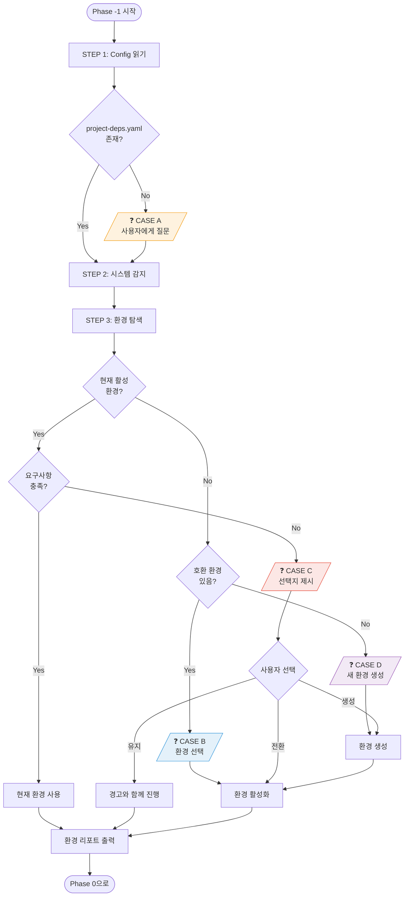
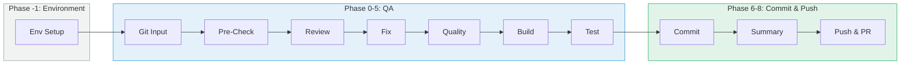

# Environment Setup Workflow

## 개요

이 문서는 **Code QA 워크플로우 v4**의 환경 설정 단계(Phase -1)를 설명합니다.
프로젝트 디펜던시 설정(config)을 기반으로 실행 환경을 검증하고 설정합니다.

### 핵심 개념

```
┌─────────────────────────────────────────────────────────────────────────────────┐
│                                                                                  │
│   프로젝트 디펜던시 Config          ≠           실행 환경 (env)                  │
│   ─────────────────────────                    ─────────────────                 │
│                                                                                  │
│   "이 프로젝트를 실행하려면              "이 config를 만족하는                   │
│    이런 소프트웨어가 필요하다"            환경을 어디서 실행할까?"                │
│                                                                                  │
│   • Python 3.11                              • conda env: ml-dev                │
│   • PyTorch 2.1.0                            • venv: ./venv                     │
│   • CUDA 11.8                                • uv: .venv                        │
│   • numpy <2.0                                                                  │
│                                                                                  │
└─────────────────────────────────────────────────────────────────────────────────┘
```

### 대상 환경

- **OS**: Linux 개발 서버
- **접속 방식**: SSH
- **Shell**: bash / zsh
- **환경 관리자**: conda / venv / uv

---

## 목차

1. [Project Dependencies Config](#1-project-dependencies-config)
2. [Config 필드 상세](#2-config-필드-상세)
3. [Config 예시](#3-config-예시)
4. [Environment Setup Agent](#4-environment-setup-agent)
5. [워크플로우 흐름](#5-워크플로우-흐름)
6. [다이어그램](#6-다이어그램)

---

## 1. Project Dependencies Config

### 1.1 파일 위치

```
project-root/
└── .opencode/
    └── project-deps.yaml      # 프로젝트 디펜던시 설정
```

### 1.2 Config 구조 요약

| 섹션 | 설명 | 필수 |
|------|------|------|
| `project` | 프로젝트 메타정보 (이름, 설명) | ❌ |
| `runtime` | Python/Node 버전 요구사항 | ✅ |
| `gpu` | CUDA, cuDNN, VRAM 요구사항 | ✅ |
| `packages` | Python 패키지 디펜던시 | ✅ |
| `system` | 시스템 패키지 (git, ffmpeg 등) | ❌ |
| `environment` | 환경 관리자 설정 | ❌ |
| `validation` | 환경 검증 명령어 | ❌ |

---

## 2. Config 필드 상세

### 2.1 `project` - 프로젝트 메타정보

| 필드 | 타입 | 설명 | 예시 | 필수 |
|------|------|------|------|------|
| `name` | string | 프로젝트 이름 | `"my-ml-project"` | ❌ |
| `description` | string | 프로젝트 설명 | `"ML Training Pipeline"` | ❌ |

### 2.2 `runtime` - 런타임 요구사항

#### `runtime.python`

| 필드 | 타입 | 설명 | 예시 | 필수 |
|------|------|------|------|------|
| `version` | string | 허용 버전 범위 (PEP 440) | `">=3.10,<3.12"` | ✅ |
| `recommended` | string | 권장 버전 (새 환경 생성 시) | `"3.11"` | ❌ |

#### `runtime.node` (선택적)

| 필드 | 타입 | 설명 | 예시 | 필수 |
|------|------|------|------|------|
| `version` | string | 허용 버전 범위 | `">=18"` | ❌ |
| `recommended` | string | 권장 버전 | `"20"` | ❌ |

### 2.3 `gpu` - GPU/CUDA 요구사항

| 필드 | 타입 | 설명 | 예시 | 필수 |
|------|------|------|------|------|
| `required` | boolean | GPU 필수 여부 | `true` | ✅ |
| `cuda.version` | string | CUDA 버전 범위 | `">=11.8,<12.2"` | `required=true`일 때 ✅ |
| `cuda.recommended` | string | 권장 CUDA 버전 | `"11.8"` | ❌ |
| `cudnn.version` | string | cuDNN 버전 범위 | `">=8.6"` | ❌ |
| `cudnn.recommended` | string | 권장 cuDNN 버전 | `"8.9"` | ❌ |
| `min_vram_gb` | integer | 최소 VRAM (GB) | `16` | ❌ |

### 2.4 `packages` - Python 패키지 디펜던시

| 필드 | 타입 | 설명 | 예시 | 필수 |
|------|------|------|------|------|
| `name` | string | 패키지 이름 | `"torch"` | ✅ |
| `version` | string | 버전 범위 (PEP 440) | `">=2.1.0,<2.3.0"` | ✅ |
| `cuda` | string | CUDA 빌드 버전 (torch 등) | `"cu118"` | ❌ |
| `required` | boolean | 필수 여부 | `true` | ❌ (기본: `true`) |
| `dev` | boolean | 개발 의존성 여부 | `true` | ❌ (기본: `false`) |

#### 버전 명세 문법 (PEP 440)

| 연산자 | 의미 | 예시 |
|--------|------|------|
| `>=` | 이상 | `">=2.1.0"` |
| `<` | 미만 | `"<2.0"` |
| `==` | 정확히 | `"==2.1.0"` |
| `~=` | 호환 (~=2.1은 >=2.1.0, <2.2.0) | `"~=2.1.0"` |
| `,` | AND 조합 | `">=2.1.0,<2.3.0"` |

### 2.5 `system` - 시스템 패키지

| 필드 | 타입 | 설명 | 예시 | 필수 |
|------|------|------|------|------|
| `packages[].name` | string | 패키지 이름 | `"git"` | ✅ |
| `packages[].version` | string | 버전 범위 | `">=2.30"` | ❌ |
| `packages[].required` | boolean | 필수 여부 | `true` | ❌ (기본: `true`) |

### 2.6 `environment` - 환경 관리자 설정

| 필드 | 타입 | 설명 | 예시 | 필수 |
|------|------|------|------|------|
| `preferred_manager` | string | 선호 환경 관리자 | `"conda"` / `"venv"` / `"uv"` | ❌ |
| `conda.channels` | array | conda 채널 목록 | `["pytorch", "nvidia"]` | ❌ |
| `default_env_name` | string | 새 환경 이름 | `"${PROJECT_NAME}-env"` | ❌ |

### 2.7 `validation` - 환경 검증

| 필드 | 타입 | 설명 | 예시 | 필수 |
|------|------|------|------|------|
| `imports` | array | import 검증 목록 | `["import torch"]` | ❌ |
| `cuda_check` | string | CUDA 검증 명령어 | `"python -c '...'"` | ❌ |
| `version_checks` | array | 버전 검증 명령어 목록 | `["python -c '...'"]` | ❌ |
| `custom_script` | string | 커스텀 검증 스크립트 경로 | `"./scripts/validate.py"` | ❌ |

---

## 3. Config 예시

### 3.1 PyTorch ML 프로젝트

```yaml
version: "1.0"

project:
  name: "image-classifier"
  description: "이미지 분류 모델 학습 파이프라인"

runtime:
  python:
    version: ">=3.10,<3.12"
    recommended: "3.11"

gpu:
  required: true
  cuda:
    version: ">=11.8"
    recommended: "11.8"
  cudnn:
    version: ">=8.6"
  min_vram_gb: 16

packages:
  # 핵심 ML
  - name: torch
    version: ">=2.1.0,<2.3.0"
    cuda: "cu118"
    required: true
  - name: torchvision
    version: ">=0.16.0"
    required: true

  # 데이터 처리
  - name: numpy
    version: "<2.0"              # numpy 2.0 호환성 문제
    required: true
  - name: pandas
    version: ">=2.0"
    required: true
  - name: pillow
    version: ">=10.0"
    required: true

  # 개발 도구
  - name: pytest
    version: ">=7.0"
    dev: true
  - name: ruff
    version: ">=0.1.0"
    dev: true

system:
  packages:
    - name: git
      version: ">=2.30"

environment:
  preferred_manager: "conda"
  conda:
    channels:
      - pytorch
      - nvidia
      - conda-forge
      - defaults
  default_env_name: "image-classifier-env"

validation:
  imports:
    - "import torch"
    - "import torchvision"
    - "import numpy"
    - "import pandas"
  cuda_check: "python -c 'import torch; assert torch.cuda.is_available(), \"CUDA not available\"'"
  version_checks:
    - "python -c 'import torch; assert torch.__version__.startswith(\"2.\")'"
    - "python -c 'import numpy; assert int(numpy.__version__.split(\".\")[0]) < 2'"
```

### 3.2 FastAPI 백엔드 (GPU 불필요)

```yaml
version: "1.0"

project:
  name: "api-server"
  description: "REST API 서버"

runtime:
  python:
    version: ">=3.11"
    recommended: "3.12"

gpu:
  required: false

packages:
  - name: fastapi
    version: ">=0.109.0"
    required: true
  - name: uvicorn
    version: ">=0.27.0"
    required: true
  - name: pydantic
    version: ">=2.0"
    required: true
  - name: sqlalchemy
    version: ">=2.0"
    required: true
  - name: pytest
    version: ">=7.0"
    dev: true
  - name: ruff
    version: ">=0.1.0"
    dev: true

environment:
  preferred_manager: "uv"        # 빠른 설치
  default_env_name: "api-server-env"

validation:
  imports:
    - "import fastapi"
    - "import uvicorn"
    - "import pydantic"
```

### 3.3 LLM 추론 서버 (고사양 GPU)

```yaml
version: "1.0"

project:
  name: "llm-inference"
  description: "LLM 추론 서버"

runtime:
  python:
    version: ">=3.10,<3.12"
    recommended: "3.11"

gpu:
  required: true
  cuda:
    version: ">=12.1"
    recommended: "12.1"
  cudnn:
    version: ">=8.9"
  min_vram_gb: 24               # 큰 모델용

packages:
  - name: torch
    version: ">=2.2.0"
    cuda: "cu121"
    required: true
  - name: transformers
    version: ">=4.38.0"
    required: true
  - name: accelerate
    version: ">=0.27.0"
    required: true
  - name: bitsandbytes
    version: ">=0.42.0"
    required: true
  - name: safetensors
    version: ">=0.4.0"
    required: true
  - name: vllm
    version: ">=0.3.0"
    required: false             # 선택적 (vLLM 사용 시)

environment:
  preferred_manager: "conda"
  conda:
    channels:
      - pytorch
      - nvidia
      - conda-forge
  default_env_name: "llm-inference-env"

validation:
  cuda_check: |
    python -c '
    import torch
    assert torch.cuda.is_available(), "CUDA not available"
    vram = torch.cuda.get_device_properties(0).total_memory / 1e9
    assert vram >= 24, f"VRAM {vram:.1f}GB < 24GB required"
    print(f"CUDA OK, VRAM: {vram:.1f}GB")
    '
```

---

## 4. Environment Setup Agent

### 4.1 역할

| 단계 | 역할 | 설명 |
|------|------|------|
| STEP 1 | Config 읽기 | `.opencode/project-deps.yaml` 파싱 |
| STEP 2 | 시스템 감지 | Shell, 환경 관리자, GPU/CUDA 상태 |
| STEP 3 | 환경 탐색 | 기존 conda/venv 환경 목록 |
| STEP 4 | 매칭 검증 | Config 요구사항 vs 환경 비교 |
| STEP 5 | 사용자 확인 | 환경 선택/생성 결정 |
| STEP 6 | 환경 설정 | 활성화 또는 생성 |

### 4.2 사용자 확인 케이스

| 케이스 | 상황 | 사용자 선택 |
|--------|------|-------------|
| **CASE A** | Config 파일 없음 | Shell, Python 버전, GPU 사용 여부 등 입력 |
| **CASE B** | 활성 환경 없음 + 호환 환경 있음 | 기존 환경 중 선택 또는 새로 생성 |
| **CASE C** | 활성 환경이 요구사항 불일치 | 유지(경고) / 전환 / 업그레이드 / 새로 생성 |
| **CASE D** | 호환 환경 없음 | 새 환경 생성 정보 입력 |

### 4.3 권한 매트릭스

| 명령어 유형 | 권한 | 예시 |
|-------------|------|------|
| 정보 조회 | `allow` | `echo $SHELL`, `conda env list`, `nvidia-smi` |
| 환경 활성화 | `ask` | `conda activate`, `source */activate` |
| 환경 생성 | `ask` | `conda create`, `python -m venv` |
| 패키지 설치 | `ask` | `pip install`, `conda install` |
| 삭제/위험 명령 | `deny` | `rm`, `conda remove` |

---

## 5. 워크플로우 흐름

### 5.1 전체 흐름

```
┌─────────────────────────────────────────────────────────────────────────────────┐
│                    Environment Setup Workflow (Phase -1)                         │
├─────────────────────────────────────────────────────────────────────────────────┤
│                                                                                  │
│  STEP 1                    STEP 2                    STEP 3                     │
│  ┌──────────────┐         ┌──────────────┐         ┌──────────────┐            │
│  │ Config 읽기  │────────▶│ 시스템 감지  │────────▶│ 환경 탐색    │            │
│  │              │         │              │         │              │            │
│  │ project-deps │         │ • Shell      │         │ • conda envs │            │
│  │ .yaml        │         │ • GPU/CUDA   │         │ • venv       │            │
│  │              │         │ • 관리자     │         │ • uv         │            │
│  └──────────────┘         └──────────────┘         └──────────────┘            │
│                                                            │                    │
│                                                            ▼                    │
│  STEP 6                    STEP 5                    STEP 4                     │
│  ┌──────────────┐         ┌──────────────┐         ┌──────────────┐            │
│  │ 환경 설정    │◀────────│ 사용자 확인  │◀────────│ 매칭 검증    │            │
│  │              │         │              │         │              │            │
│  │ • 활성화     │         │ • 환경 선택  │         │ Config vs    │            │
│  │ • 생성       │         │ • 생성 결정  │         │ 환경 비교    │            │
│  └──────────────┘         └──────────────┘         └──────────────┘            │
│         │                                                                       │
│         ▼                                                                       │
│  ┌──────────────────────────────────────────────────────────────────────────┐  │
│  │                         Phase 0: Git Input으로 진행                       │  │
│  └──────────────────────────────────────────────────────────────────────────┘  │
│                                                                                  │
└─────────────────────────────────────────────────────────────────────────────────┘
```

### 5.2 Decision Tree

| 조건 | 결과 |
|------|------|
| Config 없음 | → CASE A: 사용자에게 요구사항 질문 |
| 활성 환경 있음 + 요구사항 충족 | → 현재 환경 사용 (확인) |
| 활성 환경 있음 + 요구사항 불일치 | → CASE C: 선택지 제시 |
| 활성 환경 없음 + 호환 환경 있음 | → CASE B: 환경 선택 |
| 호환 환경 없음 | → CASE D: 새 환경 생성 |

---

## 6. 다이어그램

### 6.1 전체 흐름 (Mermaid)



### 6.2 Code QA v4 전체 파이프라인



---

## 관련 문서

- [Code QA 워크플로우 v3](./11-code-qa-workflow-v3-git-integrated.md)
- [Custom Agent 가이드](./02-custom-agent-guide.md)
- [통합 설정 가이드](./05-integrated-configuration.md)
