# Environment Setup Workflow

## 개요

이 문서는 **Code QA 워크플로우 v4**의 환경 설정 단계(Phase -1)를 설명합니다.
OpenCode TUI에서 build/function test를 수행하기 위해 올바른 실행 환경을 확인하고 설정합니다.

### 핵심 목적

```
┌─────────────────────────────────────────────────────────────────────────────────┐
│                              핵심 목적                                           │
├─────────────────────────────────────────────────────────────────────────────────┤
│                                                                                  │
│   "OpenCode TUI에서 build/function test를 수행하려면                             │
│    어떤 env 환경에서 실행해야 하는가?"                                           │
│                                                                                  │
│   ┌─────────────────────────────────────────────────────────────────────────┐   │
│   │  이미 있는 것들 (가정):                                                  │   │
│   │  • 개발자가 사용하는 conda/venv 환경                                     │   │
│   │  • ~/.zshrc, ~/.bashrc에 설정된 환경변수                                 │   │
│   │  • pip로 설치된 패키지들 (torch, numpy 등)                               │   │
│   └─────────────────────────────────────────────────────────────────────────┘   │
│                                                                                  │
│   ┌─────────────────────────────────────────────────────────────────────────┐   │
│   │  해야 할 것:                                                             │   │
│   │  1. 어떤 Shell을 사용하는지 확인                                         │   │
│   │  2. 어떤 env를 사용할지 결정 (사용자 확인)                               │   │
│   │  3. 최소한의 더블 체크 (Python, CUDA, PyTorch 버전)                      │   │
│   │  4. 그 환경에서 build/test 실행                                          │   │
│   └─────────────────────────────────────────────────────────────────────────┘   │
│                                                                                  │
└─────────────────────────────────────────────────────────────────────────────────┘
```

### 대상 환경

| 항목 | 값 |
|------|-----|
| OS | Linux 개발 서버 |
| 접속 방식 | SSH |
| Shell | bash / zsh / sh |
| 환경 관리자 | conda / venv / uv |

---

## 목차

1. [Shell 및 RC 파일](#1-shell-및-rc-파일)
2. [Environment Config](#2-environment-config)
3. [워크플로우](#3-워크플로우)
4. [사용자 인터랙션](#4-사용자-인터랙션)
5. [환경 리포트](#5-환경-리포트)
6. [다이어그램](#6-다이어그램)

---

## 1. Shell 및 RC 파일

### 1.1 Shell별 RC 파일 매핑

| Shell | RC 파일 | 비고 |
|-------|---------|------|
| `zsh` | `~/.zshrc` | 기본 (최신 Linux, macOS) |
| `bash` | `~/.bashrc` | Interactive shell |
| `bash` | `~/.bash_profile` | Login shell |
| `sh` | `~/.profile` | POSIX 호환 |

### 1.2 Shell 감지 방법

```bash
# 현재 Shell 확인
echo $SHELL
# → /bin/zsh

# 또는 현재 프로세스의 Shell
echo $0
# → -zsh
```

### 1.3 RC 파일에서 확인할 내용

```
┌─────────────────────────────────────────────────────────────────────────────────┐
│                         RC 파일 분석                                             │
├─────────────────────────────────────────────────────────────────────────────────┤
│                                                                                  │
│  ~/.zshrc 또는 ~/.bashrc                                                        │
│                                                                                  │
│  1. conda init 블록                                                              │
│     ┌───────────────────────────────────────────────────────────────────────┐   │
│     │ # >>> conda initialize >>>                                            │   │
│     │ __conda_setup="$('/home/user/miniconda3/bin/conda' 'shell.zsh' ...)"  │   │
│     │ ...                                                                    │   │
│     │ # <<< conda initialize <<<                                            │   │
│     └───────────────────────────────────────────────────────────────────────┘   │
│                                                                                  │
│  2. 환경 자동 활성화                                                              │
│     ┌───────────────────────────────────────────────────────────────────────┐   │
│     │ conda activate my-project-env                                          │   │
│     │ # 또는                                                                  │   │
│     │ source ~/projects/my-project/venv/bin/activate                         │   │
│     └───────────────────────────────────────────────────────────────────────┘   │
│                                                                                  │
│  3. CUDA 환경변수                                                                │
│     ┌───────────────────────────────────────────────────────────────────────┐   │
│     │ export CUDA_HOME=/usr/local/cuda-11.8                                  │   │
│     │ export PATH=$CUDA_HOME/bin:$PATH                                       │   │
│     │ export LD_LIBRARY_PATH=$CUDA_HOME/lib64:$LD_LIBRARY_PATH               │   │
│     └───────────────────────────────────────────────────────────────────────┘   │
│                                                                                  │
└─────────────────────────────────────────────────────────────────────────────────┘
```

---

## 2. Environment Config

### 2.1 파일 위치

```
project-root/
└── .opencode/
    └── env-config.yaml      # 환경 설정 (선택적)
```

### 2.2 Config 구조

```yaml
# =============================================================================
# Environment Config - 실행 환경 설정
# =============================================================================

# Shell 설정
shell:
  type: "zsh"                # zsh | bash | sh
  rc_file: "~/.zshrc"        # 자동 추론 가능 (생략 가능)

# 환경 설정
environment:
  name: "my-project-env"     # conda env 이름 또는 venv 경로
  type: "conda"              # conda | venv | uv

# 최소 요구사항 (더블 체크용, 선택적)
requirements:
  python: ">=3.10"
  cuda: ">=11.8"
  torch: ">=2.0"
```

### 2.3 필드 상세

| 섹션 | 필드 | 타입 | 설명 | 필수 | 기본값 |
|------|------|------|------|------|--------|
| **shell** | `type` | string | 사용할 Shell | ❌ | `$SHELL`에서 감지 |
| | `rc_file` | string | RC 파일 경로 | ❌ | Shell에서 자동 추론 |
| **environment** | `name` | string | 환경 이름/경로 | ❌ | 사용자에게 물어봄 |
| | `type` | string | conda / venv / uv | ❌ | 자동 감지 |
| **requirements** | `python` | string | Python 버전 체크 | ❌ | - |
| | `cuda` | string | CUDA 버전 체크 | ❌ | - |
| | `torch` | string | PyTorch 버전 체크 | ❌ | - |

### 2.4 Shell → RC 파일 자동 추론

| shell.type | rc_file (자동) |
|------------|----------------|
| `zsh` | `~/.zshrc` |
| `bash` | `~/.bashrc` |
| `sh` | `~/.profile` |

### 2.5 Config 없는 경우

Config 파일이 없어도 됩니다. 이 경우:

1. Shell은 `$SHELL`에서 자동 감지
2. 환경은 사용자에게 물어봄
3. 더블 체크는 스킵

---

## 3. 워크플로우

### 3.1 전체 흐름

```
┌─────────────────────────────────────────────────────────────────────────────────┐
│                    Environment Setup Workflow                                    │
├─────────────────────────────────────────────────────────────────────────────────┤
│                                                                                  │
│  STEP 1: Shell 확인                                                              │
│  ┌─────────────────────────────────────────────────────────────────────────┐   │
│  │  $ echo $SHELL                                                           │   │
│  │  → /bin/zsh                                                              │   │
│  │                                                                          │   │
│  │  RC 파일: ~/.zshrc                                                       │   │
│  └─────────────────────────────────────────────────────────────────────────┘   │
│                                      │                                          │
│                                      ▼                                          │
│  STEP 2: 현재 환경 확인                                                          │
│  ┌─────────────────────────────────────────────────────────────────────────┐   │
│  │  $ echo $CONDA_DEFAULT_ENV                                               │   │
│  │  → ml-dev                                                                │   │
│  │                                                                          │   │
│  │  또는 $VIRTUAL_ENV 확인                                                   │   │
│  └─────────────────────────────────────────────────────────────────────────┘   │
│                                      │                                          │
│                                      ▼                                          │
│  STEP 3: 사용자 확인                                                             │
│  ┌─────────────────────────────────────────────────────────────────────────┐   │
│  │  ❓ 현재 환경(ml-dev)을 사용할까요?                                       │   │
│  │  [Y] 예  [N] 다른 환경 선택                                               │   │
│  └─────────────────────────────────────────────────────────────────────────┘   │
│                                      │                                          │
│                                      ▼                                          │
│  STEP 4: 더블 체크 (선택적)                                                      │
│  ┌─────────────────────────────────────────────────────────────────────────┐   │
│  │  Python: 3.11.5    ✅                                                    │   │
│  │  CUDA:   11.8      ✅                                                    │   │
│  │  PyTorch: 2.1.0    ✅                                                    │   │
│  └─────────────────────────────────────────────────────────────────────────┘   │
│                                      │                                          │
│                                      ▼                                          │
│  STEP 5: 환경 리포트 → Phase 0으로                                               │
│                                                                                  │
└─────────────────────────────────────────────────────────────────────────────────┘
```

### 3.2 단계별 명령어

| 단계 | 목적 | 명령어 |
|------|------|--------|
| **STEP 1** | Shell 확인 | `echo $SHELL` |
| **STEP 2a** | conda 환경 확인 | `echo $CONDA_DEFAULT_ENV` |
| **STEP 2b** | venv 환경 확인 | `echo $VIRTUAL_ENV` |
| **STEP 2c** | conda 목록 | `conda env list` |
| **STEP 4a** | Python 버전 | `python --version` |
| **STEP 4b** | CUDA 버전 | `nvcc --version` 또는 `python -c "import torch; print(torch.version.cuda)"` |
| **STEP 4c** | PyTorch 버전 | `python -c "import torch; print(torch.__version__)"` |

### 3.3 Decision Tree

| 조건 | 결과 |
|------|------|
| Config에 환경 명시됨 | → 해당 환경 사용 (확인) |
| 현재 활성 환경 있음 | → 현재 환경 사용할지 물어봄 |
| 활성 환경 없음 | → 환경 목록 보여주고 선택 요청 |

---

## 4. 사용자 인터랙션

### 4.1 케이스 1: 현재 환경이 있을 때

```
┌─────────────────────────────────────────────────────────────────────────────────┐
│  🔧 Environment Setup                                                            │
│                                                                                  │
│  🐚 Shell: zsh (RC: ~/.zshrc)                                                   │
│                                                                                  │
│  현재 활성화된 환경:                                                              │
│  ┌─────────────────────────────────────────────────────────────────────────┐   │
│  │ Type     : conda                                                         │   │
│  │ Name     : ml-dev                                                        │   │
│  │ Python   : 3.11.5                                                        │   │
│  │ PyTorch  : 2.1.0+cu118                                                   │   │
│  │ CUDA     : 11.8                                                          │   │
│  └─────────────────────────────────────────────────────────────────────────┘   │
│                                                                                  │
│  ❓ 이 환경을 사용할까요?                                                         │
│                                                                                  │
│  [Y] 예, 이 환경 사용                                                            │
│  [N] 아니오, 다른 환경 선택                                                       │
│                                                                                  │
└─────────────────────────────────────────────────────────────────────────────────┘
```

### 4.2 케이스 2: 환경이 없을 때

```
┌─────────────────────────────────────────────────────────────────────────────────┐
│  🔧 Environment Setup                                                            │
│                                                                                  │
│  🐚 Shell: zsh (RC: ~/.zshrc)                                                   │
│                                                                                  │
│  ⚠️ 현재 활성화된 환경이 없습니다.                                                │
│                                                                                  │
│  사용 가능한 환경:                                                                │
│  ┌─────────────────────────────────────────────────────────────────────────┐   │
│  │ #  │ Type  │ Name        │ Python │ PyTorch     │ CUDA  │              │   │
│  │────┼───────┼─────────────┼────────┼─────────────┼───────│              │   │
│  │ 1  │ conda │ base        │ 3.11.5 │ -           │ -     │              │   │
│  │ 2  │ conda │ ml-dev      │ 3.11.5 │ 2.1.0+cu118 │ 11.8  │              │   │
│  │ 3  │ conda │ torch21     │ 3.11.0 │ 2.1.0+cu121 │ 12.1  │              │   │
│  │ 4  │ venv  │ ./venv      │ 3.10.12│ 2.0.1       │ 11.7  │              │   │
│  └─────────────────────────────────────────────────────────────────────────┘   │
│                                                                                  │
│  ❓ 어떤 환경을 사용할까요? [1-4]:                                                │
│                                                                                  │
└─────────────────────────────────────────────────────────────────────────────────┘
```

### 4.3 케이스 3: 더블 체크 실패

```
┌─────────────────────────────────────────────────────────────────────────────────┐
│  🔧 Environment Setup                                                            │
│                                                                                  │
│  ⚠️ 요구사항 체크 결과:                                                           │
│  ┌─────────────────────────────────────────────────────────────────────────┐   │
│  │ Item     │ Required   │ Current    │ Status │                           │   │
│  │──────────┼────────────┼────────────┼────────│                           │   │
│  │ Python   │ >=3.10     │ 3.11.5     │ ✅     │                           │   │
│  │ CUDA     │ >=11.8     │ 11.7       │ ⚠️     │                           │   │
│  │ PyTorch  │ >=2.0      │ 1.13.1     │ ❌     │                           │   │
│  └─────────────────────────────────────────────────────────────────────────┘   │
│                                                                                  │
│  ❓ 계속 진행할까요?                                                              │
│                                                                                  │
│  [Y] 예, 경고 무시하고 진행                                                       │
│  [N] 아니오, 다른 환경 선택                                                       │
│                                                                                  │
└─────────────────────────────────────────────────────────────────────────────────┘
```

---

## 5. 환경 리포트

### 5.1 리포트 형식

```
══════════════════════════════════════════════════════════════
                    Environment Report
══════════════════════════════════════════════════════════════

🐚 Shell
┌──────────────┬─────────────────────────────────┐
│ Type         │ zsh                             │
│ RC File      │ ~/.zshrc                        │
└──────────────┴─────────────────────────────────┘

📦 Environment
┌──────────────┬─────────────────────────────────┐
│ Type         │ conda                           │
│ Name         │ ml-dev                          │
│ Path         │ ~/miniconda3/envs/ml-dev        │
└──────────────┴─────────────────────────────────┘

✅ Requirements Check
┌──────────────┬──────────────┬──────────────────┐
│ Item         │ Required     │ Current          │
├──────────────┼──────────────┼──────────────────┤
│ Python       │ >=3.10       │ 3.11.5      ✅   │
│ CUDA         │ >=11.8       │ 11.8        ✅   │
│ PyTorch      │ >=2.0        │ 2.1.0       ✅   │
└──────────────┴──────────────┴──────────────────┘

➡️ 다음 단계: Git Input (Phase 0)

══════════════════════════════════════════════════════════════
```

---

## 6. 다이어그램

### 6.1 전체 흐름 (Mermaid)


### 6.2 Code QA v4 전체 파이프라인

```mermaid
flowchart LR
    subgraph PHASE_NEG1["Phase -1"]
        ENV[🔧 Env Setup]
    end

    subgraph PHASE_0_5["Phase 0-5: QA"]
        GIT[📂 Git Input]
        PRE[⚡ Pre-Check]
        REV[🔍 Review]
        FIX[🔧 Fix]
        QA[📋 Quality]
        BUILD[🏗️ Build]
        TEST[🧪 Test]
    end

    subgraph PHASE_6_8["Phase 6-8"]
        COMMIT[📝 Commit]
        SUMMARY[📊 Summary]
        PUSH[📤 Push]
    end

    ENV --> GIT --> PRE --> REV --> FIX --> QA --> BUILD --> TEST --> COMMIT --> SUMMARY --> PUSH

    style PHASE_NEG1 fill:#95A5A622,stroke:#95A5A6
    style PHASE_0_5 fill:#3498DB22,stroke:#3498DB
    style PHASE_6_8 fill:#27AE6022,stroke:#27AE60
```



---

## 관련 문서

- [Code QA 워크플로우 v3](./11-code-qa-workflow-v3-git-integrated.md)
- [Custom Agent 가이드](./02-custom-agent-guide.md)
- [통합 설정 가이드](./05-integrated-configuration.md)
