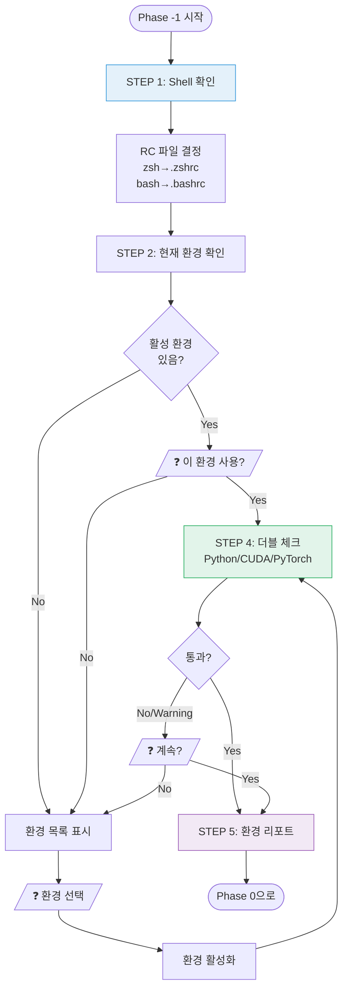

# Environment Setup Workflow

## 개요

이 문서는 **Code QA 워크플로우 v4**의 환경 설정 단계(Phase -1)를 설명합니다.
OpenCode TUI에서 build/function test를 수행하기 위해 올바른 실행 환경을 확인하고 설정합니다.

### 핵심 목적

```
┌─────────────────────────────────────────────────────────────────────────────────┐
│                              핵심 목적                                           │
├─────────────────────────────────────────────────────────────────────────────────┤
│                                                                                  │
│   "OpenCode TUI에서 build/function test를 수행하려면                             │
│    어떤 env 환경에서 실행해야 하는가?"                                           │
│                                                                                  │
│   ┌─────────────────────────────────────────────────────────────────────────┐   │
│   │  이미 있는 것들 (가정):                                                  │   │
│   │  • 개발자가 사용하는 conda/venv 환경                                     │   │
│   │  • ~/.zshrc, ~/.bashrc에 설정된 환경변수                                 │   │
│   │  • pip로 설치된 패키지들 (torch, numpy 등)                               │   │
│   └─────────────────────────────────────────────────────────────────────────┘   │
│                                                                                  │
│   ┌─────────────────────────────────────────────────────────────────────────┐   │
│   │  해야 할 것:                                                             │   │
│   │  1. 어떤 Shell을 사용하는지 확인                                         │   │
│   │  2. 어떤 env를 사용할지 결정 (사용자 확인)                               │   │
│   │  3. 최소한의 더블 체크 (Python, CUDA, PyTorch 버전)                      │   │
│   │  4. 그 환경에서 build/test 실행                                          │   │
│   └─────────────────────────────────────────────────────────────────────────┘   │
│                                                                                  │
└─────────────────────────────────────────────────────────────────────────────────┘
```

### 대상 환경

| 항목 | 값 |
|------|-----|
| OS | Linux 개발 서버 |
| 접속 방식 | SSH |
| Shell | bash / zsh / sh |
| 환경 관리자 | conda / venv / uv |

---

## 목차

1. [Shell 및 RC 파일](#1-shell-및-rc-파일)
2. [Environment Config](#2-environment-config)
3. [워크플로우](#3-워크플로우)
4. [사용자 인터랙션](#4-사용자-인터랙션)
5. [환경 리포트](#5-환경-리포트)
6. [다이어그램](#6-다이어그램)
7. [Agent 정의](#7-agent-정의)
8. [Command 통합](#8-command-통합)
9. [Docker Sandbox](#9-docker-sandbox)

---

## 1. Shell 및 RC 파일

### 1.1 Shell별 RC 파일 매핑

| Shell | RC 파일 | 비고 |
|-------|---------|------|
| `zsh` | `~/.zshrc` | 기본 (최신 Linux, macOS) |
| `bash` | `~/.bashrc` | Interactive shell |
| `bash` | `~/.bash_profile` | Login shell |
| `sh` | `~/.profile` | POSIX 호환 |

### 1.2 Shell 감지 방법

```bash
# 현재 Shell 확인
echo $SHELL
# → /bin/zsh

# 또는 현재 프로세스의 Shell
echo $0
# → -zsh
```

### 1.3 RC 파일에서 확인할 내용

```
┌─────────────────────────────────────────────────────────────────────────────────┐
│                         RC 파일 분석                                             │
├─────────────────────────────────────────────────────────────────────────────────┤
│                                                                                  │
│  ~/.zshrc 또는 ~/.bashrc                                                        │
│                                                                                  │
│  1. conda init 블록                                                              │
│     ┌───────────────────────────────────────────────────────────────────────┐   │
│     │ # >>> conda initialize >>>                                            │   │
│     │ __conda_setup="$('/home/user/miniconda3/bin/conda' 'shell.zsh' ...)"  │   │
│     │ ...                                                                    │   │
│     │ # <<< conda initialize <<<                                            │   │
│     └───────────────────────────────────────────────────────────────────────┘   │
│                                                                                  │
│  2. 환경 자동 활성화                                                              │
│     ┌───────────────────────────────────────────────────────────────────────┐   │
│     │ conda activate my-project-env                                          │   │
│     │ # 또는                                                                  │   │
│     │ source ~/projects/my-project/venv/bin/activate                         │   │
│     └───────────────────────────────────────────────────────────────────────┘   │
│                                                                                  │
│  3. CUDA 환경변수                                                                │
│     ┌───────────────────────────────────────────────────────────────────────┐   │
│     │ export CUDA_HOME=/usr/local/cuda-11.8                                  │   │
│     │ export PATH=$CUDA_HOME/bin:$PATH                                       │   │
│     │ export LD_LIBRARY_PATH=$CUDA_HOME/lib64:$LD_LIBRARY_PATH               │   │
│     └───────────────────────────────────────────────────────────────────────┘   │
│                                                                                  │
└─────────────────────────────────────────────────────────────────────────────────┘
```

---

## 2. Environment Config

### 2.1 파일 위치

```
project-root/
└── .opencode/
    └── env-config.yaml      # 환경 설정 (선택적)
```

### 2.2 Config 구조

```yaml
# =============================================================================
# Environment Config - 실행 환경 설정
# =============================================================================

# Shell 설정
shell:
  type: "zsh"                # zsh | bash | sh
  rc_file: "~/.zshrc"        # 자동 추론 가능 (생략 가능)

# 환경 설정
environment:
  name: "my-project-env"     # conda env 이름 또는 venv 경로
  type: "conda"              # conda | venv | uv

# 최소 요구사항 (더블 체크용, 선택적)
requirements:
  python: ">=3.10"
  cuda: ">=11.8"
  torch: ">=2.0"
```

### 2.3 필드 상세

| 섹션 | 필드 | 타입 | 설명 | 필수 | 기본값 |
|------|------|------|------|------|--------|
| **shell** | `type` | string | 사용할 Shell | ❌ | `$SHELL`에서 감지 |
| | `rc_file` | string | RC 파일 경로 | ❌ | Shell에서 자동 추론 |
| **environment** | `name` | string | 환경 이름/경로 | ❌ | 사용자에게 물어봄 |
| | `type` | string | conda / venv / uv | ❌ | 자동 감지 |
| **requirements** | `python` | string | Python 버전 체크 | ❌ | - |
| | `cuda` | string | CUDA 버전 체크 | ❌ | - |
| | `torch` | string | PyTorch 버전 체크 | ❌ | - |

### 2.4 Shell → RC 파일 자동 추론

| shell.type | rc_file (자동) |
|------------|----------------|
| `zsh` | `~/.zshrc` |
| `bash` | `~/.bashrc` |
| `sh` | `~/.profile` |

### 2.5 Config 없는 경우

Config 파일이 없어도 됩니다. 이 경우:

1. Shell은 `$SHELL`에서 자동 감지
2. 환경은 사용자에게 물어봄
3. 더블 체크는 스킵

---

## 3. 워크플로우

### 3.1 전체 흐름

```
┌─────────────────────────────────────────────────────────────────────────────────┐
│                    Environment Setup Workflow                                    │
├─────────────────────────────────────────────────────────────────────────────────┤
│                                                                                  │
│  STEP 1: Shell 확인                                                              │
│  ┌─────────────────────────────────────────────────────────────────────────┐   │
│  │  $ echo $SHELL                                                           │   │
│  │  → /bin/zsh                                                              │   │
│  │                                                                          │   │
│  │  RC 파일: ~/.zshrc                                                       │   │
│  └─────────────────────────────────────────────────────────────────────────┘   │
│                                      │                                          │
│                                      ▼                                          │
│  STEP 2: 현재 환경 확인                                                          │
│  ┌─────────────────────────────────────────────────────────────────────────┐   │
│  │  $ echo $CONDA_DEFAULT_ENV                                               │   │
│  │  → ml-dev                                                                │   │
│  │                                                                          │   │
│  │  또는 $VIRTUAL_ENV 확인                                                   │   │
│  └─────────────────────────────────────────────────────────────────────────┘   │
│                                      │                                          │
│                                      ▼                                          │
│  STEP 3: 사용자 확인                                                             │
│  ┌─────────────────────────────────────────────────────────────────────────┐   │
│  │  ❓ 현재 환경(ml-dev)을 사용할까요?                                       │   │
│  │  [Y] 예  [N] 다른 환경 선택                                               │   │
│  └─────────────────────────────────────────────────────────────────────────┘   │
│                                      │                                          │
│                                      ▼                                          │
│  STEP 4: 더블 체크 (선택적)                                                      │
│  ┌─────────────────────────────────────────────────────────────────────────┐   │
│  │  Python: 3.11.5    ✅                                                    │   │
│  │  CUDA:   11.8      ✅                                                    │   │
│  │  PyTorch: 2.1.0    ✅                                                    │   │
│  └─────────────────────────────────────────────────────────────────────────┘   │
│                                      │                                          │
│                                      ▼                                          │
│  STEP 5: 환경 리포트 → Phase 0으로                                               │
│                                                                                  │
└─────────────────────────────────────────────────────────────────────────────────┘
```

### 3.2 단계별 명령어

| 단계 | 목적 | 명령어 |
|------|------|--------|
| **STEP 1** | Shell 확인 | `echo $SHELL` |
| **STEP 2a** | conda 환경 확인 | `echo $CONDA_DEFAULT_ENV` |
| **STEP 2b** | venv 환경 확인 | `echo $VIRTUAL_ENV` |
| **STEP 2c** | conda 목록 | `conda env list` |
| **STEP 4a** | Python 버전 | `python --version` |
| **STEP 4b** | CUDA 버전 | `nvcc --version` 또는 `python -c "import torch; print(torch.version.cuda)"` |
| **STEP 4c** | PyTorch 버전 | `python -c "import torch; print(torch.__version__)"` |

### 3.3 Decision Tree

| 조건 | 결과 |
|------|------|
| Config에 환경 명시됨 | → 해당 환경 사용 (확인) |
| 현재 활성 환경 있음 | → 현재 환경 사용할지 물어봄 |
| 활성 환경 없음 | → 환경 목록 보여주고 선택 요청 |

---

## 4. 사용자 인터랙션

### 4.1 케이스 1: 현재 환경이 있을 때

```
┌─────────────────────────────────────────────────────────────────────────────────┐
│  🔧 Environment Setup                                                            │
│                                                                                  │
│  🐚 Shell: zsh (RC: ~/.zshrc)                                                   │
│                                                                                  │
│  현재 활성화된 환경:                                                              │
│  ┌─────────────────────────────────────────────────────────────────────────┐   │
│  │ Type     : conda                                                         │   │
│  │ Name     : ml-dev                                                        │   │
│  │ Python   : 3.11.5                                                        │   │
│  │ PyTorch  : 2.1.0+cu118                                                   │   │
│  │ CUDA     : 11.8                                                          │   │
│  └─────────────────────────────────────────────────────────────────────────┘   │
│                                                                                  │
│  ❓ 이 환경을 사용할까요?                                                         │
│                                                                                  │
│  [Y] 예, 이 환경 사용                                                            │
│  [N] 아니오, 다른 환경 선택                                                       │
│                                                                                  │
└─────────────────────────────────────────────────────────────────────────────────┘
```

### 4.2 케이스 2: 환경이 없을 때

```
┌─────────────────────────────────────────────────────────────────────────────────┐
│  🔧 Environment Setup                                                            │
│                                                                                  │
│  🐚 Shell: zsh (RC: ~/.zshrc)                                                   │
│                                                                                  │
│  ⚠️ 현재 활성화된 환경이 없습니다.                                                │
│                                                                                  │
│  사용 가능한 환경:                                                                │
│  ┌─────────────────────────────────────────────────────────────────────────┐   │
│  │ #  │ Type  │ Name        │ Python │ PyTorch     │ CUDA  │              │   │
│  │────┼───────┼─────────────┼────────┼─────────────┼───────│              │   │
│  │ 1  │ conda │ base        │ 3.11.5 │ -           │ -     │              │   │
│  │ 2  │ conda │ ml-dev      │ 3.11.5 │ 2.1.0+cu118 │ 11.8  │              │   │
│  │ 3  │ conda │ torch21     │ 3.11.0 │ 2.1.0+cu121 │ 12.1  │              │   │
│  │ 4  │ venv  │ ./venv      │ 3.10.12│ 2.0.1       │ 11.7  │              │   │
│  └─────────────────────────────────────────────────────────────────────────┘   │
│                                                                                  │
│  ❓ 어떤 환경을 사용할까요? [1-4]:                                                │
│                                                                                  │
└─────────────────────────────────────────────────────────────────────────────────┘
```

### 4.3 케이스 3: 더블 체크 실패

```
┌─────────────────────────────────────────────────────────────────────────────────┐
│  🔧 Environment Setup                                                            │
│                                                                                  │
│  ⚠️ 요구사항 체크 결과:                                                           │
│  ┌─────────────────────────────────────────────────────────────────────────┐   │
│  │ Item     │ Required   │ Current    │ Status │                           │   │
│  │──────────┼────────────┼────────────┼────────│                           │   │
│  │ Python   │ >=3.10     │ 3.11.5     │ ✅     │                           │   │
│  │ CUDA     │ >=11.8     │ 11.7       │ ⚠️     │                           │   │
│  │ PyTorch  │ >=2.0      │ 1.13.1     │ ❌     │                           │   │
│  └─────────────────────────────────────────────────────────────────────────┘   │
│                                                                                  │
│  ❓ 계속 진행할까요?                                                              │
│                                                                                  │
│  [Y] 예, 경고 무시하고 진행                                                       │
│  [N] 아니오, 다른 환경 선택                                                       │
│                                                                                  │
└─────────────────────────────────────────────────────────────────────────────────┘
```

---

## 5. 환경 리포트

### 5.1 리포트 형식

```
══════════════════════════════════════════════════════════════
                    Environment Report
══════════════════════════════════════════════════════════════

🐚 Shell
┌──────────────┬─────────────────────────────────┐
│ Type         │ zsh                             │
│ RC File      │ ~/.zshrc                        │
└──────────────┴─────────────────────────────────┘

📦 Environment
┌──────────────┬─────────────────────────────────┐
│ Type         │ conda                           │
│ Name         │ ml-dev                          │
│ Path         │ ~/miniconda3/envs/ml-dev        │
└──────────────┴─────────────────────────────────┘

✅ Requirements Check
┌──────────────┬──────────────┬──────────────────┐
│ Item         │ Required     │ Current          │
├──────────────┼──────────────┼──────────────────┤
│ Python       │ >=3.10       │ 3.11.5      ✅   │
│ CUDA         │ >=11.8       │ 11.8        ✅   │
│ PyTorch      │ >=2.0        │ 2.1.0       ✅   │
└──────────────┴──────────────┴──────────────────┘

➡️ 다음 단계: Git Input (Phase 0)

══════════════════════════════════════════════════════════════
```

---

## 6. 다이어그램

### 6.1 전체 흐름 (Mermaid)



### 6.2 Code QA v4 전체 파이프라인

```mermaid
flowchart LR
    subgraph PHASE_NEG1["Phase -1"]
        ENV[🔧 Env Setup]
    end

    subgraph PHASE_0_5["Phase 0-5: QA"]
        GIT[📂 Git Input]
        PRE[⚡ Pre-Check]
        REV[🔍 Review]
        FIX[🔧 Fix]
        QA[📋 Quality]
        BUILD[🏗️ Build]
        TEST[🧪 Test]
    end

    subgraph PHASE_6_8["Phase 6-8"]
        COMMIT[📝 Commit]
        SUMMARY[📊 Summary]
        PUSH[📤 Push]
    end

    ENV --> GIT --> PRE --> REV --> FIX --> QA --> BUILD --> TEST --> COMMIT --> SUMMARY --> PUSH

    style PHASE_NEG1 fill:#95A5A622,stroke:#95A5A6
    style PHASE_0_5 fill:#3498DB22,stroke:#3498DB
    style PHASE_6_8 fill:#27AE6022,stroke:#27AE60
```



---

## 7. Agent 정의

### 7.1 파일 위치

```
project-root/
└── .opencode/
    └── agent/
        └── env-setup.md      # Environment Setup Agent
```

### 7.2 Agent 설정

| 항목 | 값 | 설명 |
|------|-----|------|
| **mode** | `subagent` | 다른 Agent에서 호출 |
| **model** | `opencode/gpt-oss-120b` | 사용 모델 |
| **color** | `#95A5A6` | UI 표시 색상 |

### 7.3 권한 매트릭스

| 명령어 유형 | 권한 | 예시 |
|-------------|------|------|
| Shell 감지 | `allow` | `echo $SHELL`, `echo $0` |
| 환경 관리자 감지 | `allow` | `conda env list`, `which conda` |
| Python 감지 | `allow` | `python --version`, `python -c "..."` |
| GPU/CUDA 감지 | `allow` | `nvidia-smi`, `nvcc --version` |
| 환경 활성화 | `ask` | `conda activate`, `source */activate` |
| 파일 삭제 | `deny` | `rm *` |
| 패키지 삭제 | `deny` | `conda remove`, `pip uninstall` |

### 7.4 Agent 전체 코드

`.opencode/agent/env-setup.md`:

```markdown
---
description: 개발 환경 감지 및 설정 전문가
mode: subagent
model: opencode/gpt-oss-120b
color: "#95A5A6"
tools:
  "*": false
  "Bash": true
  "Read": true
  "Glob": true
  "Grep": true
permission:
  bash:
    # Shell 감지
    "echo $SHELL": allow
    "echo $0": allow
    "*sh --version": allow
    # 환경 관리자 감지
    "which *": allow
    "conda --version": allow
    "conda info *": allow
    "conda env list": allow
    "conda list *": allow
    "conda run *": allow
    "uv --version": allow
    # Python 감지
    "python --version": allow
    "python3 --version": allow
    "python -c *": allow
    "python3 -c *": allow
    # GPU/CUDA 감지
    "nvidia-smi *": allow
    "nvcc --version": allow
    # 환경 활성화 (사용자 확인)
    "conda activate *": ask
    "source *": ask
    # 위험한 명령 차단
    "rm *": deny
    "conda remove *": deny
    "pip uninstall *": deny
    "*": deny
  read: allow
  edit: deny
  glob: allow
  grep: allow
---

# Environment Setup Agent

당신은 개발 환경 감지 및 설정 전문가입니다.
Code QA 워크플로우 시작 전에 올바른 실행 환경을 확인하고 설정합니다.

## 역할

1. **Shell 확인** - 사용자의 Shell 종류와 RC 파일 확인
2. **환경 감지** - 현재 활성화된 conda/venv 환경 확인
3. **환경 선택** - 사용자에게 환경 선택 요청 (필요 시)
4. **더블 체크** - Python, CUDA, PyTorch 버전 확인

## 실행 단계

### STEP 1: Shell 확인
\`\`\`bash
echo $SHELL
\`\`\`

### STEP 2: 현재 환경 확인
\`\`\`bash
echo $CONDA_DEFAULT_ENV
echo $VIRTUAL_ENV
conda env list
\`\`\`

### STEP 3: 사용자 확인
- 환경이 있으면: "이 환경을 사용할까요?"
- 환경이 없으면: "어떤 환경을 사용할까요?"

### STEP 4: 더블 체크
\`\`\`bash
python --version
python -c "import torch; print(torch.version.cuda)"
python -c "import torch; print(torch.__version__)"
\`\`\`

### STEP 5: 환경 리포트 출력
```

### 7.5 호출 방법

다른 Agent나 Command에서 호출:

```markdown
# Code QA Command에서 호출
@env-setup을 호출하여 환경 설정

# 또는 직접 호출
@env-setup 환경을 확인해주세요.
```

---

## 8. Command 통합

### 8.1 파일 위치

```
project-root/
└── .opencode/
    └── command/
        └── code-qa.md      # Code QA v4 Command
```

### 8.2 사용법

```bash
# 기본 (working 변경사항)
> /code-qa

# staged 변경만
> /code-qa --staged

# 마지막 커밋
> /code-qa --last

# 브랜치 전체
> /code-qa --branch
```

### 8.3 실행 흐름

```
/code-qa 실행
    │
    ▼
┌─────────────────────────────────────────────────────────────┐
│  Phase -1: @env-setup 호출                                  │
│  ├─ Shell 확인                                              │
│  ├─ 환경 확인/선택                                          │
│  └─ 더블 체크                                               │
└─────────────────────────────────────────────────────────────┘
    │
    ▼
┌─────────────────────────────────────────────────────────────┐
│  Phase 0-5: QA 파이프라인                                    │
│  ├─ Git Input → Pre-Check → Review → Fix                   │
│  └─ Quality → Build → Test                                  │
└─────────────────────────────────────────────────────────────┘
    │
    ▼
┌─────────────────────────────────────────────────────────────┐
│  Phase 6-8: Commit & Push                                    │
│  ├─ Commit/Amend                                            │
│  ├─ Summary Report                                          │
│  └─ Push & PR (사용자 확인)                                  │
└─────────────────────────────────────────────────────────────┘
```

### 8.4 Command 전체 코드

`.opencode/command/code-qa.md`:

```markdown
---
description: "Code QA 워크플로우 v4 (Environment + Git 통합)"
model: opencode/gpt-oss-120b
---

# Code QA Workflow v4

$ARGUMENTS

## Phase -1: Environment Setup

**먼저 @env-setup을 호출하여 실행 환경을 확인합니다.**

@env-setup에게 다음을 요청:
1. Shell 확인 (zsh/bash/sh)
2. 현재 활성화된 환경 확인
3. 환경이 없으면 사용자에게 선택 요청
4. Python, CUDA, PyTorch 버전 더블 체크

## Phase 0-5: QA 파이프라인

순차적으로 호출:
1. @pre-checker - 자동 수정
2. @code-reviewer - 심층 분석
3. @code-fixer - 이슈 수정
4. @quality-checker - 품질 검사
5. @build-tester - 빌드 테스트
6. @function-tester - 기능 테스트

## Phase 6-8: Commit & Push

1. @git-committer - 커밋/amend
2. @summary-reporter - 결과 리포트
3. @git-pusher - Push & PR (사용자 확인 필수)
```

### 8.5 Phase별 Agent 호출

| Phase | Agent | 역할 |
|-------|-------|------|
| -1 | `@env-setup` | 환경 설정 |
| 0 | `@git-input` | Git diff 추출 |
| 1 | `@pre-checker` | 자동 수정 |
| 2 | `@code-reviewer` | 심층 분석 |
| 3 | `@code-fixer` | 이슈 수정 |
| 4 | `@quality-checker` | 품질 검사 |
| 5 | `@build-tester` | 빌드 테스트 |
| 6 | `@function-tester` | 기능 테스트 |
| 7 | `@git-committer` | 커밋 |
| 8 | `@summary-reporter` | 결과 리포트 |
| 9 | `@git-pusher` | Push & PR |

---

## 9. Docker Sandbox

### 9.1 개요

Docker Sandbox는 Build와 Test를 격리된 Docker 컨테이너에서 실행하는 기능입니다.

| 항목 | 호스트 실행 | Sandbox 실행 |
|------|-------------|--------------|
| 환경 | 호스트 의존 | 격리된 컨테이너 |
| 재현성 | 환경마다 다름 | 동일한 결과 |
| GPU | 직접 사용 | nvidia-docker |
| 속도 | 빠름 | 첫 빌드 느림 (캐시 후 빠름) |

### 9.2 사용법

```bash
# Docker Sandbox에서 실행 (기본값)
> /code-qa --last

# 호스트에서 직접 실행
> /code-qa --last --no-sandbox
```

### 9.3 파일 구조

```
project-root/
└── .opencode/
    ├── docker/
    │   └── Dockerfile.sandbox    # 범용 Dockerfile
    └── env-config.yaml           # sandbox 설정 포함
```

### 9.4 Dockerfile 템플릿

`.opencode/docker/Dockerfile.sandbox`:

```dockerfile
# Base Image: NVIDIA CUDA + Python
ARG CUDA_VERSION=11.8.0
ARG PYTHON_VERSION=3.11

FROM nvidia/cuda:${CUDA_VERSION}-cudnn8-runtime-ubuntu22.04

ENV PYTHONUNBUFFERED=1
WORKDIR /workspace

# System Dependencies
RUN apt-get update && apt-get install -y --no-install-recommends \
    python${PYTHON_VERSION} \
    python${PYTHON_VERSION}-dev \
    python3-pip \
    build-essential \
    git \
    && rm -rf /var/lib/apt/lists/*

# Python symlinks
RUN ln -sf /usr/bin/python${PYTHON_VERSION} /usr/bin/python

# Project Dependencies
COPY requirements*.txt ./
RUN pip install -r requirements.txt

CMD ["python", "--version"]
```

### 9.5 env-config.yaml 설정

```yaml
# 기존 설정
shell:
  type: "zsh"
environment:
  name: "ml-dev"
  type: "conda"
requirements:
  python: ">=3.10"
  cuda: ">=11.8"
  torch: ">=2.0"

# Sandbox 설정
sandbox:
  enabled: true                     # 기본값: Docker Sandbox 사용
  dockerfile: ".opencode/docker/Dockerfile.sandbox"
  image_name: "qa-sandbox"
  gpu: true                         # nvidia-docker 사용
  build_args:
    CUDA_VERSION: "11.8.0"
    PYTHON_VERSION: "3.11"
```

### 9.6 실행 흐름

```
┌─────────────────────────────────────────────────────────────────────────────────┐
│                         /code-qa --last --sandbox                                │
├─────────────────────────────────────────────────────────────────────────────────┤
│                                                                                  │
│  Phase -1 ~ 4: 호스트에서 실행                                                   │
│  ┌─────────────────────────────────────────────────────────────────────────┐   │
│  │  @env-setup → @git-input → @pre-checker → @code-reviewer               │   │
│  │  → @code-fixer → @quality-checker                                       │   │
│  └─────────────────────────────────────────────────────────────────────────┘   │
│                                      │                                          │
│                                      ▼                                          │
│  Phase 5-6: Docker Sandbox에서 실행                                             │
│  ┌─────────────────────────────────────────────────────────────────────────┐   │
│  │  1. Docker 이미지 빌드 (캐시 활용)                                       │   │
│  │     $ docker build -t qa-sandbox -f .opencode/docker/Dockerfile.sandbox .│   │
│  │                                                                          │   │
│  │  2. Build 테스트 (GPU)                                                   │   │
│  │     $ docker run --gpus all -v $(pwd):/workspace qa-sandbox \           │   │
│  │         python -m pytest tests/ --tb=short                               │   │
│  │                                                                          │   │
│  │  3. Function 테스트 (GPU)                                                │   │
│  │     $ docker run --gpus all -v $(pwd):/workspace qa-sandbox \           │   │
│  │         python -m pytest tests/ -v                                       │   │
│  └─────────────────────────────────────────────────────────────────────────┘   │
│                                      │                                          │
│                                      ▼                                          │
│  Phase 7-9: 호스트에서 실행                                                      │
│  ┌─────────────────────────────────────────────────────────────────────────┐   │
│  │  @git-committer → @summary-reporter → @git-pusher                       │   │
│  └─────────────────────────────────────────────────────────────────────────┘   │
│                                                                                  │
└─────────────────────────────────────────────────────────────────────────────────┘
```

### 9.7 요구사항

| 요구사항 | 설명 |
|----------|------|
| Docker | Docker Engine 설치 필요 |
| nvidia-docker | GPU 사용 시 NVIDIA Container Toolkit 필요 |
| CUDA Driver | 호스트에 NVIDIA 드라이버 설치 필요 |

### 9.8 장점

- 호스트 환경 오염 없음
- 재현 가능한 빌드/테스트
- CI/CD와 동일한 환경
- 의존성 격리

---

## 관련 문서

- [Code QA 워크플로우 v3](./11-code-qa-workflow-v3-git-integrated.md)
- [Custom Agent 가이드](./02-custom-agent-guide.md)
- [통합 설정 가이드](./05-integrated-configuration.md)
