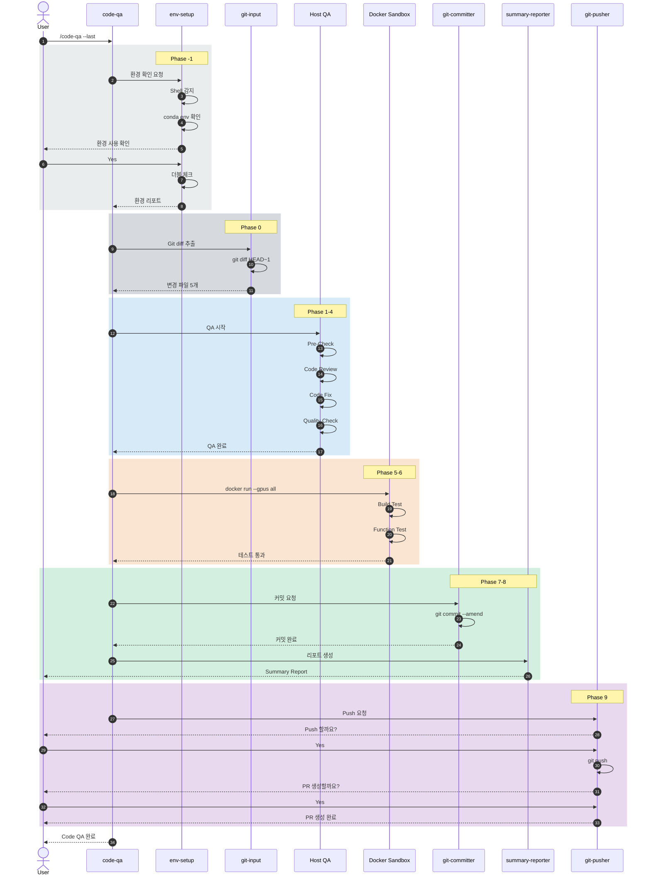

# Code QA v4 전체 워크플로우 다이어그램

## 개요

이 문서는 **Code QA v4 워크플로우**의 전체 흐름을 하나의 통합 다이어그램으로 제공합니다.

---

## 1. 전체 파이프라인 개요

```
┌─────────────────────────────────────────────────────────────────────────────────────────────────────┐
│                                    Code QA Workflow v4                                               │
│                            (Environment + Git + Docker Sandbox 통합)                                 │
├─────────────────────────────────────────────────────────────────────────────────────────────────────┤
│                                                                                                      │
│   ┌──────────────────────────────────────────────────────────────────────────────────────────────┐  │
│   │                                    호스트 실행 영역                                            │  │
│   ├──────────────────────────────────────────────────────────────────────────────────────────────┤  │
│   │                                                                                               │  │
│   │  Phase -1        Phase 0         Phase 1         Phase 2         Phase 3         Phase 4     │  │
│   │  ┌─────────┐    ┌─────────┐    ┌─────────┐    ┌─────────┐    ┌─────────┐    ┌─────────┐    │  │
│   │  │   🔧    │───▶│   📂    │───▶│   ⚡    │───▶│   🔍    │───▶│   🔧    │───▶│   📋    │    │  │
│   │  │   Env   │    │   Git   │    │   Pre   │    │  Review │    │   Fix   │    │ Quality │    │  │
│   │  │  Setup  │    │  Input  │    │  Check  │    │         │    │         │    │  Check  │    │  │
│   │  └─────────┘    └─────────┘    └─────────┘    └─────────┘    └────┬────┘    └────┬────┘    │  │
│   │                                                                   │              │          │  │
│   │                                                                   │◀─── 회귀 ◀───┤ <70%     │  │
│   │                                                                   │   (최대3회)  │          │  │
│   └───────────────────────────────────────────────────────────────────┼──────────────┼──────────┘  │
│                                                                       │              │              │
│   ┌───────────────────────────────────────────────────────────────────┼──────────────┼──────────┐  │
│   │                              Docker Sandbox 영역 (기본값)          │              │          │  │
│   ├───────────────────────────────────────────────────────────────────┼──────────────┼──────────┤  │
│   │                                                                   │              ▼          │  │
│   │  Phase 5                                    Phase 6               │        ┌─────────┐     │  │
│   │  ┌─────────────────────┐                   ┌─────────────────────┐│        │  Build  │     │  │
│   │  │        🏗️           │                   │        🧪           ││◀───────│   🏗️    │     │  │
│   │  │   Build Tester     │──────────────────▶│  Function Tester    ││  회귀  └─────────┘     │  │
│   │  │   (GPU 지원)        │                   │   (GPU 지원)         ││                        │  │
│   │  └─────────────────────┘                   └──────────┬──────────┘│                        │  │
│   │                                                       │           │                        │  │
│   │  ┌─────────────────────────────────────────────────────────────────────────────────────┐  │  │
│   │  │  docker run --gpus all -v $(pwd):/workspace qa-sandbox python -m pytest tests/     │  │  │
│   │  └─────────────────────────────────────────────────────────────────────────────────────┘  │  │
│   │                                                       │           │                        │  │
│   └───────────────────────────────────────────────────────┼───────────┼────────────────────────┘  │
│                                                           │           │                          │
│   ┌───────────────────────────────────────────────────────┼───────────┼────────────────────────┐  │
│   │                                    호스트 실행 영역    │           │                        │  │
│   ├───────────────────────────────────────────────────────┼───────────┼────────────────────────┤  │
│   │                                                       │  회귀 ◀───┤ 실패                   │  │
│   │                                                       │           │                        │  │
│   │                                                       ▼           │                        │  │
│   │  Phase 7              Phase 8              Phase 9                │                        │  │
│   │  ┌─────────┐         ┌─────────┐         ┌─────────────────────┐ │                        │  │
│   │  │   📝    │────────▶│   📊    │────────▶│   📤 Push   🔀 PR   │ │                        │  │
│   │  │ Commit  │         │ Summary │         │   (사용자 확인 필수)  │ │                        │  │
│   │  │ /Amend  │         │ Report  │         └─────────────────────┘ │                        │  │
│   │  └─────────┘         └─────────┘                  │               │                        │  │
│   │                                                   ▼               │                        │  │
│   │                                              ┌─────────┐         │                        │  │
│   │                                              │   🎉    │         │                        │  │
│   │                                              │  완료!   │         │                        │  │
│   │                                              └─────────┘         │                        │  │
│   └──────────────────────────────────────────────────────────────────────────────────────────┘  │
│                                                                                                      │
└─────────────────────────────────────────────────────────────────────────────────────────────────────┘
```

---

## 2. Phase 요약 테이블

| Phase | Agent | 모델 | 역할 | 실행 환경 |
|-------|-------|------|------|-----------|
| **-1** | `@env-setup` | Qwen3-Coder | Shell/conda/venv 환경 감지 | 호스트 |
| **0** | `@git-input` | Qwen3-Coder | Git diff 추출, 변경 파일 목록 | 호스트 |
| **1** | `@pre-checker` | Qwen3-Coder | 자동 수정 (lint --fix, format) | 호스트 |
| **2** | `@code-reviewer` | **GPT-OSS-120B** | 심층 코드 분석, 이슈 발견 | 호스트 |
| **3** | `@code-fixer` | Qwen3-Coder | 발견된 이슈 수정 (SWE-Bench SOTA) | 호스트 |
| **4** | `@quality-checker` | Qwen3-Coder | 품질 점수 검사 (≥70%) | 호스트 |
| **5** | `@build-tester` | Qwen3-Coder | 빌드 테스트 (GPU) | **Sandbox** |
| **6** | `@function-tester` | Qwen3-Coder | 기능 테스트 (GPU) | **Sandbox** |
| **7** | `@git-committer` | Qwen3-Coder | Commit 또는 Amend | 호스트 |
| **8** | `@summary-reporter` | **GPT-OSS-120B** | Markdown 결과 리포트 (CoT) | 호스트 |
| **9** | `@git-pusher` | Qwen3-Coder | Push & PR 생성 | 호스트 |

### 2.1 모델 배분 다이어그램

```
┌─────────────────────────────────────────────────────────────────────────────────────────┐
│                              모델 배분 전략                                               │
├─────────────────────────────────────────────────────────────────────────────────────────┤
│                                                                                          │
│  ┌─────────────────────────────────────────────────────────────────────────────────┐   │
│  │  Qwen3-Coder-30B (9개 Agent - 82%)                                              │   │
│  │  ─────────────────────────────────                                              │   │
│  │  • SWE-Bench 오픈소스 SOTA                                                       │   │
│  │  • Agent RL 학습 (멀티턴, 도구 사용)                                              │   │
│  │  • Tool/Function Calling 특화                                                   │   │
│  │  • 3.3B 활성 파라미터 → 빠르고 효율적                                            │   │
│  │                                                                                  │   │
│  │  적용: env-setup, git-input, pre-checker, code-fixer, quality-checker,          │   │
│  │        build-tester, function-tester, git-committer, git-pusher                 │   │
│  └─────────────────────────────────────────────────────────────────────────────────┘   │
│                                                                                          │
│  ┌─────────────────────────────────────────────────────────────────────────────────┐   │
│  │  GPT-OSS-120B (2개 Agent - 18%)                                                 │   │
│  │  ─────────────────────────────                                                  │   │
│  │  • Full Chain-of-Thought 지원                                                   │   │
│  │  • Reasoning effort 조절 가능                                                   │   │
│  │  • 복잡한 분석/종합 판단에 적합                                                  │   │
│  │  • 5.1B 활성 파라미터                                                           │   │
│  │                                                                                  │   │
│  │  적용: code-reviewer (깊은 분석), summary-reporter (결과 종합)                   │   │
│  └─────────────────────────────────────────────────────────────────────────────────┘   │
│                                                                                          │
│  ═══════════════════════════════════════════════════════════════════════════════════   │
│                                                                                          │
│   Phase -1  Phase 0   Phase 1   Phase 2   Phase 3   Phase 4   Phase 5-6   Phase 7-9   │
│   ┌─────┐  ┌─────┐   ┌─────┐   ┌─────┐   ┌─────┐   ┌─────┐   ┌───────┐   ┌───────┐   │
│   │Qwen3│  │Qwen3│   │Qwen3│   │ GPT │   │Qwen3│   │Qwen3│   │ Qwen3 │   │Qwen3+ │   │
│   │     │→ │     │ → │     │ → │ OSS │ → │     │ → │     │ → │       │ → │  GPT  │   │
│   └─────┘  └─────┘   └─────┘   └─────┘   └─────┘   └─────┘   └───────┘   └───────┘   │
│    env      git       pre      review     fix      quality   build/test  commit/     │
│   setup    input     check      (CoT)    (SOTA)    check      (agent)    summary     │
│                                                                                          │
└─────────────────────────────────────────────────────────────────────────────────────────┘
```

---

## 3. 상세 플로우차트

```mermaid
flowchart TB
    START(["code-qa --last"]) --> ENV_SETUP

    subgraph PHASE_NEG1["Phase -1: Environment Setup"]
        ENV_SETUP["env-setup"]
        SHELL["Shell 확인"]
        ENV_CHECK["환경 확인"]
        ENV_SELECT{"환경 선택"}
        DOUBLE_CHECK["더블 체크"]

        ENV_SETUP --> SHELL --> ENV_CHECK --> ENV_SELECT --> DOUBLE_CHECK
    end

    DOUBLE_CHECK --> GIT_INPUT

    subgraph PHASE_0["Phase 0: Git Input"]
        GIT_INPUT["git-input"]
        PARSE_MODE["모드 파싱"]
        EXTRACT_FILES["변경 파일 추출"]

        GIT_INPUT --> PARSE_MODE --> EXTRACT_FILES
    end

    EXTRACT_FILES --> PRE_CHECK

    subgraph HOST_QA["Phase 1-4: 호스트 QA"]
        PRE_CHECK["pre-checker"]
        CODE_REVIEW["code-reviewer"]
        CODE_FIX["code-fixer"]
        QUALITY["quality-checker"]

        PRE_CHECK --> CODE_REVIEW --> CODE_FIX --> QUALITY
    end

    QUALITY --> Q_CHECK{"70% 이상?"}
    Q_CHECK -->|No| RETRY_Q{"회귀 3회 미만?"}
    RETRY_Q -->|Yes| CODE_FIX
    RETRY_Q -->|No| HUMAN["사용자 개입"]
    HUMAN --> BUILD_TEST

    Q_CHECK -->|Yes| BUILD_TEST

    subgraph SANDBOX["Phase 5-6: Docker Sandbox"]
        BUILD_TEST["build-tester"]
        FUNC_TEST["function-tester"]

        BUILD_TEST --> B_CHECK{"성공?"}
        B_CHECK -->|Yes| FUNC_TEST
        FUNC_TEST --> T_CHECK{"통과?"}
    end

    B_CHECK -->|No| CODE_FIX
    T_CHECK -->|No| CODE_FIX

    T_CHECK -->|Yes| COMMIT

    subgraph HOST_GIT["Phase 7-9: Git 작업"]
        COMMIT["git-committer"]
        SUMMARY["summary-reporter"]
        PUSH_PR["git-pusher"]

        COMMIT --> HAS_CHANGE{"수정 있음?"}
        HAS_CHANGE -->|No| SUMMARY
        HAS_CHANGE -->|Yes| COMMIT_MODE{"입력 모드?"}

        COMMIT_MODE -->|커밋전| NEW_COMMIT["새 커밋"]
        COMMIT_MODE -->|커밋후| AMEND["amend"]

        NEW_COMMIT --> SUMMARY
        AMEND --> SUMMARY
        SUMMARY --> PUSH_PR
    end

    PUSH_PR --> PUSH_ASK["Push 할까요?"]
    PUSH_ASK --> PUSH_CHOICE{"선택"}
    PUSH_CHOICE -->|No| DONE_LOCAL(["완료 - 로컬만"])
    PUSH_CHOICE -->|Yes| DO_PUSH["git push"]

    DO_PUSH --> PR_ASK["PR 생성할까요?"]
    PR_ASK --> PR_CHOICE{"선택"}
    PR_CHOICE -->|No| DONE_PUSH(["완료 - Push만"])
    PR_CHOICE -->|Yes| CREATE_PR["PR 생성"]
    CREATE_PR --> DONE(["완료!"])

    style PHASE_NEG1 fill:#95A5A622,stroke:#95A5A6
    style PHASE_0 fill:#34495E22,stroke:#34495E
    style HOST_QA fill:#3498DB22,stroke:#3498DB
    style SANDBOX fill:#E67E2222,stroke:#E67E22
    style HOST_GIT fill:#27AE6022,stroke:#27AE60
```



---

## 4. 실행 흐름 시퀀스



---

## 5. 입력 옵션별 동작

```
┌─────────────────────────────────────────────────────────────────────────────────────────┐
│                                입력 옵션별 동작                                           │
├─────────────────────────────────────────────────────────────────────────────────────────┤
│                                                                                          │
│  ┌────────────────────────────────────────┐  ┌────────────────────────────────────────┐ │
│  │         Git 옵션                        │  │         Sandbox 옵션                   │ │
│  ├────────────────────────────────────────┤  ├────────────────────────────────────────┤ │
│  │                                        │  │                                        │ │
│  │  --working (기본)                      │  │  (기본값)                              │ │
│  │  └─ git diff                           │  │  └─ Docker Sandbox에서                 │ │
│  │  └─ 커밋 전 → 새 커밋                   │  │     Build/Test 실행                    │ │
│  │                                        │  │  └─ GPU 지원 (nvidia-docker)           │ │
│  │  --staged                              │  │                                        │ │
│  │  └─ git diff --staged                  │  │  --no-sandbox                          │ │
│  │  └─ 커밋 전 → 새 커밋                   │  │  └─ 호스트에서 직접                    │ │
│  │                                        │  │     Build/Test 실행                    │ │
│  │  --last                                │  │                                        │ │
│  │  └─ git diff HEAD~1                    │  │                                        │ │
│  │  └─ 커밋 후 → amend                     │  │                                        │ │
│  │                                        │  │                                        │ │
│  │  --branch                              │  │                                        │ │
│  │  └─ git diff main...HEAD              │  │                                        │ │
│  │  └─ 커밋 후 → amend                     │  │                                        │ │
│  │                                        │  │                                        │ │
│  │  --range a..b                          │  │                                        │ │
│  │  └─ git diff a..b                      │  │                                        │ │
│  │  └─ 커밋 후 → amend                     │  │                                        │ │
│  │                                        │  │                                        │ │
│  └────────────────────────────────────────┘  └────────────────────────────────────────┘ │
│                                                                                          │
│  사용 예시:                                                                              │
│  ┌──────────────────────────────────────────────────────────────────────────────────┐   │
│  │  /code-qa                         # working + Sandbox (기본)                     │   │
│  │  /code-qa --staged                # staged + Sandbox                             │   │
│  │  /code-qa --last                  # last commit + Sandbox (amend)                │   │
│  │  /code-qa --last --no-sandbox     # last commit + 호스트 (amend)                 │   │
│  │  /code-qa --branch                # 브랜치 전체 + Sandbox                        │   │
│  └──────────────────────────────────────────────────────────────────────────────────┘   │
│                                                                                          │
└─────────────────────────────────────────────────────────────────────────────────────────┘
```

---

## 6. 회귀 루프 상세

```
┌─────────────────────────────────────────────────────────────────────────────────────────┐
│                                    회귀 루프 시스템                                       │
├─────────────────────────────────────────────────────────────────────────────────────────┤
│                                                                                          │
│  ┌─────────────────────────────────────────────────────────────────────────────────┐   │
│  │  회귀 트리거                                                                     │   │
│  │                                                                                  │   │
│  │  1. Quality Check < 70%                                                         │   │
│  │     └─ @code-fixer로 회귀 (최대 3회)                                             │   │
│  │     └─ 3회 초과 시 사용자 개입 요청                                               │   │
│  │                                                                                  │   │
│  │  2. Build 실패                                                                   │   │
│  │     └─ @code-fixer로 회귀                                                        │   │
│  │     └─ 빌드 에러 로그 전달                                                        │   │
│  │                                                                                  │   │
│  │  3. Test 실패                                                                    │   │
│  │     └─ @code-fixer로 회귀                                                        │   │
│  │     └─ 실패한 테스트 케이스 전달                                                  │   │
│  │                                                                                  │   │
│  └─────────────────────────────────────────────────────────────────────────────────┘   │
│                                                                                          │
│  ┌─────────────────────────────────────────────────────────────────────────────────┐   │
│  │  회귀 흐름                                                                       │   │
│  │                                                                                  │   │
│  │   @quality-checker ──(< 70%)──▶ @code-fixer ──▶ @quality-checker ──▶ ...        │   │
│  │         │                            ▲                                           │   │
│  │         │                            │                                           │   │
│  │   @build-tester ──(실패)─────────────┤                                           │   │
│  │         │                            │                                           │   │
│  │         │                            │                                           │   │
│  │   @function-tester ──(실패)──────────┘                                           │   │
│  │                                                                                  │   │
│  └─────────────────────────────────────────────────────────────────────────────────┘   │
│                                                                                          │
│  MAX_RETRY = 3                                                                          │
│  QUALITY_THRESHOLD = 70                                                                 │
│                                                                                          │
└─────────────────────────────────────────────────────────────────────────────────────────┘
```

---

## 7. 파일 구조

```
project-root/
├── .opencode/
│   ├── agent/
│   │   ├── env-setup.md           # Phase -1: 환경 설정
│   │   ├── git-input.md           # Phase 0: Git 입력
│   │   ├── pre-checker.md         # Phase 1: 자동 수정
│   │   ├── code-reviewer.md       # Phase 2: 코드 리뷰
│   │   ├── code-fixer.md          # Phase 3: 이슈 수정
│   │   ├── quality-checker.md     # Phase 4: 품질 검사
│   │   ├── build-tester.md        # Phase 5: 빌드 테스트
│   │   ├── function-tester.md     # Phase 6: 기능 테스트
│   │   ├── git-committer.md       # Phase 7: 커밋
│   │   ├── summary-reporter.md    # Phase 8: 리포트
│   │   └── git-pusher.md          # Phase 9: Push & PR
│   │
│   ├── command/
│   │   └── code-qa.md             # /code-qa 커맨드
│   │
│   ├── docker/
│   │   └── Dockerfile.sandbox     # Docker Sandbox 이미지
│   │
│   └── env-config.yaml            # 환경 설정 파일
│
└── src/
    └── ...
```

---

## 8. 권한 매트릭스

```
┌──────────────────────────────────────────────────────────────────────────────────────────────┐
│                                      Agent 권한 매트릭스                                       │
├───────────────────┬───────┬───────┬────────────────┬────────────────┬───────────────────────┤
│ Agent             │ read  │ edit  │ bash (git)     │ bash (기타)     │ 사용자 확인            │
├───────────────────┼───────┼───────┼────────────────┼────────────────┼───────────────────────┤
│ @env-setup        │  ✅   │  ❌   │ ❌             │ echo, conda,   │ 환경 선택 시           │
│                   │       │       │                │ python, nvidia │                       │
├───────────────────┼───────┼───────┼────────────────┼────────────────┼───────────────────────┤
│ @git-input        │  ✅   │  ❌   │ diff, status,  │ ❌             │ ❌                    │
│                   │       │       │ log, branch    │                │                       │
├───────────────────┼───────┼───────┼────────────────┼────────────────┼───────────────────────┤
│ @pre-checker      │  ✅   │  ❌   │ diff           │ lint --fix,    │ ❌                    │
│                   │       │       │                │ format         │                       │
├───────────────────┼───────┼───────┼────────────────┼────────────────┼───────────────────────┤
│ @code-reviewer    │  ✅   │  ❌   │ diff, log      │ ❌             │ ❌                    │
├───────────────────┼───────┼───────┼────────────────┼────────────────┼───────────────────────┤
│ @code-fixer       │  ✅   │  ✅   │ diff, status   │ ❌             │ ❌                    │
├───────────────────┼───────┼───────┼────────────────┼────────────────┼───────────────────────┤
│ @quality-checker  │  ✅   │  ❌   │ ❌             │ lint, tsc,     │ ❌                    │
│                   │       │       │                │ format         │                       │
├───────────────────┼───────┼───────┼────────────────┼────────────────┼───────────────────────┤
│ @build-tester     │  ✅   │  ❌   │ ❌             │ build,         │ ❌                    │
│                   │       │       │                │ docker run     │                       │
├───────────────────┼───────┼───────┼────────────────┼────────────────┼───────────────────────┤
│ @function-tester  │  ✅   │  ❌   │ diff           │ test,          │ ❌                    │
│                   │       │       │                │ docker run     │                       │
├───────────────────┼───────┼───────┼────────────────┼────────────────┼───────────────────────┤
│ @git-committer    │  ✅   │  ❌   │ add, commit,   │ ❌             │ ❌                    │
│                   │       │       │ status         │                │                       │
├───────────────────┼───────┼───────┼────────────────┼────────────────┼───────────────────────┤
│ @summary-reporter │  ✅   │  ❌   │ log, diff      │ ❌             │ ❌                    │
├───────────────────┼───────┼───────┼────────────────┼────────────────┼───────────────────────┤
│ @git-pusher       │  ✅   │  ❌   │ push (ask),    │ ❌             │ ✅ Push/PR 필수       │
│                   │       │       │ branch, remote │                │                       │
└───────────────────┴───────┴───────┴────────────────┴────────────────┴───────────────────────┘
```

---

## 9. Quick Reference

### 9.1 자주 사용하는 명령어

| 명령어 | 설명 |
|--------|------|
| `/code-qa` | working 변경사항 검사 (Sandbox 기본) |
| `/code-qa --staged` | staged 변경만 검사 |
| `/code-qa --last` | 마지막 커밋 검사 → amend |
| `/code-qa --branch` | 브랜치 전체 검사 |
| `/code-qa --last --no-sandbox` | 호스트에서 Build/Test |

### 9.2 환경 요구사항

| 요구사항 | 설명 |
|----------|------|
| Docker | Docker Engine 설치 |
| nvidia-docker | GPU 사용 시 NVIDIA Container Toolkit |
| CUDA Driver | 호스트에 NVIDIA 드라이버 설치 |

### 9.3 설정 파일

| 파일 | 위치 | 용도 |
|------|------|------|
| `env-config.yaml` | `.opencode/` | Shell, 환경, 요구사항, Sandbox 설정 |
| `Dockerfile.sandbox` | `.opencode/docker/` | Sandbox 이미지 정의 |
| `code-qa.md` | `.opencode/command/` | /code-qa 커맨드 정의 |

---

## 관련 문서

- [Environment Setup 상세](./12-environment-setup-workflow.md)
- [Code QA v3 (Git 통합)](./11-code-qa-workflow-v3-git-integrated.md)
- [Custom Agent 가이드](./02-custom-agent-guide.md)
